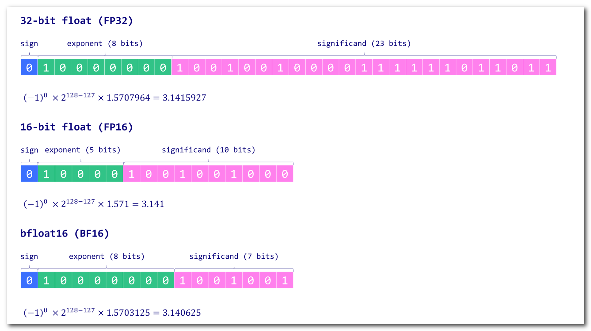

# Learning Notes - LLM courses

> 想学习大语言模型(LLM)，应该从哪个开源模型开始？ - LeonYi的回答 - 知乎
> https://www.zhihu.com/question/608820310/answer/3401824221

>  

① The LLM architecture

- [x] **[Visual intro to Transformers](https://www.youtube.com/watch?v=wjZofJX0v4M&t=187s) by 3Blue1Brown: Simple easy to understand visual intro to Transformers**
- [x] **[Attention? Attention!](https://lilianweng.github.io/posts/2018-06-24-attention/) by Lilian Weng: Introduce the need for attention in a more formal way.**
- [x] **[Decoding Strategies in LLMs](https://mlabonne.github.io/blog/posts/2023-06-07-Decoding_strategies.html): Provide code and a visual introduction to the different decoding strategies to generate text.**

② Building an instruction dataset

- [x] [Preparing a Dataset for Instruction tuning](https://wandb.ai/capecape/alpaca_ft/reports/How-to-Fine-Tune-an-LLM-Part-1-Preparing-a-Dataset-for-Instruction-Tuning--Vmlldzo1NTcxNzE2) by Thomas Capelle: 

  Exploration of the Alpaca and Alpaca-GPT4 datasets and how to format them.

- [x] [Generating a Clinical Instruction Dataset](https://medium.com/mlearning-ai/generating-a-clinical-instruction-dataset-in-portuguese-with-langchain-and-gpt-4-6ee9abfa41ae) by Solano Todeschini: Tutorial on how to create a synthetic instruction dataset using GPT-4.

- [x] [Dataset creation for fine-tuning LLM](https://colab.research.google.com/drive/1GH8PW9-zAe4cXEZyOIE-T9uHXblIldAg?usp=sharing): Notebook that contains a few techniques to filter a dataset and upload the result.

- [x] [Chat Template](https://huggingface.co/blog/chat-templates) by Matthew Carrigan: Hugging Face's page about prompt templates

③ Pre-training models

- [x] [LLMDataHub](https://github.com/Zjh-819/LLMDataHub) by Junhao Zhao: Curated list of datasets for pre-training, fine-tuning, and RLHF.
- [x] **[TinyLlama](https://github.com/jzhang38/TinyLlama) by Zhang et al.: Check this project to get a good understanding of how a Llama model is trained from scratch.**
- [x] **[Chinchilla's wild implications](https://www.lesswrong.com/posts/6Fpvch8RR29qLEWNH/chinchilla-s-wild-implications) by nostalgebraist: Discuss the scaling laws and explain what they mean to LLMs in general.**
- [x] **[BLOOM](https://bigscience.notion.site/BLOOM-BigScience-176B-Model-ad073ca07cdf479398d5f95d88e218c4) by BigScience: Notion page that describes how the BLOOM model was built, with a lot of useful information about the engineering part and the problems that were encountered.**
- [x] **[OPT-175 Logbook](https://github.com/facebookresearch/metaseq/blob/main/projects/OPT/chronicles/OPT175B_Logbook.pdf) by Meta: Research logs showing what went wrong and what went right. Useful if you're planning to pre-train a very large language model (in this case, 175B parameters).**
- [x] [LLM 360](https://www.llm360.ai/): A framework for open-source LLMs with training and data preparation code, data, metrics, and models.

④ Supervised Fine-Tuning

- [x] **[The Novice's LLM Training Guide](https://rentry.org/llm-training) by Alpin: **

  **Overview of the main concepts and parameters to consider when fine-tuning LLMs.**

- [x] [LoRA insights](https://lightning.ai/pages/community/lora-insights/) by Sebastian Raschka: Practical insights about LoRA and how to select the best parameters.

- [x] [Fine-Tune Your Own Llama 2 Model](https://mlabonne.github.io/blog/posts/Fine_Tune_Your_Own_Llama_2_Model_in_a_Colab_Notebook.html): Hands-on tutorial on how to fine-tune a Llama 2 model using Hugging Face libraries.

⑤ Reinforcement Learning from Human Feedback

- [x] **[An Introduction to Training LLMs using RLHF](https://wandb.ai/ayush-thakur/Intro-RLAIF/reports/An-Introduction-to-Training-LLMs-Using-Reinforcement-Learning-From-Human-Feedback-RLHF---VmlldzozMzYyNjcy) by Ayush Thakur: **

  **Explain why RLHF is desirable to reduce bias and increase performance in LLMs.**

- [x] **[Illustration RLHF](https://huggingface.co/blog/rlhf) by Hugging Face: Introduction to RLHF with reward model training and fine-tuning with reinforcement learning.**

- [x] **[LLM Training: RLHF and Its Alternatives](https://substack.com/profile/27393275-sebastian-raschka-phd) by Sebastian Rashcka: Overview of the RLHF process and alternatives like RLAIF.**

  > [LLM Training: RLHF and Its Alternatives (sebastianraschka.com)](https://magazine.sebastianraschka.com/p/llm-training-rlhf-and-its-alternatives?utm_source=%2Fsearch%2FRLHF%20and%20Its%20Alternatives&utm_medium=reader2)

- [x] [Fine-tune Mistral-7b with DPO](https://huggingface.co/blog/dpo-trl): Tutorial to fine-tune a Mistral-7b model with DPO and reproduce [NeuralHermes-2.5](https://huggingface.co/mlabonne/NeuralHermes-2.5-Mistral-7B).

⑥ Evaluation

- [x] **[Perplexity of fixed-length models](https://huggingface.co/docs/transformers/perplexity) by Hugging Face: Overview of perplexity with code to implement it with the transformers library.**
- [x] **[BLEU at your own risk](https://towardsdatascience.com/evaluating-text-output-in-nlp-bleu-at-your-own-risk-e8609665a213) by Rachael Tatman: Overview of the BLEU score and its many issues with examples.**

- [x] **[A Survey on Evaluation of LLMs](https://arxiv.org/abs/2307.03109) by Chang et al.:** 

  **Comprehensive paper about what to evaluate, where to evaluate, and how to evaluate.**

- [x] **[Chatbot Arena Leaderboard](https://huggingface.co/spaces/lmsys/chatbot-arena-leaderboard) by lmsys: Elo rating of general-purpose LLMs, based on comparisons made by humans.**

⑦ Quantization

- [x] **[Introduction to quantization](https://mlabonne.github.io/blog/posts/Introduction_to_Weight_Quantization.html): Overview of quantization, absmax and zero-point quantization, and LLM.int8() with code.** 

⑧ New Trends (MoE)

- [x] **[Extending the RoPE](https://blog.eleuther.ai/yarn/) by EleutherAI: Article that summarizes the different position-encoding techniques.**
- [x] [Merge LLMs with mergekit](https://mlabonne.github.io/blog/posts/2024-01-08_Merge_LLMs_with_mergekit.html): Tutorial about model merging using mergekit.
- [x] **[Mixture of Experts Explained](https://huggingface.co/blog/moe) by Hugging Face: Exhaustive guide about MoEs and how they work.**

---

## Part Ⅰ The LLM architecture

### ① 理解 Transformers By 3B1B

> **3Blue1Brown: Simple easy to understand visual intro to Transformers**
>
> **[但什么是 GPT？通过图形化的方式来理解 Transformer 架构 | 深度学习，第 5 章 (youtube.com)](https://www.youtube.com/watch?v=wjZofJX0v4M&t=187s)**
>
> **[可视化注意力，变形金刚的心脏 | 第 6 章，深度学习 (youtube.com)](https://www.youtube.com/watch?v=eMlx5fFNoYc)**

在 Transformers 中,注意力机制 (Attention Mechanism) 扮演着至关重要的角色。

其中,$Q$ (Query)、$K$ (Key) 和 $V$ (Value) 是注意力计算过程中的三个核心概念。$Q$ 和 $K$ 进行点积计算, 本质上是在向量空间中进行查询和匹配的过程 [ 点积的核心概念 ]。这个过程可以理解为用 $K$ 去匹配 $Q$, 找到与 $Q$ 最相关的信息。接下来,通过对点积结果应用 Softmax 函数,可以得到一个概率分布,表示不同位置上的内容对当前查询的相关性。

通常情况下,$K$ 和 $V$ 来自相同的输入, 而 $Q$ 则代表当前的查询。通过 $Q$ 与 $K$ 的匹配过程, 再经过数值变换,最终从 $V$ 中提取出与查询最相关的信息,形成了一个 **"改变量"**。这个 "改变量" 代表了查询 $Q$ 在当前上下文中的语义表示。最后,通过将这个 "改变量" 与原始查询 $Q$ **相加**,可以得到一个更新后的查询表示,即查询方向在语义空间中的改变。

### ② 生成模型的 Decoder 策略 

> **[Decoding Strategies in LLMs](https://mlabonne.github.io/blog/posts/2023-06-07-Decoding_strategies.html): **
>
> **Provide code and a visual introduction to the different decoding strategies to generate text.**

在大型语言模型(LLM)的文本生成任务中,解码策略的选择对生成文本的质量和风格有着重要影响。以下是四种常用的解码方法的简介,包括它们的特点、常用参数、参数操作的影响以及在实际工程应用中的经验值选择及其原因。

① 贪婪搜索(Greedy Search)

贪婪搜索是最简单的解码策略,每一步仅选择概率最高的单词。这种方法的优点是计算效率高,但缺点是生成的文本可能缺乏多样性和创造性,因为它总是选择当前最可能的选项,容易陷入局部最优。

② 束搜索(Beam Search) 

束搜索是一种平衡输出质量和计算成本的方法,通过在每一步保持多个(由参数`num_beams`控制)最优候选序列来实现。常见的`num_beams`值在2到10之间,较高的值可以提高输出质量,但计算成本也相应增加。束搜索适用于需要较高质量输出的场景,如机器翻译或复杂的文本生成任务。在实际应用中,`num_beams`的选择通常在5到10之间,以在输出质量和计算效率之间取得平衡。

③ Top-k 抽样(Top-k Sampling)

Top-k 抽样在每一步从概率最高的k个单词中随机选择一个,通过参数`top_k`控制。这种方法引入了随机性,使得生成的文本更加多样化和不可预测。`top_k`的常用值通常在10到50之间,较大的`top_k`值增加了文本的多样性,但可能降低文本的连贯性和相关性。在实践中,`top_k`的选择需要根据任务的需求来权衡,一般在20到40之间选择。

④ Nucleus 抽样(Top-p Sampling)

Nucleus抽样是根据概率累积阈值`top_p`来动态选择候选单词集合的方法。这种策略在保持文本多样性的同时,通过控制概率的累积分布来限制随机性,常用的`top_p`值在0.9左右。较高的`top_p`值可以保证生成文本的流畅性和相关性,而较低的值则可能使文本更加创新但不够连贯。在实际应用中,`top_p`的选择一般在0.8到0.95之间,需要在流畅性和创新性之间取得平衡。

在选择这些参数时,需要根据具体的应用场景和任务要求进行权衡。例如,对于需要高度创新性的文本生成任务,可能会选择较高的`top_k`或`top_p`值；而对于需要高度精确和相关的输出,如内容推荐或用户交互场景,则可能选择较低的这些值或使用束搜索。在实际工程实践中,经验值的选择通常基于反复的实验和调整,以找到最佳的平衡点。一般情况下,可以先从较为保守的参数值开始调试,如`num_beams=5`, `top_k=20`, `top_p=0.9`,然后根据实际效果进行进一步的微调,直到找到最适合具体任务的参数组合。同时也要注意, 不同的模型和数据集可能对参数的敏感度不同,需要针对性地进行实验和调优。

## Part Ⅱ Building an instruction dataset

### ① Instruction Tuning 数据准备

>[Preparing a Dataset for Instruction tuning](https://wandb.ai/capecape/alpaca_ft/reports/How-to-Fine-Tune-an-LLM-Part-1-Preparing-a-Dataset-for-Instruction-Tuning--Vmlldzo1NTcxNzE2) by Thomas Capelle: 
>
>Exploration of the Alpaca and Alpaca-GPT4 datasets and how to format them.
>
>**In (almost) pure PyTorch.**
>
>记录了之后如何使用其进行训练, 如有需要看之后的文章

Tips : 

* `transformers` 库 与 `W&B` 进行了很好的集成. `Axolotl` 作为开源软件 继承了多种 Tricks 的库, 比如 `transformers` `peft` `bitsandbytes` `deepspeed`

* 高质量的 Instruction 数据集有人工制作的 [Flan Collection](https://github.com/google-research/FLAN) and [Dolly15k dataset](https://www.databricks.com/blog/2023/04/12/dolly-first-open-commercially-viable-instruction-tuned-llm) 和 LLM生成的如  [Alpaca dataset](https://crfm.stanford.edu/2023/03/13/alpaca.html) | Some of the recent datasets like [OpenOrca](https://huggingface.co/datasets/Open-Orca/OpenOrca), [Platypus](https://huggingface.co/datasets/garage-bAInd/Open-Platypus), [OpenHermes ](https://huggingface.co/datasets/teknium/openhermes)produce very high-quality fine-tuned models that score high on the leaderboards and different evaluation tasks.
* 您可以将预处理后的数据集存储为 W&B 工件，这样就可以避免每次都重新进行处理了

#### Alpaca-GPT4 Dataset

Alpaca-GPT4 数据集只是一个单独的 JSON 文件，alpaca_gpt4_data.json 包含由 GPT-4 生成的 52K 指令跟随数据和 Alpaca 中的提示。该 JSON 文件与 Alpaca 数据格式相同，只是输出由 GPT-4 生成。

[GPT-4-LLM/data/alpaca_gpt4_data.json at main · Instruction-Tuning-with-GPT-4/GPT-4-LLM · GitHub](https://github.com/Instruction-Tuning-with-GPT-4/GPT-4-LLM/blob/main/data/alpaca_gpt4_data.json) | 41MB

```json
instruction: str, describes the task the model should perform. 
                  Each of the 52K instructions is unique.
input:       str, optional context or input for the task.
output:      str, the answer to the instruction as generated by GPT-4.
```

我鼓励大家探索数据集。有些任务很简单，有些则不那么简单。尽管如此：GPT-4 生成的这些数据还是令人印象深刻。

#### STEP 0 Prompt 数据准备

 ```json
 one_row = {
    'instruction': 'What are the three primary colors?',
    'input': '',
    'output': 'The three primary colors are red, blue, and yellow.'
 }
 ```

我们需要进行一些预处理，以便将这些数据输入 LLM。让我们定义一些函数来格式化指令

```python
def prompt_no_input(row):
    return ("Below is an instruction that describes a task. "
            "Write a response that appropriately completes the request.\n\n"
            "### Instruction:\n{instruction}\n\n### Response:\n").format_map(row)


def prompt_input(row):
    return ("Below is an instruction that describes a task, paired with an input that provides further context. "
            "Write a response that appropriately completes the request.\n\n"
            "### Instruction:\n{instruction}\n\n### Input:\n{input}\n\n### Response:\n").format_map(row)

```

我们有带提示和不带Prompt的instruction，因此必须分别处理。我们本可以同时串联输出，但由于稍后在指令微调时将重复使用这些指令，因此我们将其分开处理

```python
row = alpaca[232]
print(prompt_input(row))


>> Below is an instruction that describes a task, paired with an input that provides further context. Write a response that appropriately completes the request.


### Instruction:
What are the three primary colors?


### Input:


### Response:
```

然后，我们就可以将这两条路径合并为

```python
def create_prompt(row):
    return prompt_no_input(row) if row["input"] == "" else prompt_input(row)


prompts = [create_prompt(row) for row in alpaca]  # all LLM inputs are here
```

#### STEP 1 : End of String Tokens (EOS)

**告诉 model 何时停止** 

We will append this token after each response:

```python
EOS_TOKEN = "</s>"
outputs = [row['output'] + EOS_TOKEN for row in alpaca]
---------------------------------------------
outputs[0]
# this is a oneliner split here for readability
>> 1.Eat a balanced diet and make sure to include plenty of fruits and vegetables. 
\n2. Exercise regularly to keep your body active and strong.
\n3. Get enough sleep and maintain a consistent sleep schedule.</s>' 
```

我们还将存储指令和输出的 concatenation：

```python
dataset = [{"prompt":s, "output":t, "example": s+t} for s, t in zip(prompts, outputs)]
```

##### String To Tokenizer | Use transformers 

这个库可以完成以下任务

* String 2 Tokens
* 将输出转换为 PyTorch 张量
* 填充输入以匹配长度

```python
model_id = 'meta-llama/Llama-2-7b-hf'
tokenizer = AutoTokenizer.from_pretrained(model_id)
tokenizer.pad_token = tokenizer.eos_token
```

我们必须告诉令牌生成器使用什么令牌进行填充；

在本例中，使用的是 EOS 令牌（id = 2）。我们可以指定填充序列的长度，并据此完成它。

```python
tokenizer.encode("My experiments are going strong!")
# >> [1, 1619, 15729, 526, 2675, 4549, 29991]

tokenizer.encode("My experiments are going strong!", padding='max_length', max_length=10)
# >> [1, 1619, 15729, 526, 2675, 4549, 29991, 2, 2, 2]
```

我们还可以直接获取 PyTorch 张量：

```python
tokenizer.encode("My experiments are going strong!", 
                 padding='max_length', 
                 max_length=10,
                 return_tensors="pt")
# >> tensor([[    1,  1619, 15729,   526,  2675,  4549, 29991,     2,     2,     2]])
```

后者的好处是，我们可以把 tokenizer 放在 collate 函数中！这样，我们从 dataloader 的字符串中采样，然后collate函数将其 tokenizer 并转换为 PyTorch 张量

> #### 什么是 Collate 函数？
>
> 在 PyTorch 中，`collate_fn` 是 DataLoader 的一个参数，用于指定如何将多个数据样本（通常是一个批次的数据）组合成一个批次。默认情况下，DataLoader 会尝试将样本简单地堆叠起来，但当数据需要复杂的处理时（比如不同长度的序列），就需要自定义 `collate_fn`。
>
> #### Collate 函数的作用
>
> `collate_fn` 允许开发者自定义数据的批次处理方式。例如，当处理文本数据时，不同的文本长度会导致无法直接堆叠，因此可以在 `collate_fn` 中实现如下功能：
>
> - 对数据进行填充（padding）以保证所有数据具有相同的长度；
> - 将数据封装成 Tensor；
> - 可以进行更复杂的操作，例如数据增强、动态调整填充长度等。
>
> #### 在训练过程中的使用
>
> 在神经网络训练过程中，当从 DataLoader 获取数据批次时，`collate_fn` 被调用，以确保每个批次的数据格式正确，可以被模型正确处理。

#### STEP 2 : Creating a Train-Eval Split

```python
import random
random.shuffle(dataset). # shuffle inplace


train_dataset = dataset[:-1000]
eval_dataset = dataset[-1000:]


train_table = wandb.Table(dataframe=pd.DataFrame(train_dataset))
eval_table  = wandb.Table(dataframe=pd.DataFrame(eval_dataset))


with wandb.init(project="alpaca_ft", job_type="split_data"):
    wandb.log({"train_dataset":train_table, "eval_dataset":eval_table})

```

#### STEP 3 : Packing | Combining multiple samples into a longer sequence

为了提高训练效率，并利**用这些 LLM 的较长上下文**，我们将采取一种称为 "打包Packing "的方法。我们将合并多个示例来填充模型的内存，从而提高训练效率，而不是单独输入示例。这样，我们就可以**避免进行大量填充和处理不同的长度**。


这里的主要思路是，指令/输出样本都很短，因此我们可以将它们串联起来，并用 EOS 标记隔开。我们还可以对数据集进行预标记和预打包，让一切变得更快！  如果我们定义 max_seq_len = 1024，那么打包的代码将如下所示：

```python
max_seq_len = 1024


def pack(dataset, max_seq_len=1024):
    tkds_ids = tokenizer([s["example"] for s in dataset])["input_ids"]
    
    all_token_ids = []
    for tokenized_input in tkds_ids:
        all_token_ids.extend(tokenized_input + [tokenizer.eos_token_id])
    
    packed_ds = []
    for i in range(0, len(all_token_ids), max_seq_len+1):
        input_ids = all_token_ids[i : i + max_seq_len+1]
        if len(input_ids) == (max_seq_len+1):
            packed_ds.append({"input_ids": input_ids[:-1], "labels": input_ids[1:]})  # < --- ‼️ ⛔️
	    # if you use the model.output.loss you don't need to shift, it is done for you!
    return packed_ds


train_ds_packed = pack(train_dataset)
eval_ds_packed = pack(eval_dataset)

```

这样，我们就得到了超过 11k 个长度为 1024 的序列。(原本52k)

#### STEP 4 : Second Option | Batching multiple sequences of different lengths

> **这种解决方案性能不佳，因为每个批次的长度都不一样，而且包含的标记对模型没有任何启发。**

还有一种方法可以从不同大小的行中构建批次；那就是对序列进行填充，使它们变得更长，这样就可以将它们集中在一起。

标记化器有一个批处理函数，可以根据所需的策略从不同的样本和填充中创建批处理。


```python
tokenizer(["My experiments are going strong!", 
           "I love Llamas"], 
          padding='longest',
          return_tensors="pt")


>> {'input_ids': tensor([[    1,  1619, 15729,   526,  2675,  4549, 29991],
                         [    1,   306,  5360,   365,  5288,   294,     2]]), 
    'attention_mask': tensor([[1, 1, 1, 1, 1, 1, 1],
                              [1, 1, 1, 1, 1, 1, 0]])}


tokenizer(["My experiments are going strong!", 
           "I love Llamas"], 
          # padding='max_length', 
          padding='max_length',
          max_length=10,
          return_tensors="pt")


>> {'input_ids': tensor([[    1,  1619, 15729,   526,  2675,  4549, 29991,     2,     2,     2],
                         [    1,   306,  5360,   365,  5288,   294,     2,     2,     2,     2]]), 
    'attention_mask': tensor([[1, 1, 1, 1, 1, 1, 1, 0, 0, 0],
                              [1, 1, 1, 1, 1, 1, 0, 0, 0, 0]])}
```

因此，我们可以使用该函数创建最终批次，并将其传递给模型。

还要注意的是，这项任务可以离线完成，只需对整个数据集进行一次预处理。在大多数情况下都是这样做的，人们从标记化的数据集中进行流式处理。转换器库中甚至有一个用 Rust 实现的 FastTokenizer 类，可以让这一步变得更快。

#### STEP 5 : Storing our preprocessed dataset on W&B 

 现在，我们已经打包好数据集，可以安全地保存数据集以训练模型！

为了获得模型的脉络，并准确地知道哪个数据集用于微调我们的模型，好的做法是对数据进行版本化，并将一切都整理得井井有条。我们将把数据集记录为 W&B 工件。

我们可以将数据存储为 JSONL 格式，其中每一行对应一个字典对象：

```python
import json
def save_jsonl(data, filename):
    with open(filename, 'w') as file:
        for entry in data:
            json.dump(entry, file)
            file.write('\n')


# dump everything to jsonl files
save_jsonl(train_ds_packed, "train_packed_alpaca.jsonl")
save_jsonl(eval_ds_packed, "eval_packed_alpaca.jsonl")


# Create a W&B artifact
packed_at = wandb.Artifact(
    name="packed_alpaca",
    type="dataset",
    description="Alpaca dataset packed in sequences",
    metadata={"max_seq_len":1024, "model_id":model_id})


packed_at.add_file("train_packed_alpaca.jsonl")
packed_at.add_file("eval_packed_alpaca.jsonl")


# log the artifact to the project, we can give this run a job_type like `preprocess`
with wandb.init(project="alpaca_ft", job_type="preprocess"):
    wandb.log_artifact(packed_at)

```

如果需要，您可以在描述和元数据参数中存储数据集的相关信息。

### ② 构建合成数据

> [Generating a Clinical Instruction Dataset](https://medium.com/mlearning-ai/generating-a-clinical-instruction-dataset-in-portuguese-with-langchain-and-gpt-4-6ee9abfa41ae) by Solano Todeschini: 
>
> Tutorial on how to create a synthetic instruction dataset using GPT-4.
>
> 使用 pytorch | OpenAI api | langchain | => 详细请见原文

在本文中，我们将探讨在 Langchain 库的辅助下，使用 OpenAI 的 GPT-4 模型创建高质量指令跟随数据集的过程，该过程基于生成 Alpaca 数据集的相同方法 (https://huggingface.co/datasets/tatsu-lab/alpaca)。

> 在本教程中，我们准备了一个数据集，其中包含 17 对与临床领域相关的巴西葡萄牙语指令。我们首先创建了一个 .csv 文件，其中包含指令、输入和输出列。
>
> 然后，我们将该文件读入 pandas DataFrame，并将 DataFrame 转换为 JSON 对象列表。然后将该列表保存为 .json 文件，其格式适合作为提示信息传递给 GPT-4。

#### STEP 1 : Preparing Your Seed Tasks

在开始生成指令数据集之前，您首先需要一组种子任务。这些任务通常以指令的形式出现，后面跟着相应的输入和输出，是数据集生成过程的基础。它们用于提供上下文，并促使 LLM 生成更多任务。

```python
{'instruction': 'What is the scientific name for a beaver?',
 'input': '',
 'output': 'The scientific name for a beaver is Castor canadensis.
```

#### STEP 2 : Creating a Prompt Template

准备好种子任务后，下一步就是将这些任务编码成可供 Langchain 链使用的特定格式。

```
You are asked to come up with a set of 20 diverse task instructions. These task instructions will be given to a GPT model and we will evaluate the GPT model for completing the instructions.

Here are the requirements:
1. Try not to repeat the verb for each instruction to maximize diversity.
2. The language used for the instruction also should be diverse. For example, you should combine questions with imperative instrucitons.
3. The type of instructions should be diverse. The list should include diverse types of tasks like open-ended generation, classification, editing, etc.
2. A GPT language model should be able to complete the instruction. For example, do not ask the assistant to create any visual or audio output. For another example, do not ask the assistant to wake you up at 5pm or set a reminder because it cannot perform any action.
3. The instructions should be in English.
4. The instructions should be 1 to 2 sentences long. Either an imperative sentence or a question is permitted.
5. You should generate an appropriate input to the instruction. The input field should contain a specific example provided for the instruction. It should involve realistic data and should not contain simple placeholders. The input should provide substantial content to make the instruction challenging but should ideally not exceed 100 words.
6. Not all instructions require input. For example, when a instruction asks about some general information, "what is the highest peak in the world", it is not necssary to provide a specific context. In this case, we simply put "<noinput>" in the input field.
7. The output should be an appropriate response to the instruction and the input. Make sure the output is less than 100 words.

List of 20 tasks:
```

#### STEP 3 : Mixing Seed Tasks and Format the Final Prompts

在适当创建提示模板后，下一个关键步骤是开发一个管道，随机获取种子指令，并将其格式化到提示模板中，形成一组最终提示，指示 LLM 生成新示例。

#### STEP 4 : Generating and Processing Instructions


设置完成后，我们现在可以专注于流程的核心部分：生成和处理指令。这包括向 LLM 发送编码提示，并将接收到的响应处理为适合指令数据集的格式。

按照这些步骤，您将能够利用 Langchain 和 GPT-4 生成一个全面的指令数据集，该数据集可用于微调您的大型语言模型，以更好地满足您的特定需求。

#### ③ Instruction Datasets 数据过滤

> [Dataset creation for fine-tuning LLM](https://colab.research.google.com/drive/1GH8PW9-zAe4cXEZyOIE-T9uHXblIldAg?usp=sharing): 
>
> Notebook that contains a few techniques to filter a dataset and upload the result.
>
> 1 Filter out rows with more than 2048 tokens
>
> 2 使用Embedding技术进行去重
>
> 3 筛出 Token 少的样例
>
> 4 定义模板 作为输入

#### 数据集种类

1. **Instruction datasets**：

   输入是指令（如问题），输出对应于预期反应（如答案）。示例：Open-Orca

2. Raw completion : 

   这是预训练目标（下一个标记预测）的继续。在这种情况下，训练好的模型不是用来作为辅助工具的。例如：MADLAD-400

3. **Preference datasets**：

   这些数据集与强化学习一起用于对候选回答进行排序。它们可以为同一指令提供多个答案，帮助模型选择最佳答案。示例：Ultrafeedback_barinized。

4. **Others**

   中间填充目标在代码完成模型（如 GitHub Copilot 的 Codex）中非常流行。其他数据集可以设计用于分类，其中的输出与我们想要预测的标签相对应（在这种情况下，模型需要一个额外的分类头）。

实际上，有监督的微调只能利用第一类数据集。我们既可以创建自己的指令数据集，也可以修改现有数据集，对其进行过滤、改进或丰富。

### ③ Chat 模板

> [Chat Template](https://huggingface.co/blog/chat-templates) by Matthew Carrigan: Hugging Face's page about prompt templates

现存的聊天模型使用的训练数据格式各各不同，我们需要用这些格式将对话转换为单个字符串并传给分词器。**如果我们在微调或推理时使用的格式与模型训练时使用的格式不同，通常会导致严重的、无声的性能下降，因此匹配训练期间使用的格式极其重要！** 

Hugging Face 分词器新增了 `chat_template` 属性，可用于保存模型训练时使用的聊天格式。此属性包含一个 Jinja 模板，可将对话历史记录格式化为正确的字符串。请参阅 [技术文档](https://huggingface.co/docs/transformers/main/en/chat_templated)，以了解有关如何在代码中编写和应用聊天模板。

#### 1 引言

最常见的，角色是“用户”(用于用户发送的消息) 、“助理”(用于模型生成的响应)，以及可选的“系统”(指在对话开始时给出的高级指令)。

```json
[
    {"role": "user", "content": "Hi there!"},
    {"role": "assistant", "content": "Nice to meet you!"}
]
```

此消息序列需要先转换为一个文本字符串，然后才能对其进行分词以输入给模型。但问题是，转换方法有很多！例如，你可以将消息列表转换为“即时消息”格式:

```
User: Hey there!
Bot: Nice to meet you!
```

或者你可以添加特殊词元来指示角色:

```
[USER] Hey there! [/USER]
[ASST] Nice to meet you! [/ASST]
```

抑或你可以添加词元以指示消息之间的边界，而将角色信息作为字符串插入:

```
<|im_start|>user
Hey there!<|im_end|>
<|im_start|>assistant
Nice to meet you!<|im_end|>
```

方法多种多样，但没有哪种方法是最好的或是最正确的。因此，不同的模型会采用截然不同的格式进行训练。上面这些例子不是我编造的，它们都是真实的，并且至少被一个现存模型使用过！但是，一旦模型接受了某种格式的训练，你需要确保未来的输入使用相同的格式，否则就可能会出现损害性能的分布漂移。

#### 2 模板: 一种保存格式信息的方式

聊天模板旨在解决以下几个问题：

1. **格式一致性和正确性**：在使用机器学习模型进行聊天或其他文本生成任务时，输入的格式非常重要。不正确的格式可能导致模型性能下降，但这种下降是难以通过常规的错误提示来识别的（被称为“静默错误”）。聊天模板确保输入格式符合模型的预期，从而避免这种静默错误。
2. **简化模型使用**：在没有聊天模板的情况下，用户需要手动查找并编写代码来确保输入格式的正确，这不仅耗时而且容易出错。聊天模板通过提供一个预定义的、可重用的模板字符串，简化了这一流程。

聊天模板是一个 [Jinja 模板字符串](https://jinja.palletsprojects.com/en/3.1.x/)，你可以使用分词器保存和加载它。聊天模板包含了将聊天消息列表转换为模型所需的、格式正确的输入字符串所需要的全部信息, 下面是三个聊天模板字符串，分别对应上文所述的三种消息格式:

```jinja2

    
        {{ "User : " }}
    
        {{ "Bot : " }}
    {{ message['content'] + '\n' }}

```

```jinja2

    
        {{ "[USER]" + message['content'] + " [/USER]" }}
    
        {{ "[ASST]" + message['content'] + " [/ASST]" }}
    {{ message['content'] + '\n' }}

```

```jinja2
""
    "{{'<|im_start|>' + message['role'] + '\n' + message['content'] + '<|im_end|>' + '\n'}}"
""
```

我们认为最接近“标准”的格式是 OpenAI 创建的 [ChatML 格式](https://github.com/openai/openai-python/blob/main/chatml.md)。如果你正在训练新的聊天模型，并且此格式适合你，我们建议你使用它并给分词器添加特殊的 `<|im_start|>` 和 `<|im_end|>` 词元。

它的优点是角色非常灵活，因为角色只是作为字符串插入，而不是特定的角色词元。如果你想使用这个，它是上面的第三个模板，你可以简单地使用一行代码进行设置

```python
tokenizer.chat_template = "{{'<|im_start|>' + message['role'] + '\n' + message['content'] + '<|im_end|>' + '\n'}}"
```

不过，除了格式林立的现状之外，还有第二个不硬设标准格式的原因 - 我们预计模板将广泛用于多种类型模型的预处理，包括那些可能与标准聊天操作迥异的模型。硬设标准格式限制了模型开发人员使用此功能完成我们尚未想到的任务的能力，而模板则为用户和开发人员提供了最大的自由度。甚至可以在模板中加入逻辑检查和判断，这是目前任何默认模板中都没有深入使用的功能，但我们希望它能成为喜欢冒险的用户手中的利刃。我们坚信，开源生态系统应该让你能够做你想做的事，而不是命令你做什么。

## Part Ⅲ Pre-training models

### ① 模型的预训练 - 全流程 - TinyLlama

> **[TinyLlama](https://github.com/jzhang38/TinyLlama) by Zhang et al.: Check this project to get a good understanding of how a Llama model is trained from scratch.**
>
> 里面展现了完整的 (小)大模型 从数据到预训练的完整过程, 及其其中的评估方式

- 1.1 B 类 Llama 模型 | 3T Tokens | 预训练 16块 A100-40G GPU -> 90 Days 完成任务 | 
- 如果要训练50亿以下参数的语言模型, 你其实不需要Megatron-LM

| Setting                        | Description                                                  |
| ------------------------------ | ------------------------------------------------------------ |
| Parameters                     | 1.1B                                                         |
| Attention Variant              | Grouped Query Attention                                      |
| Model Size                     | Layers: 22, Heads: 32, Query Groups: 4, Embedding Size: 2048, Intermediate Size (Swiglu): 5632 |
| Sequence Length                | 2048                                                         |
| Batch Size                     | 2 million tokens (2048 * 1024)                               |
| Learning Rate                  | 4e-4                                                         |
| Learning Rate Schedule         | Cosine with 2000 warmup steps                                |
| Training Data                  | [Slimpajama](https://huggingface.co/datasets/cerebras/slimpajama-627b) & [Starcoderdata](https://huggingface.co/datasets/bigcode/starcoderdata) |
| Data Preprocessing             | Excluded GitHub subset of Slimpajama; Sampled all code from Starcoderdata |
| Combined Dataset Size          | Around 950B tokens                                           |
| Total Tokens During Training   | 3 trillion (slightly more than 3 epochs/143k steps)          |
| Natural Language to Code Ratio | 7:3                                                          |
| Hardware                       | 16 A100-40G GPUs                                             |

代码库支持以下特性：

- 使用FSDP进行多GPU和多节点分布式训练
- flash attention 2
- 融合层归一化 (fused layernorm)
- 融合swiglu (fused swiglu)
- 融合交叉熵损失 (fused cross entropy loss)
- 融合旋转位置嵌入 (fused rotary positional embedding)

有了这些优化, 我们可以达到**24k tokens/秒/A100**的训练速度，也就是56%的MFU（在A100-80G上的MFU会更高）。这个速度可以让你可以在**8个A100上用32小时训练一个chinchilla-optimial的模型**(11亿参数，220亿token)。这些优化也大大减少了显存占用, 我们可以把11亿参数的模型塞入40GB的GPU里面还能同时维持16k tokens的per-gpu batch size。只需要把batch size改小一点， 你就可以在**RTX 3090/4090**上面训练TinyLlama。 

### ② 模型的预训练 - 工程细节 - BLOOM

> **[BLOOM](https://bigscience.notion.site/BLOOM-BigScience-176B-Model-ad073ca07cdf479398d5f95d88e218c4) by BigScience: **
>
> **Notion page that describes how the BLOOM model was built, with a lot of useful information about the engineering part and the problems that were encountered.**

BLOOM 训练信息

**General**

- [ ] **176 B | 416 A100s | 100 Days** 
  - [ ] Traing : 384 A100 GPU with 80 Gb of memory each
  - [ ] Copy  : 48 GPUs (using 60 GB of memory on each GPU)
- [ ] **150 TFLOPs |** 

**Model Arch** 

- [ ] **70 layers | 112 attention heads per layers  |  hidden dimensionality of 14336  |  2048 tokens sequence length** 

**Data**

- [ ] **341.6 B tokens | 46 languages |** 

 ### ③ 模型的预训练 - 工程细节 - OPT

> **[OPT-175 Logbook](https://github.com/facebookresearch/metaseq/blob/main/projects/OPT/chronicles/OPT175B_Logbook.pdf) by Meta:** 
>
> **Research logs showing what went wrong and what went right. Useful if you're planning to pre-train a very large language model (in this case, 175B parameters).**

OPT（Open Pre-trained Transformer）是一种预训练的变换器模型，由Meta（原Facebook）开发。该模型设计用于自然语言处理和理解任务中，采用了与GPT类似的架构，即基于Transformer的架构，通过大规模语料库进行预训练，以学习语言的深层次特征。OPT模型的开放性体现在其预训练模型和代码的公开，使得研究人员和开发者可以自由使用这些资源，进行下游任务的微调或研究。

本文档是关于OPT模型的一份训练日志报告，记录了模型从初始化到多次训练尝试的详细过程。

* 报告详细记录了各种训练配置、问题诊断、解决方案以及结果。
* 文档中涵盖了从节点和硬件问题的处理，到模型超参数的调整，再到实际训练过程中遇到的具体技术挑战。

报告中反复提及了多次试图通过**修改学习率、权重衰减系数、梯度裁剪值**等超参数来优化训练过程，同时也展示了在训练过程中如何**处理各种硬件和软件**引起的问题，比如**GPU失效、节点通信故障**等。此外，报告中还涉及到了使用**不同的数据集、初始化方法**、以及**模型并行处理技术**等多种尝试，旨在提高模型性能并减少训练时间。

整体来看，这份报告提供了一个关于大规模语言模型训练过程的全面视角，展示了在现实世界中进行此类训练所需面对的复杂性和挑战性，同时也突显了持续优化和问题解决策略在成功训练大型模型中的重要性。

> 一、模型概览
> - 模型架构: transformer_lm_megatron, 使用了FSDP(Fully Sharded Data Parallel) 和 Tensor Parallelism
> - 层数(nlay): 96 
> - 嵌入维度(emb): 12288
> - 批大小(bm): 2048 (run 11.0开始, 之前为4096)
> - adam_beta2: 0.95 (run 11.7开始)
>
> 二、数据集
> - 主要包含 BookCorpus, CC-Stories, OpenWebText2, Wikipedia,以及Push shift.io等语料
> - 使用了多种过滤和清洗方法, 逐步优化数据质量
> - run 11.7 开始使用手工正则清洗后的最终语料
>
> 三、训练超参数
> - 优化器: Adam和FP16 Adam
> - 权重衰减(weight_decay): 0.01 (run 6), 0.1 (run 8, 11.5), 0.05 (run 11.6, 11.8)
> - 学习率(lr):
>     - 3e-4 (run 6,11.0), 7.5e-5 (run 11.1), 6e-5 (run 8, 11.9)
>     - 使用线性lr warmup,持续约290步(run 8)或1000步(run 11.0)
> - 梯度裁剪(gradient clipping):
>     - 1.5 (run 11.2), 1.0 (run 8, 11.6, 11.7), 0.3 (run 12.16)
>     - run 11.5移除了梯度裁剪,改为丢弃越界的batches
> - 每次更新的tokens: 143052 (run 8), 147665 (run 9), 73832 (run 11.0)
> - 激活函数: GELU (run 11.0), ReLU (run 11.10, run 12.0)
> - 总更新步数(max_updates):  286,720 (run 8), 147,666 (run 9, 11.0)
>
> 四、训练框架
> - Fairseq: 模型训练框架
> - Fairscale: 支持FSDP(Fully Sharded Data Parallel)
> - Megatron-LM: 支持Tensor Parallelism
>
> 五、训练硬件
> - Cloud集群, 最多使用128个8卡A100-40GB节点
> - 网络互联: Infiniband 200GB/s
> - NCCL + pytorch分布式训练
>
> 六、训练策略
> - 从checkpoint恢复中断的训练(比如run 12.25到run 12.54)
> - 伸缩学习率(比如run 12.42到run 12.52, 缩减lr至0.75x)
> - 更换激活函数 (从GELU到ReLU, run 11.10)
> - 缩小权重初始化 (run 12.0)
> - 调整Adam beta权重(从0.98到0.95, run 11.7)
> - 在越界时跳过更新, 而非裁剪梯度(run 11.6)
> - 手动清洗训练语料(run 11.7)
>
> 七、训练监控
> - 在专门的Tensorboard目录下记录loss、学习率等训练曲线
> - 编写脚本监控loss、GPU状态、训练日志是否卡住等
> - 轮值工程师密切关注训练曲线, 根据异常决定是否人工介入
> - 详细记录每次操作, 确保团队信息同步
>
> 以上就是我从这份OPT训练报告中提炼的主要训练细节,围绕模型、数据、超参数、硬件、框架、策略等方面进行了系统梳理,力求简洁明了又不失全面。你在实际操作时可以参考这些关键点,设置合适的参数,运用得当的优化技巧,同时做好训练过程的监控,及时应对可能出现的问题。我相信对你的工作会有所帮助。

### ④ 模型预训练 - 全流程及代码 - LLM360

一个包含训练和数据准备代码、数据、指标和模型的开源 LLM 框架。

> [LLM360 | Open-source LLMs for Transparency, Trust, and Collaborative Research 🚀](https://www.llm360.ai/index.html)
>
> [Introducing LLM360: Fully Transparent open-source LLMs | LLM360](https://www.llm360.ai/blog/introducing-llm360-fully-transparent-open-source-llms.html)

LLM360 是一项全面、完全开源的 LLM 计划，所有**训练细节**、**模型检查点**、**中间结果**和**附加分析**均向社区开放。我们的目标是邀请社区共同加深对 LLM 的理解，从而推动该领域的发展。作为 LLM360 项目的第一步，我们发布了所有**中间模型检查点**、**完全准备好的预训练数据集**、**所有源代码**和**配置**以及训练细节。我们致力于通过这项开源工作不断推动 LLM 的发展。

> 大多数开源 LLM 版本都包含模型权重和评估结果。然而，要真正理解一个模型的行为，往往还需要其他信息，而大多数研究人员通常无法获得这些信息。因此，我们承诺发布在训练过程中收集到的所有中间检查点（多达 360 个！）、所有训练数据（及其与检查点的映射）、所有收集到的指标（如损失、梯度规范、评估结果），以及预处理数据和模型训练的所有源代码。这些额外的人工制品可以帮助研究人员和从业人员深入了解 LLM 的构建过程，并开展模型动态分析等研究。我们希望 LLM360 能让高级 LLM 更加透明，促进小规模实验室的研究，并提高人工智能研究的可重复性。
>
> * 频繁的中间模型检查点：
>
>   在训练过程中，定期收集模型参数和优化器状态。这些工件可以为研究 LLM 训练动态及其如何随数据扩展提供有价值的见解，并允许在不同阶段恢复训练。
>
> * 具有完整数据序列的训练数据：
>
>   整个经过预处理、标记化的训练数据集完全公开，可供公众使用。数据集与训练步骤完全对应。
>
> * 源代码：使用的所有代码，包括数据处理、训练、评估和分析。
>
> * 日志和指标：公开披露在训练过程中收集的所有训练日志、评估和分析结果，并与训练步骤和数据序列相对应。

### ⑥ 开源 预训练数据集 

> [GitHub - Zjh-819/LLMDataHub: A quick guide (especially) for trending instruction finetuning datasets](https://github.com/Zjh-819/LLMDataHub?tab=readme-ov-file#domain-specific-datasets--)

大型语言模型（LLM），如 OpenAI 的 GPT 系列、谷歌的 Bard 和百度的文心雕龙，正在推动深刻的技术变革。最近，随着 LlaMa 和 ChatGLM 等开源大型模型框架的出现，培训 LLM 不再是资源丰富的公司的专属领域。小型组织或个人培训 LLM 已成为开源社区的一个重要兴趣点，一些著名的作品包括 Alpaca、Vicuna 和 Luotuo。除了大型模型框架，大规模和高质量的训练语料库对于训练大型语言模型也至关重要。目前，社区中相关的开源语料仍很分散。因此，本资源库的目标是在开源社区中持续收集高质量的 LLM 训练语料。

要训练一个能有效遵从人类指令的聊天机器人 LLM，需要访问涵盖一系列对话领域和风格的高质量数据集。在本资源库中，我们提供了专为聊天机器人训练而设计的数据集，包括链接、大小、语言、使用情况以及每个数据集的简要说明。我们的目标是让研究人员和从业人员更容易识别和选择最相关、最有用的数据集，满足他们的聊天机器人 LLM 培训需求。无论您是在提高聊天机器人对话质量、生成响应还是语言理解，这个资源库都能满足您的需求。

## Part Ⅳ Supervised Fine-Tuning

### ① LLM 微调流程 [ Base LoRA ]

> **[The Novice's LLM Training Guide](https://rentry.org/llm-training) by Alpin: **
>
> **Overview of the main concepts and parameters to consider when fine-tuning LLMs.**

#### 0 **总述** 

LoRA : 可以减小 一万倍的可训练参数量, 同时 GPU 内存量可以减小三倍. 

> [Parameter-Efficient Fine-Tuning using 🤗 PEFT (huggingface.co)](https://huggingface.co/blog/peft) -> Transformers 调用 LoRA

QLoRA : 利用 bitsandbytes 库对语言模型进行即时、近乎无损的量化，并将其应用于 LoRA 训练程序。非常节省内存, 甚至能使用 2×3090s 来训练70B参数模型. (否则要使用 16×A100 80G来进行全参数微调 ) |  
It enables the finetuning of a 65B parameter model on a single 48GB GPU, while **preserving full 16-bit fine-tuning task performance.**

下面是一个微调过程讲解: **使用 QLoRA 在单张 3090 上面 微调 Mistral 7B 模型** 

#### 1 微调 - 概述

##### 训练资源

Base **Llama-7B** OR **Mistral 7B** -> **160~192GB range**

GPU 租用 :  [Runpod](https://runpod.io/), [VastAI](https://vast.ai/), [Lambdalabs](https://lambdalabs.com/), and [Amazon AWS Sagemaker](https://aws.amazon.com/sagemaker/). | VastAI is the Cheapest & AWS is the most expensive.

TPU 使用 | Know a guy who knows a guy.

##### 数据集

需要关注一下几点: 

1. **Dataset size**: **对话模型不应该只包含对话**
   您不希望您的模型只能完成一项非常具体的任务。
   您需要多样化的训练样本，包括各种场景，这样您的模型才能学会如何针对不同类型的输入生成输出。

2. **Dataset size: ** 需要比LoRA更多的微调数据, [Rule of a thumb] 至少10Mib 的文本数据. 越大越好
3. **Dataset quality**: 数据质量非常重要

> 数据处理: 
>
> - [ ] HTML - 使用 [Beautiful Soup](https://www.crummy.com/software/BeautifulSoup/bs4/doc/) 进行解析 提取数据
> - [ ] CSV - 使用 Pandas   进行提取
> - [ ] SQL - 使用 [sqlparse](https://sqlparse.readthedocs.io/en/latest/) 进行MariaDB or PostgreSQL数据库的提取
> - [ ] AIGC - 需要去除 "As an AI language model..." 等内容. 使用  
>   [This script](https://huggingface.co/datasets/ehartford/wizard_vicuna_70k_unfiltered/blob/main/optional_clean.py) by [ehartford](https://huggingface.co/ehartford) is a good filter for this specific task. You can also refer to the [gptslop](https://github.com/AlpinDale/gptslop) repo.

##### 训练框架

**STEP 1 配置环境**

Use the [**axolotl**](https://github.com/OpenAccess-AI-Collective/axolotl) trainer for fine-tuning, as it's simple to use and has all the features we need.

Clone the repository and install requirements | 云GPU 通常包括了所有的环境

```bash
git clone https://github.com/OpenAccess-AI-Collective/axolotl && cd axolotl
pip3 install packaging
pip3 install -e '.[flash-attn,deepspeed]'
```

Axolotl takes all the options for training in a single `yaml` file. 

There are already some sample configs in the `examples` directory, for various different models.

运行以下命令开始运行 - **测试环境通过性** | 

```bash
accelerate launch -m axolotl.cli.train examples/mistral/config.yml
```

**STEP 2 转换数据格式**

**转换 数据格式** -> [GitHub - OpenAccess-AI-Collective/axolotl: Go ahead and axolotl questions](https://github.com/OpenAccess-AI-Collective/axolotl#config)

要使用自定义数据集，您需要将其正确格式化为 JSONL 文件。Axolotl 支持多种不同格式，你可以在这里找到示例。

然后，你可以编辑 qlora.yml 文件并将其指向你的数据集。这里有所有配置选项的完整解释，确保点击展开按钮查看所有选项！

#### 2 LoRA - 权重

保留预先训练的权重 | 训练过的权重的可移植性 | 与注意层集成 | 内存效率 | 

| 参数                    | 描述                                                 | 补充                                                         |
| ----------------------- | ---------------------------------------------------- | ------------------------------------------------------------ |
| **LoRA Rank**           | Determines the number of rank decomposition matrices | 1 最低为8, 越高性能越高. <br />2 数据集越复杂, 这个值越高.<br />3 越高的 Rank 对应越高的计算复杂度<br />4 当 Rank 等于 Hidden Size 的时候, 等价于全量微调 |
| **LoRA Alpha**          | LoRA 的缩放因子，决定了模型对新训练数据的适应程度。  | 1 alpha 值用于调整训练过程中更新矩阵的贡献。<br />2 与较高的值相比，较低的值会给予原始数据更多的权重，并在更大程度上保持模型的现有知识。 |
| **LoRA Target Modules** | 确定要训练哪些特定权重和矩阵                         | 1 最基本的训练矩阵是查询向量（如 `q_proj`）和值向量（如 `v_proj`）投影矩阵。这些矩阵的名称因模型而异。<br />2 一般来说, 如果涉及到领域的迁移, 那么模型的输入Embedding层和输出Embedding层都需要进行相应的调整 |

> You can find out the exact names by running the following script:
>
> ```python
> from transformers import AutoModelForCausalLM
> model_name = "huggyllama/llama-7b"      # can also be a local directory
> model = AutoModelForCausalLM.from_pretrained(model_name)
> layer_names = model.state_dict().keys()
> 
> for name in layer_names:
>     print(name)
> ```
>
> output
>
> ```python
> model.embed_tokens.weight
> model.layers.0.self_attn.q_proj.weight
> model.layers.0.self_attn.k_proj.weight
> model.layers.0.self_attn.v_proj.weight
> model.layers.0.self_attn.o_proj.weight
> model.layers.0.self_attn.rotary_emb.inv_freq
> model.layers.0.mlp.gate_proj.weight
> model.layers.0.mlp.down_proj.weight
> model.layers.0.mlp.up_proj.weight
> model.layers.0.input_layernorm.weight
> model.layers.0.post_attention_layernorm.weight
> 
> ...
> 
> model.norm.weight
> lm_head.weight
> ```
>
> The naming convention is essentially: `{identifier}.{layer}.{layer_number}.{component}.{module}.{parameter}`. 

#### 3 QLoRA

1. **通过量化的预训练语言模型进行梯度反向传播 **Backpropagation of gradients through a frozen：

   这涉及到通过一个被冻结且被量化到4比特的语言模型反向传播梯度。

   通常，量化可以减少存储模型权重所需的内存量，但如果处理不当，也可能影响性能。在QLoRA中，尽管进行了量化，但由于与低秩适配器（LoRA）的结合使用，模型仍然能够保持有效性。

2. **使用4比特正态浮点（NormalFloat, NF4）**：

   NF4是一种新型数据类型，专门设计用于以减少内存使用的方式处理遵循正态分布的权重（使用4比特而不是更常见的16或32比特）。这种数据类型通过优化权重的存储和处理方式，帮助维持量化模型的性能。

3. **双重量化 (Double quantization)**：

   这种方法通过不仅量化模型权重，还量化量化常数本身，进一步减少了内存使用。这种分层量化策略最小化了模型的平均内存占用。

4. **分页优化器 (Paged optimizers)**：

   在微调过程中，内存使用可能会显著增加，这在硬件有限的情况下可能难以管理。分页优化器通过将优化器的内存需求分解成更小、更易管理的“页面”，帮助更有效地管理这些峰值。

#### 4 训练超参数

##### **Batch Size and Epoch** 

##### **Learning Rate** 

> " 可能是最重要的超参数, 如果你只能调节一个超参数, 请调节学习率 "

* high learning rate = less epochs. && low learning rate = more epochs.
* 了解你正在微调的预训练模型使用的学习率，并以此为基础 | 常用学习率为 1e-5
* 通过 观察训练Loss下降快慢, 迭代调整学习率

**计算公式 general-purpose formula**
$$
base\_lr * sqrt(supervised\_tokens\_in\_batch / pretrained\_bsz)
$$

* The `base_lr` refers to the **pre-trained model's learning rate**. In case of Mistral, this is 5e-5. for Llama-2 models is 3e-4.

* `supervised_tokens_in_batch` refers the **total number of supervised tokens** (axolotl reports this number once you start training), **dividing that by total number of steps** (also reported by axolotl) **divided by the total number of epochs**

  即 总监督训练Token数 / ( 完成整个训练过程中模型更新权重的次数 / Epoch 数) 

  - **分子 (`supervised_tokens_in_batch`)**: 这是整个训练批次中的总监督标记数。
  - **分母 (`total number of steps / total number of epochs`)**: 这是平均每个训练周期中的步数。通过总步数除以总周期数，我们可以得到每个周期中平均有多少step。

  这个比值给出了每个训练周期中平均每步处理的监督标记数。| 

  **直观来讲, 这个值就是多少个Token进行一次权重更新.**

* The `pretrained_bsz` refers to the original **batch size** of the base model.  In case of Mistral and Llama, this is 4,000,000 (4 millions)

假设我们用 2M 监督 Token 权重更新 350次, 

而 Llama 预训练  4,000,000 (4 millions). Tokens 迭代一次模型. 那么学习率就可以如下所示的计算
$$
5e-5 * sqrt(2000000/(350/1) / 4000000) = 0.00000189 (1.89e-6)
$$

### ② LLM 微调 - LoRA Insights

> [LoRA insights](https://lightning.ai/pages/community/lora-insights/) by Sebastian Raschka: Practical insights about LoRA and how to select the best parameters.

Specifically, I aim to address questions about **the value of QLoRA**, **whether to replace AdamW with SGD**, **the potential use of a scheduler**, and **how to adjust the LoRA hyperparameters**.

> 本文探讨了我们在使用 LoRA 训练自定义 LLM 时可以调整的各种旋钮。
>
> 我们发现，**QLoRA 虽然会增加运行时间成本，但却能极大地节省内存**。
>
> 此外，虽然学习率调度器也有好处，但在 **AdamW 和 SGD 优化器之间进行选择几乎没有什么区别**。(包括显存)
>
> **对数据集进行多次迭代会使结果更糟**。
>
> 通过优化 LoRA 设置（包括Rank），可以获得最佳性价比。Rank 在 llama 7B 上设置为256效果不错
>
> 提高秩会带来更多可训练参数，这可能会导致更高的过拟合程度和运行时间成本。不过，在提高秩时，选择适当的阿尔法值非常重要。(**Rank 为 α 的两倍是一个经验值**)

#### 1 Evaluation Tasks and Dataset

Model evaluation, I selected a small subset of tasks from Eleuther AI’s [Evaluation Harness](https://github.com/EleutherAI/lm-evaluation-harness/tree/master), including [TruthfulQA](https://github.com/sylinrl/TruthfulQA), [BLiMP Causative,](https://github.com/alexwarstadt/blimp) [MMLU Global Facts](https://github.com/hendrycks/test), and simple arithmetic tasks with two (arithmetic 2ds) and four digits (arithmetic 4ds).

TruthfulQA : 

* 任务：给定一个问题，给出 1-2 句话的答案。
* 目标：首要目标是总体真实度，即模型答案中真实答案所占的百分比。由于可以用对每个问题都回答 "我无可奉告 "的模型来实现这一目标，因此次要目标是模型答案中信息量大的百分比。
* MC1 （单选题）：
  给定一个问题和 4-5 个答案选项，选择唯一正确的答案。模型选择的答案是它认为完成问题的对数概率最高的答案选项，与其他答案选项无关。得分是所有问题的简单准确率。
* MC2（多真）：
  给定一个问题和多个真/假参考答案，分数就是分配给一组真答案的归一化总概率。

BLiMP : 

BLiMP 是一个挑战集，用于评估语言模型（LM）对**英语主要语法现象的了解程度**。BLiMP 由 67 个子数据集组成，每个子数据集包含 1000 个最小对，这些最小对分离了句法、词法或语义中的特定对比。这些数据是根据专家创建的语法自动生成的。人类与标签的总一致率为 96.4%。我们使用 BLiMP 评估了 n-gram LM、LSTM LM、GPT-2 和 Transformer-XL。

MMLU : 测量大规模多任务语言理解能力

#### 2 Code Framework

The custom LLM finetuning code I used for this article is based on the open-source [Lit-GPT repository](https://github.com/Lightning-AI/lit-gpt).

#### 3 Choosing a Good Base Model

**Llama 2 7B** 

#### 4 Evaluating the LoRA Defaults

在我的机器上，使用一台 A100，在总共 6,738,415,616 [7B] 个可训练参数中，该配置训练了 4,194,304 [4M] 个 LoRA 参数，耗时约 1.8 小时。最大内存使用量为 21.33 GB。三次实验

```python
### 默认
# Hyperparameters
learning_rate = 3e-4
batch_size = 128
micro_batch_size = 1
max_iters = 50000  # train dataset size
weight_decay = 0.01
lora_r = 8
lora_alpha = 16
lora_dropout = 0.05
lora_query = True
lora_key = False
lora_value = True
lora_projection = False
lora_mlp = False
lora_head = False
warmup_steps = 100
```

#### 5 Memory Savings with QLoRA

> 时间边变长, 存储降低 (需要额外的量化 和 逆量化步骤)

Default LoRA (with bfloat-16):

- Training time: 6685.75s
- Memory used: 21.33 GB

QLoRA via –-quantize “bnb.nf4”:

- Training time: 10059.53s
- Memory used: 14.18 GB

QLoRA via –quantize “bnb.fp4”:

- Training time: 9334.45s
- Memory used: 14.19 GB

从上表可以看出，与普通 QLoRA 相比，QLoRA 对模型性能的影响较小。该模型在算术基准方面有所改进，但在 MMLU Global Facts 基准方面有所下降。

#### 6 Learning Rate Schedulers and SGD

对于可训练参数的数量较少的情况，例如 LoRA 和低 r（秩）值的情况，将 AdamW 与 SGD 互换所带来的内存增益可能非常小，这与预训练形成了鲜明对比，在预训练中，我们要训练更多的参数。

> 我发现最佳的 AdamW 学习率为 3e-4，衰减率为 0.01。最佳 SGD 学习率为 0.1，动量为 0.9。在这两种情况下，我都使用了额外的 100 步学习率预热。

#### 7 Iterating Over the Dataset Multiple Times

有趣的是，迭代次数增加导致性能全面下降。算术基准的下降最为明显。我的假设是，Alpaca 数据集不包含任何相关的算术任务，当模型更专注于其他任务时，就会主动放弃学习基本算术。

#### 8 LoRA Hyperparameter Tuning Part 1: LoRA for All Layers

现在，我们已经探索了有关 LoRA 微调脚本的基本设置，让我们把注意力转向 LoRA 超参数本身。默认情况下，LoRA 只针对多头自注意区块中的Key矩阵和查询矩阵启用。现在，我们也为值矩阵、投影层和线性层启用了 LoRA：

#### 9 LoRA Hyperparameter Tuning Part 2: Increasing R

最重要的 LoRA 参数之一是 "r"，它决定了 LoRA 矩阵的秩或维度，直接影响模型的复杂性和容量。较高的 "r "意味着更强的表现力，但会导致过拟合，而较低的 "r "则会以牺牲表现力为代价减少过拟合。在所有层都启用 LoRA 的情况下，我们将 r 从 8 增加到 16，看看这对性能有什么影响：

#### 10 LoRA Hyperparameter Tuning Part 3: Changing Alpha

在上一节中，我们增加了矩阵秩 r，而 LoRA 的 alpha 参数保持不变。

α "越高，低秩结构或正则化就越受重视，而 "α "越低，低秩结构或正则化的影响就越小，从而使模型更依赖于原始参数。调整 "α "参数有助于在拟合数据和通过正则化模型防止过拟合之间取得平衡。

根据经验，在微调 LLM 时，**通常会选择比Rank大两倍的 alpha**（注意，在处理扩散模型时情况有所不同）。让我们试一试，看看当我们把 alpha 增大两倍时会发生什么：

正如我们所看到的，将 alpha 值增加到 32，可以得到迄今为止最好的模型！不过，我们也是通过增加需要训练的参数数量才获得了这一改进：

r=8:

- Number of trainable parameters: 20,277,248
- Number of non trainable parameters: 6,738,415,616
- Memory used: 16.42 GB

r=16:

- Number of trainable parameters: 40,554,496
- Number of non trainable parameters: 6,738,415,616
- Memory used: 16.47 GB

#### 11 LoRA Hyperparameter Tuning Part 3: Very Large R

对于 r=256 和 a=512 的 QLoRA 模型，我们的模型显然比基础模型有了显著的改进。与基础模型相比，微调模型唯一表现不佳的地方是四位数运算。不过，考虑到 Alpaca 数据集可能不包含此类训练示例，这也是可以理解的。

#### 12 Leaderboard Submission

### ③ LLM 微调 Best practice

> Ⅰ [Fine-Tune Llama 2 Model in Colab](https://mlabonne.github.io/blog/posts/Fine_Tune_Your_Own_Llama_2_Model_in_a_Colab_Notebook.html) -> QLoRA
>
> Ⅱ [Fine-Tune Llama 2 Model in Axolotl](https://mlabonne.github.io/blog/posts/A_Beginners_Guide_to_LLM_Finetuning.html) -> WandB **Base** RunPod(GPU平台)
>
> Ⅲ [Fine-tune Mistral-7b Model with DPO](https://mlabonne.github.io/blog/posts/Fine_tune_Mistral_7b_with_DPO.html) -> 可以直接提交到HF上面进行评估
>
> Ⅳ [Fine-tune Llama 3 with ORPO](https://mlabonne.github.io/blog/posts/2024-04-19_Fine_tune_Llama_3_with_ORPO.html) -> TRL 库
>
> Ⅴ [Fine-tune Llama 2 with DPO (huggingface.co)](https://huggingface.co/blog/dpo-trl) 

Base 模型 基于大规模语料库训练 , 基于Base模型SFT无需遵循模板, Chat 模型已经经过一些指令微调训练, 所以基于Chat模型必须找到起初的对话模板是什么. 

#### 1 Axolotl

Axolotl 的主要吸引力在于它提供了一站式解决方案，包括众多功能、模型架构和一个活跃的社区。以下是我最喜欢它的地方：

* 配置：

  用于训练 LLM 的所有参数都整齐地存储在 yaml 配置文件中。这为共享和复制模型提供了便利。你可以在这里看到 Llama 2 的示例。

* 数据集灵活性：

  Axolotl 允许指定多种提示格式的数据集，如 alpaca（{"指令"："..."，"输入"："..."，"输出"："..."}）、sharegpt:chat（{"对话"：[{"来自"："..."，"值"："..."}]}）和 raw completion（{"文本"："..."}）。数据集的组合是无缝的，统一提示格式的麻烦也不复存在。

* 功能特点 : 

  Axolotl 包含多种 SOTA 技术，如 FSDP、deepspeed、LoRA、QLoRA、ReLoRA、样本打包、GPTQ、FlashAttention、xformers 和绳索缩放。

* 实用工具: 集成了大量用户友好型实用程序，包括添加或更改特殊令牌或自定义 wandb 配置。

#### 2 PPO vs DPO 

PPO 的核心理念是对策略进行较小的增量更新，因为较大的更新会导致不稳定或次优解。遗憾的是，根据经验，这种技术仍然不稳定（损失发散），难以复制（超参数众多，对随机种子敏感），而且计算成本高昂。

这就是直接优选优化（DPO）发挥作用的地方。DPO 将任务视为分类问题，从而简化了控制。具体来说，它使用两个模型：训练模型（或策略模型）和一个称为参考模型的副本。在训练过程中，我们的目标是确保**训练模型输出的首选答案概率高于参考模型**。反之，我们也希望它对拒绝答案输出较低的概率。这意味着我们要对坏答案惩罚 LLM，对好答案奖励 LLM。

通过将 LLM 本身作为奖励模型，并采用二元交叉熵目标，DPO 可以有效地使模型输出与人类偏好保持一致，而无需进行大量采样、奖励模型拟合或复杂的超参数调整。这将带来一个更稳定、更高效、计算要求更低的过程。

#### 3 ORPO

ORPO 是一种新的令人兴奋的微调技术，它将传统的监督微调和偏好校准阶段合并为一个过程。这减少了训练所需的计算资源和时间。此外，经验结果表明，在各种模型大小和基准上，ORPO 都优于其他配准方法。

指令调整和偏好对齐是使大型语言模型（LLM）适应特定任务的基本技术。传统上，这涉及一个多阶段过程：1/ 对指令进行监督微调 (SFT)，使模型适应目标领域；2/ 采用偏好调整方法，如人工反馈强化学习 (RLHF) 或直接偏好优化 (DPO)，以提高生成首选响应而非拒绝响应的可能性。

不过，研究人员也发现了这种方法的局限性。虽然 SFT 能有效地使模型适应所需的领域，但却无意中增加了在生成首选答案的同时生成不想要的答案的概率。这就是为什么有必要进行偏好调整阶段，以拉大首选输出和拒绝输出的可能性之间的差距。

由 Hong 和 Lee（2024 年）提出的 ORPO 将指令调整和偏好调整结合到一个单一的、整体的训练过程中，为这一问题提供了一个优雅的解决方案。ORPO 修改了标准语言建模目标，将负对数似然损失与几率比（OR）项相结合。这种赔率损失会对被拒绝的反应进行弱惩罚，同时对偏好的反应进行强奖励，从而使模型能够同时学习目标任务并与人类偏好保持一致。

ORPO 已在 TRL、Axolotl 和 LLaMA-Factory 等主要微调库中实现。在下一节中，我们将了解如何使用 TRL

## Part Ⅴ Reinforcement Learning from Human Feedback

### ① RLHF Introduction

> [ChatGPT 背后的“功臣”——RLHF 技术详解 (huggingface.co)](https://huggingface.co/blog/zh/rlhf)

关于RM模型选择: 一种直觉是，偏好模型和生成模型需要具有类似的能力来理解提供给它们的文本。

让我们首先将微调任务表述为 RL 问题。首先，该 **策略** (policy) 是一个接受提示并返回一系列文本 (或文本的概率分布) 的 LM。这个策略的 **行动空间** (action space) 是 LM 的词表对应的所有词元 (一般在 50k 数量级) ，**观察空间** (observation space) 是可能的输入词元序列，也比较大 (词汇量 ^ 输入标记的数量) 。**奖励函数** 是偏好模型和策略转变约束 (Policy shift constraint) 的结合。

PPO 算法确定的奖励函数具体计算如下：将提示 *x* 输入初始 LM 和当前微调的 LM，分别得到了输出文本 *y1*, *y2*，将来自当前策略的文本传递给 RM 得到一个标量的奖励 𝑟𝜃*r**θ*。将两个模型的生成文本进行比较计算差异的惩罚项，在来自 OpenAI、Anthropic 和 DeepMind 的多篇论文中设计为输出词分布序列之间的 Kullback–Leibler [(KL) divergence](https://en.wikipedia.org/wiki/Kullback–Leibler_divergence) 散度的缩放，即 $𝑟=𝑟_𝜃−𝜆𝑟_{KL}$​。这一项被用于惩罚 RL 策略在每个训练批次中生成大幅偏离初始模型，以确保模型输出合理连贯的文本。如果去掉这一惩罚项可能导致模型在优化中生成乱码文本来愚弄奖励模型提供高奖励值。此外，OpenAI 在 InstructGPT 上实验了在 PPO 添加新的预训练梯度，可以预见到奖励函数的公式会随着 RLHF 研究的进展而继续进化。

最后根据 PPO 算法，我们按当前批次数据的奖励指标进行优化 (来自 PPO 算法 on-policy 的特性) 。PPO 算法是一种信赖域优化 (Trust Region Optimization，TRO) 算法，它使用梯度约束确保更新步骤不会破坏学习过程的稳定性


尽管 RLHF 取得了一定的成果和关注，但依然存在局限。这些模型依然会毫无不确定性地输出有害或者不真实的文本。

收集人类偏好数据的质量和数量决定了 RLHF 系统性能的上限。RLHF 系统需要两种人类偏好数据：人工生成的文本和对模型输出的偏好标签。生成高质量回答需要雇佣兼职人员 (而不能依赖产品用户和众包) 。另一方面，训练 RM 需要的奖励标签规模大概是 50k 左右，所以并不那么昂贵 (当然远超了学术实验室的预算) 。目前相关的数据集只有一个基于通用 LM 的 RLHF 数据集 (来自 [Anthropic](https://huggingface.co/datasets/Anthropic/hh-rlhf) 和几个较小的子任务数据集 (如来自 [OpenAI](https://github.com/openai/summarize-from-feedback) 的摘要数据集) 。另一个挑战来自标注者的偏见。几个人类标注者可能有不同意见，导致了训练数据存在一些潜在差异。

### ② RLHF 和 其替代策略

> [LLM Training: RLHF and Its Alternatives (sebastianraschka.com)](https://magazine.sebastianraschka.com/p/llm-training-rlhf-and-its-alternatives?utm_source=profile&utm_medium=reader2)
>
> 1. 人工反馈强化学习 (RLHF)
> 2. Llama 2 中的 RLHF
> 3. RLHF 替代方案

#### 1 Canonical LLM Pipline : Pretraining + Supervised finetuning + Alignment

> STEP 1 Pretraining 
>
> 
>
> STEP 2 Supervised Finetuning
>
> 
>
> STEP 3 Alignment
>
> 

#### 2 RLHF

> Step 1 : 
>
> 
>
> Step 2 :
>
> 
>
> Step 3 :
>
> 

#### 3 RLHF Llama 2


##### **Margin Loss**

Llama 2 的数据集也是基于二元比较的回答，如 A < B。然而，似乎每位人类贴标者在每轮贴标中只看到 2 个回答（而不是 4-9 个回答）。

此外，新颖之处在于，在每个二进制排序的同时，还收集了一个 "余量 "标签（范围从 "明显更好 "到 "好得可以忽略不计"），它可以通过一个额外的余量参数用于二进制排序损失，以计算两个回复之间的差距。

While InstructGPT used the following cross entropy-based ranking loss to train the reward model:
$$
𝐿_{ranking} =−log⁡(𝜎(𝑟_𝜃(𝑥,𝑦_𝑐)−𝑟_𝜃(𝑥,𝑦_𝑟)))
$$
Llama 2 added the the margin “m(r)” as a discrete function of the preference rating as follows:
$$
𝐿_{ranking} =−log⁡(𝜎(𝑟_𝜃(𝑥,𝑦_𝑐)−𝑟_𝜃(𝑥,𝑦_𝑟)−𝑚(𝑟)))
$$
where

- *r_θ(x,y)* is the scalar score output for prompt *x* and the generated response *y;*
- *θ* are the model weights;
- σ is the logistic sigmoid function that converts the layer outputs to scores ranging from 0 to 1;
- *y_c* is the preferred response chosen by the human annotators;
- *y_r* is the rejected response chosen by the human annotators.

##### **Two reward models**


##### **Rejection sampling**


#### 4 RLHF Alternatives

> 在人工智能研究的网络安全方面，"红队 "一词现在被用来描述这样一个过程：外部或内部专家模仿潜在的对手，通过模仿真实世界攻击者的战术、技术和程序，来挑战、测试并最终改进特定的相关系统。

直接偏好优化（DPO）是使用 PPO 的 RLHF 的替代方法，研究人员表明，RLHF 中用于拟合奖励模型的交叉熵损失可以直接用于微调 LLM。根据他们的基准测试，使用 DPO 更为高效，在响应质量方面也往往优于 RLHF/PPO。

## Part Ⅵ Evaluation

### ① 困惑度

> [Perplexity of fixed-length models](https://huggingface.co/docs/transformers/perplexity) by Hugging Face: Overview of perplexity with code to implement it with the transformers library.

$$
\mathrm{P P L} ( X )=\operatorname{e x p} \left\{-\frac{1} {t} \sum_{i}^{t} \operatorname{l o g} p_{\theta} ( x_{i} | x_{< i} ) \right\}
$$

When we run the above with `stride = 1024`, i.e. no overlap, the resulting PPL is `19.44`, which is about the same as the `19.93` reported in the GPT-2 paper. By using `stride = 512` and thereby employing our striding window strategy, this jumps down to `16.45`. This is not only a more favorable score, but is calculated in a way that is closer to the true autoregressive decomposition of a sequence likelihood.

Q - 为什么是一个有用的工具呢? 正如我所说, 模型还是会可能对一些一眼错误的回答很确信

A - 困惑度提供了一个量化标准，可以衡量模型对其自己生成的预测有多么“自信”。这种自信度是评价模型内部一致性的一个重要指标。如果一个模型在大量的数据上表现出低困惑度，这至少说明它在统计上学到了某种模式。

### ② BLEU

> **[BLEU at your own risk](https://towardsdatascience.com/evaluating-text-output-in-nlp-bleu-at-your-own-risk-e8609665a213) by Rachael Tatman: Overview of the BLEU score and its many issues with examples.**

这种度量是通过观察输出与参考译文之间的 n-grams 重合度，并对较短的输出进行惩罚来实现的，被称为 BLEU（"Bilingual evaluation understudy "的缩写，人们在解释该缩写时只会这样说），由 IBM 的 Kishore Papineni、Salim Roukos、Todd Ward 和 Wei-Jing Zhu 于 2002 年开发。它是 NLP 中一个非常流行的指标，尤其适用于系统输出为文本字符串而非分类的任务。这包括机器翻译，以及越来越多的自然语言生成。这是我在本篇文章开头提出的一个难题的解决方案：开发一种方法，为翻译分配一个单一的数字分数，告诉我们翻译有多 "好"。

但它也存在很大缺陷。

* 不考虑意义 : 只奖励哪些在参照系统中完全匹配的 n-gram

  这意味着功能词（如 "an "或 "on"）的差异与更重要的内容词的差异一样会受到严重惩罚。这也意味着，如果译文中有一个完全有效的同义词，但恰好没有出现在参考译文中，也会受到惩罚。

  基于 BLEU 的一种度量标准 NIST 通过对错误匹配的 n-gram 进行加权处罚来解决这一问题。因此，较常见的 n-gram（如 "of the"）不匹配会受到较低的惩罚，而较罕见的 n-gram（如 "buffalo 水牛"）不匹配则会受到较高的惩罚。不过，虽然这解决了给予功能词过高权重的问题，但实际上却使同义词（如 "walked "的 "ambled"）的惩罚问题变得更加严重，因为这些同义词只出现在更罕见的 r-gram 中，因此会受到更高的惩罚。

* 不直接考虑句子结构

  不考虑句法结构的结果意味着，表面词序完全混乱的输出结果与语序更加连贯的输出结果可以获得相同的分数。

* 不能很好地处理形态丰富的语言

* 不能很好地映射人类的判断

改进方法: 

1. 如上所述，NIST 会根据 n-gram 的罕见程度对其进行加权。这意味着，正确匹配一个罕见的 n-gram，比正确匹配一个常见的 n-gram，更能提高你的得分。
2. ROUGE 是对 BLEU 的一种修改，它侧重于召回率而非精确度。换句话说，它关注的是参考译文中有多少 n-gram 出现在输出结果中，而不是相反。

什么时候使用 BLEU?

1. 您正在进行机器翻译，而且
2. 您正在对整个语料库进行评估，并且
3. 您知道衡量标准的局限性，并愿意接受这些局限性。

### ③ LLM Evaluation

> **[A Survey on Evaluation of LLMs](https://arxiv.org/abs/2307.03109) by Chang et al.:** 
>
> **Comprehensive paper about what to evaluate, where to evaluate, and how to evaluate.**

1. 这篇论文是一篇关于大语言模型(LLMs)评估的综述性论文。全文分为8个部分:

- 第1部分是引言,介绍了评估LLMs的重要性。

- 第2部分介绍了LLMs和人工智能模型评估的背景知识。 

- 第3部分从各个维度回答了"评估什么"的问题,包括自然语言处理任务、鲁棒性、伦理、偏见、社会科学、自然科学、工程、医疗、代理人应用和其他应用等。

- 第4部分回答了"在哪里评估"的问题,总结了现有的评估数据集和基准。

- 第5部分回答了"如何评估"的问题,介绍了自动评估和人工评估两种评估方式。

- 第6部分总结了全文的关键发现。

- 第7部分提出了未来LLMs评估面临的挑战和机遇。

- 第8部分是全文总结。

2. 每个部分的概述和洞见:

第1部分:引言
- 评估是人工智能模型,尤其是LLMs成功的关键,现有的评估方法可能还不足以全面评估LLMs的真实能力。

第2部分:背景
- LLMs是基于Transformer的大规模预训练语言模型,具有零样本学习和人类反馈强化学习等特点,代表模型有GPT系列、PaLM等。
- 人工智能模型的评估包括交叉验证、bootstrap等经典方法,还应考虑LLMs的特殊性。

第3部分:评估什么
- **自然语言处理任务**: 情感分析、文本分类等任务上表现出色,但在自然语言推理、语义理解等方面有局限。
- **推理**: 算术推理能力强,逻辑推理优秀,但抽象推理能力有限。随着数学推理、结构化数据推理等复杂任务成为主流评估基准,LLMs虽然取得持续进步,但仍面临诸多挑战。 
- **自然语言生成**:摘要、对话、翻译、问答等任务表现优秀,但在社交、事件、时态等常识性知识的把握上有待加强。
- **多语言**:非拉丁语系和低资源语言上表现不佳。
- **事实性**:能够基于事实回答问题,但仍可能产生不一致或虚构的信息。
- **鲁棒性**:对视觉模态信息、对抗性输入等的鲁棒性不足。
- **伦理和偏见**:可能放大有害内容,产生偏见和有毒输出。
- **可信赖性**:可能产生不真实信息,判断一致性面临挑战。
- **社会科学**:能协助解决社会科学中的规模和测量问题,但不能完全取代人类专业人士。
- **自然科学与工程**:能够解决简单的工程任务,但在复杂任务上表现不佳。化学和物理方面的应用有待提高。
- **医疗应用**:能够准确回答医疗查询,在医学考试中接近及格线,但临床应用中仍存在局限性。
- **Agent** :通过与外部工具的结合,LLMs在代理领域展现出巨大潜力。
- 其他应用:教育领域前景广阔,搜索推荐和人格测试等方面的应用也在探索中。

第4部分:在哪里评估
- 现有评估基准可分为针对通用任务、特定下游任务和多模态任务三类。
- 评估维度包括**整体表现、伦理、鲁棒性、事实性、推理能力、工具使用能力、开放域对话能力、知识掌握水平、多任务和多语言能力等。**

第5部分:如何评估
- 自动评估通过标准指标和评估工具来评估模型性能, 优点是省时和标准化,评估指标包括准确性、校准、公平性和鲁棒性等。
- 人工评估通过人工参与评估模型生成结果的质量和准确性, 更接近实际应用, 但成本较高。人工评估的关键因素包括评估者人数、评估标准和评估者专业水平。

第6部分:总结
- LLMs在许多任务上取得了令人瞩目的表现, 但在**推理、鲁棒性、多语言、事实性**等方面仍存在局限。  
- 评估基准正从**客观计算向人工参与**、从静态到动态演进。具有挑战性的评估设置越来越受到重视。

第7部分:挑战和机遇
- 设计AGI基准:需要跨学科知识,许多开放性问题有待探索。
- 完整行为评估:标准基准和开放环境下的行为测试应相辅相成。 
- 鲁棒性评估:评估集多样化,考虑新的伦理和偏见要求。
- 动态演进式评估:以适应LLMs能力的快速进化。
- 原则性和可信赖的评估:评估系统本身的可信赖性值得关注。
- 支持所有任务的统一评估: 开发更通用的评估系统。
- 评估之外:LLMs的增强和改进。

第8部分:总结
- 评估对于LLMs的进步至关重要。本文从评估内容、方式、基准三个方面进行了全面综述,以期为未来LLMs的发展提供参考和启示。

3. 现有LLMs评估基准一览表

|   基准名称    |         关注点         |       领域       |             评估标准             |
| :-----------: | :--------------------: | :--------------: | :------------------------------: |
|    SOCKET     |        社会知识        |   特定下游任务   |           社会语言理解           |
|      MME      |       多模态LLMs       |    多模态任务    |          感知和认知能力          |
|    Xiezhi     |      综合领域知识      |   通用语言任务   |       多个基准上的整体表现       |
|   Choice-75   |        脚本学习        |   特定下游任务   |          LLMs的整体表现          |
|     CUAD      |      法律合同审核      |   特定下游任务   |           法律合同理解           |
|   TRUSTGPT    |          伦理          |   特定下游任务   |     毒性、偏见和价值观一致性     |
|   **MMLU**    |        文本模型        |   通用语言任务   |           多任务准确性           |
|     MATH      |        数学问题        |   特定下游任务   |             数学能力             |
|     APPS      |        编码能力        |   特定下游任务   |           代码生成能力           |
|     CELLO     |        复杂指令        |   特定下游任务   |        四个指定的评估标准        |
|  **C-Eval**   |        中文评估        |   通用语言任务   |       52个中文语境下的考试       |
| EmotionBench  |        移情能力        |   特定下游任务   |             情绪变化             |
|    OpenLLM    |       聊天机器人       |   通用语言任务   |            排行榜排名            |
|   DynaBench   |        动态评估        |   通用语言任务   |     NLI, QA, 情感和仇恨言论      |
| Chatbot Arena |        聊天助手        |   通用语言任务   |        众包和Elo评分系统         |
|  AlpacaEval   |       自动化评估       |   通用语言任务   |       指标、鲁棒性和多样性       |
|     CMMLU     |       中文多任务       |   特定下游任务   |        多任务语言理解能力        |
|   **HELM**    |      **整体评估**      | **通用语言任务** |            **多指标**            |
|   API-Bank    |        工具利用        |   特定下游任务   |       API调用、检索和规划        |
|     M3KE      |         多任务         |   特定下游任务   |           多任务准确性           |
|    MMBench    |   大规模视觉语言模型   |    多模态任务    |     视觉语言模型的多方面能力     |
|  SEED-Bench   |    多模态大语言模型    |    多模态任务    | 多模态大语言模型的生成和理解能力 |
|    UHGEval    |     中文LLMs的幻觉     |   特定下游任务   |         形式、指标和粒度         |
|      ARB      |      高级推理能力      |   特定下游任务   |        多领域高级推理能力        |
|   BIG-bench   |   LMs的能力和局限性    |   通用语言任务   |          模型表现和校准          |
|  MultiMedQA   |         医疗QA         |   特定下游任务   |         准确性和人工评估         |
|    CVALUES    |       安全和责任       |   特定下游任务   |          LLMs的对齐能力          |
|   LVLM-eHub   |         LVLMs          |    多模态任务    |        LVLMs的多模态能力         |
|   ToolBench   |        软件工具        |   特定下游任务   |            执行成功率            |
|    FRESHQA    |         动态QA         |   特定下游任务   |           正确性和幻觉           |
|      CMB      |      中国综合医学      |   特定下游任务   |        专家评估和自动评估        |
|    PandaLM    |        指令调优        |   通用语言任务   |        PandaLM判定的胜率         |
|     MINT      |        多轮交互        |   特定下游任务   |       k轮预算下的成功率𝑆𝑅𝑘       |
| Dialogue CoT  |        深入对话        |   特定下游任务   |       LLMs的帮助和接受程度       |
|     BOSS      |    NLP中的OOD鲁棒性    |   通用语言任务   |            OOD鲁棒性             |
|    MM-Vet     |    复杂的多模态任务    |    多模态任务    |           任务特定指标           |
|     LAMM      |       多模态点云       |    多模态任务    |           任务特定指标           |
|    GLUE-X     |   NLP任务的OOD鲁棒性   |   通用语言任务   |            OOD鲁棒性             |
|     KoLA      |     面向知识的评估     |   通用语言任务   |            自对比指标            |
|    AGIEval    |  以人为中心的基础模型  |   通用语言任务   |               通用               |
|  PromptBench  |   对抗性提示的鲁棒性   |   通用语言任务   |           对抗性鲁棒性           |
|   MT-Bench    |        多轮对话        |   通用语言任务   |         GPT-4判定的胜率          |
|    M3Exam     | 多语言、多模态和多层次 |   特定下游任务   |           任务特定指标           |
| GAOKAO-Bench  |        中国高考        |   特定下游任务   |          准确性和得分率          |
|  SafetyBench  |          安全          |   特定下游任务   |          LLMs的安全能力          |
|   LLMEval2    |       LLM评估器        |   通用语言任务   |   准确率、宏F1和Kappa相关系数    |

### ④ Arena

> [Chatbot Arena Leaderboard](https://huggingface.co/spaces/lmsys/chatbot-arena-leaderboard) by lmsys: 
>
> Elo rating of general-purpose LLMs, based on comparisons made by humans.

LMSYS Chatbot Arena 是一个用于 LLM evals 的众包开放平台。我们收集了超过 800,000 次人类配对比较，利用 Bradley-Terry 模型对 LLM 进行排名，并以 Elo 标度显示模型评级。您可以在我们的论文中找到更多细节。

我们推出的聊天机器人竞技场（Chatbot Arena）是一个大型语言模型（LLM）的基准平台，以众包方式进行匿名、随机对战。在这篇博文中，我们将发布初步结果和基于 Elo 评级系统的排行榜，Elo 评级系统是国际象棋和其他竞技游戏中广泛使用的评级系统。我们邀请整个社区加入这项工作，贡献新的模型，并通过提问和投票选出您最喜欢的答案来评估这些模型。

基于成对比较的良好基准系统需要具备一些理想特性。

* 可扩展性。当无法为所有可能的模型对收集足够的数据时，系统应能扩展到大量模型。
* 递增性。系统应能使用相对较少的试验次数来评估新模型。
* 唯一顺序。系统应为所有模型提供唯一的顺序。对于任何两个模型，我们都应该能够分辨出哪一个排名靠前，或者它们是否并列。

现有的 LLM 基准系统很少能满足所有这些特性。经典的 LLM 基准框架，如 HELM 和 lm-evaluation-harness，为学术研究中常用的任务提供了多指标测量。不过，它们并非基于成对比较，**对开放式问题的评估效果不佳**。OpenAI 还启动了 evals 项目来收集更好的问题，但该项目并未为所有参与模型提供排名机制。当我们推出 Vicuna 模型时，我们使用了基于 GPT-4 的评估管道，但它并没有为可扩展的增量评级提供解决方案。

Table 2: Comparison between different evaluation methods.

|                     | HELM / lm-evaluation-harness | OpenAI/eval   | Alpaca Evaluation            | Vicuna Evaluation | Chatbot Arena |
| :------------------ | :--------------------------- | :------------ | :--------------------------- | :---------------- | :------------ |
| **Question Source** | Academic datasets            | Mixed         | Self-instruct evaluation set | GPT-4 generated   | User prompts  |
| **Evaluator**       | Program                      | Program/Model | Human                        | GPT-4             | User          |
| **Metrics**         | Basic metrics                | Basic metrics | Win rate                     | Win rate          | Elo ratings   |


## Part Ⅶ Quantization

### ① 量化简介

> **[Introduction to quantization](https://mlabonne.github.io/blog/posts/Introduction_to_Weight_Quantization.html): **
>
> **Overview of quantization, absmax and zero-point quantization, and LLM.int8() with code.** 

量化方法家族可以分为两种: **Post-Training Quantization** (PTQ) 与 **Quantization-Aware Training** (QAT) 

* PTQ 是一种直接的技术，将已训练模型的权重转换为较低精度，而无需重新训练。虽然 PTQ 很容易实现，它可能会导致性能下降。

* QAT 量化感知训练（QAT）将权重转换过程纳入预训练或微调阶段，从而提高了模型性能。不过，QAT 的计算成本很高，而且需要Representative 训练数据。

我们将重点关注 PTQ，以降低参数精度。

#### 1 浮点数表示

These $n$ bits are further partitioned into three distinct components: 

1. **Sign**: The sign bit indicates the positive or negative nature of the number. It uses one bit where 0 indicates a positive number and 1 signals a negative number.
2. **Exponent**: The exponent is a segment of bits that represents the power to which the base (usually 2 in binary representation) is raised. The exponent can also be positive or negative, allowing the number to represent very large or very small values.
3. **Significand/Mantissa**: The remaining bits are used to store the significand, also referred to as the mantissa. This represents the significant digits (有效数字) of the number. The **precision** of the number heavily depends on the length of the significand. 

This design allows floating point numbers to cover a wide range of values with varying levels of precision. The formula used for this representation is:
$$
(-1)^{\text{sign}} \times \text{base}^{\text{exponent}} \times \text{significand}
$$
我们来深入了解深度学习中最常用的一些数据类型：float32 (FP32)、float16 (FP16) 和 bfloat16 (BF16)：

> 

* FP32 使用 32 位来表示一个数字：

  1 位表示符号，8 位表示指数，其余 23 位表示有效数字。虽然 FP32 的精度很高，但其缺点是计算量大，占用内存多。

* FP16 使用 16 位来存储一个数字：

  1 位用于符号，5 位用于指数，10 位用于有效数字。虽然这样可以提高内存效率并加快计算速度，但范围和精度的降低会带来数值不稳定性，从而可能影响模型精度。

* BF16 也是一种 16 位格式，

  1 位用于符号，指数为 8 位，有效数字为 7 位。与 FP16 相比，BF16 扩大了可表示范围，从而降低了下溢和溢出风险。尽管由于减少了示数位而降低了精度，但 BF16 通常不会对模型性能产生重大影响，对于深度学习任务来说是一个有用的折衷方案。

在 ML 术语中，FP32 通常被称为 "全精度"（4 字节），而 BF16 和 FP16 则是 "半精度"（2 字节）。但是，我们能否做得更好，使用单字节来存储权重呢？答案就是 INT8 数据类型，它由 8 位表示法组成，能够存储 256  不同的值。在下一节中，我们将了解如何将 FP32 权值转换为 INT8 格式。

#### 2 Naïve 8-bit Quantization

我们将采用两种量化技术：

一种是绝对最大量化（absmax）[**absolute maximum (absmax) quantization**] 的对称技术，另一种是零点量化的非对称技术 [**zero-point Quantization**] 。In both cases, the goal is to map an FP32 tensor $X$ (original weights) to an INT8 tensor $X_{quant}$​ (quantized weights).

**使用 absmax 量化时**，原始数值除以张量的绝对最大值，再乘以缩放因子（127），将输入映射到 [-127, 127] 的范围内。

为了获取 FP16 的原始值，INT8 数字要除以量化因子，同时承认由于四舍五入会损失一些精度。
$$
\begin{aligned} {{{\bf X}_{\mathrm{q u a n t}}}} & {{} {{} {{}=\mathrm{r o u n d} \left( \frac{1 2 7} {\operatorname* {m a x} | {\bf X} |} \cdot{\bf X} \right)}}} \\ {{{\bf X}_{\mathrm{d e q u a n t}}}} & {{} {{} {{}=\frac{\operatorname* {m a x} | {\bf X} |} {1 2 7} \cdot{\bf X}_{\mathrm{q u a n t}}}}} \\ \end{aligned}
$$
使用 [zero-point Quantization] 时，我们就可以**考虑非对称输入分布**，例如，在考虑 ReLU 函数的输出（只有正值）时就很有用。

输入值首先按总值范围（255）除以最大值和最小值之差进行缩放。然后通过零点对分布进行移动，将其映射到 [-128, 127] 的范围内（注意与 absmax 相比多了一个值）。

首先，我们计算比例因子和零点值：
$$
\begin{align*}
\text{scale} &= \frac{255}{\max(\mathbf{X}) - \min(\mathbf{X})} \\
\text{zeropoint} &= - \text{round}(\text{scale} \cdot \min(\mathbf{X})) - 128
\end{align*}
$$
然后，我们就可以利用这些变量对权重进行量化或去量化：
$$
\begin{align*}
\mathbf{X}_{\text{quant}} &= \text{round}\bigg(\text{scale} \cdot \mathbf{X} + \text{zeropoint} \bigg) \\
\mathbf{X}_{\text{dequant}} &= \frac{\mathbf{X}_{\text{quant}} - \text{zeropoint}}{\text{scale}}
\end{align*}
$$

> 

**理论上，零点量化应该比 absmax 略好，但计算成本也更高。**

**量化无法解决离群特征的问题**。

离群特征是指当模型达到一定规模（>6.7B 个参数）时，所有转换器层中出现的极端值（负值或正值）。这是一个问题，因为一个离群值会降低所有其他值的精度。但放弃这些离群点特征是不可取的，因为这会大大降低模型的性能。

#### 3 8-bit Quantization with LLM.int8()

LLM.int8() 由 Dettmers 等人（2022 年）提出，是离群值问题的一种解决方案。

它依赖于矢量（absmax）量化方案，并引入了混合精度量化。这意味着，**离群值会以 FP16 格式处理，以保留其精度，而其他值则以 INT8 格式处理**。由于离群值约占数值的 0.1%，这就有效地将 LLM 的内存占用减少了近2倍

>  

LLM.int8() 通过三个关键步骤进行矩阵乘法计算：

1. 使用自定义阈值从包含离群特征的输入隐藏状态 X 中提取列。

2. 使用 FP16 对异常值进行矩阵乘法运算，使用 INT8 对非异常值进行矩阵乘法运算，并进行矢量量化（对隐藏状态 X 进行行量化，对权重矩阵 X 进行列量化）。

3. 将非离群值结果 Dequantize（INT8 到 FP16），并与离群值结果相加，得到 FP16 的完整结果。

>  

这种方法是必要的，因为 8 位精度是有限的，当量化一个大数值的矢量时，可能会导致很大的误差。这些误差在多层传播时还会扩大。

由于 bitsandbytes 库已集成到 Hugging Face 生态系统中，我们可以轻松使用这一技术。

我们只需在加载模型时指定 `load_in_8bit=True`（也需要 GPU）。

```python
device = torch.device('cuda' if torch.cuda.is_available() else 'cpu')

model_int8 = AutoModelForCausalLM.from_pretrained(model_id,
                                             device_map='auto',
                                             load_in_8bit=True,
                                             )
print(f"Model size: {model_int8.get_memory_footprint():,} bytes")
```

事实上，LLM.int8() 的作者表明，性能下降非常低，可以忽略不计（<1%）。

不过，这种方法需要额外的计算成本：**对于大型模型，LLM.int8() 的运算速度大约要慢 20%**。

## Part Ⅷ New Trends 

### ① Positional Embedding

> [Extending the RoPE](https://blog.eleuther.ai/yarn/) by EleutherAI: Article that summarizes the different position-encoding techniques.
>
> [Rotary Embeddings: A Relative Revolution | EleutherAI Blog](https://blog.eleuther.ai/rotary-embeddings/)

旋转位置嵌入（RoPE）是一种有效的位置编码技术，最早由 Su 等人（2020 年）[1] 提出，它将**绝对位置编码和相对位置编码统一起来**. 后来在 GPT-J、GPT-NeoX、PaLM、LLaMA 等开源模型中得到推广。大约两年前，我们在这篇博文中介绍了 RoPE 的数学和实现细节。

#### 1 Conventions

Given a sequence of tokens $w_1, w_2, \cdots, w_L$, the token embedding maps them to $x_1, x_2, \cdots, x_L\in \mathbb R^{|D|}$ where $|D|$ is the dimension of the hidden states. At token position $m$, the attention mechanism first produces the query and key vectors through functions $f_q$ and $f_k$ as follows:
$$
q_m = f_q(x_m, m) \in \mathbb R^{|L|}, k_m = f_k(x_m, m) \in \mathbb R^{|L|}.
$$
Given a pair of token positions $m$, $n$ the attention scores are given by:
$$
\text{softmax}(\dfrac{q_m^Tk_n}{\sqrt{|D|}}),
$$
where $q_m, k_n$ are column vectors. The heuristic is that given the pair $m, n$ the attention score indicates how much "attention" should be assigned to the $n-th$ token, given the $m$-th token. 

#### 2 RoPE

> [RoPE可能是LLM时代的Resnet - 知乎 (zhihu.com)](https://zhuanlan.zhihu.com/p/641865355)

Attention 得分表示的是, 在 m($Q$) 的前提下, 应该对 Token $n$ 投入多少的注意力. 

位置编码编码的是位置信息, 而Token与Token的交互也正是通过Attention机制联系到一起的, 具体而言是注意力分数(Attention Score). 而 RoPE 的中心思想很简单: 即 Attention分数, 应该仅仅取决于两个 Token Embedding, 及两者之间的相对位置信息 $m-n$. 数学形式如下:
$$
f_q(x_m, m)^Tf_k(x_n, n) = g(x_m, x_n, m - n),
$$
通俗地说，两个向量之间的点积是单个向量的大小和它们之间的角度的函数。考虑到这一点，RoPE 背后的直觉是，我们可以将 **Token Embedding** 表示为复数，将其 **Position Representation** 为我们**对其进行的纯旋转**。如果我们以相同的幅度移动查询和密钥，改变绝对位置而不改变相对位置，这将导致这两个表示 ($Q, K$)以相同的方式进行额外旋转--正如我们在推导中将看到的那样--**因此它们之间的角度将保持不变，从而点积也将保持不变**。通过利用旋转的性质，**自我关注中使用的点积将具有我们所寻找的特性，即保留相对位置信息，同时摒弃绝对位置信息**。
$$
\begin{align}
\mathrm{RoPE}(x, m) &= xe^{mi\varepsilon} \\
\langle \mathrm{RoPE}(q_j, m), \mathrm{RoPE}(k_j, n)\rangle &= \langle q_j e^{mi\varepsilon}, k_j e^{ni\varepsilon} \rangle \\
&= q_j k_j e^{mi\varepsilon} \overline{e^{ni\varepsilon}} \\
&= q_j k_j e^{(m - n)i\varepsilon} \\
&= \mathrm{RoPE}(q_j k_j, m - n)
\end{align}
$$
最后, 查询向量 与 键向量可以被如下重构
$$
\begin{align}
f_W(x_m, m, \theta_d) = \begin{pmatrix}
\text{cos} m\theta_1 & - \text{sin} m\theta_1 & 0 & 0 & \cdots & 0 & 0 \\
\text{sin} m\theta_1 & \text{cos} m\theta_1 & 0 & 0 & \cdots & 0 & 0 \\
0 & 0 & \text{cos} m\theta_2 & - \text{sin} m\theta_2 & \cdots & 0 & 0 \\
0 & 0 & \text{sin} m\theta_2 & \text{cos} m\theta_2 & \cdots & 0 & 0 \\
0 & 0 & 0 & 0 & \cdots & \text{cos} m\theta_l & - \text{sin} m\theta_l  \\
0 & 0 & 0 & 0 & \cdots & \text{sin} m\theta_l & \text{cos} m\theta_l \\
\end{pmatrix}
W_q\textbf{x}_m.\\
f_q = f_{W_q}, ~f_k = f_{W_k},
\end{align}
$$
where $\theta_d = b^{-2d/|D|}$, is the angle at the $d$-th hidden state with $b$ chosen to be 10000 in the RoFormer paper ([1]).

### ② MoE

> **[Mixture of Experts Explained](https://huggingface.co/blog/moe) by Hugging Face: Exhaustive guide about MoEs and how they work.**
>
> [欢迎 Mixtral - 当前 Hugging Face 上最先进的 MoE 模型](https://huggingface.co/blog/zh/mixtral)

混合专家模型 (MoEs):

- 与稠密模型相比， **预训练速度更快**
- 与具有相同参数数量的模型相比，具有更快的 **推理速度**
- 需要 **大量显存**，因为所有专家系统都需要加载到内存中
- 在 **微调方面存在诸多挑战**，但 [近期的研究](https://arxiv.org/pdf/2305.14705.pdf) 表明，对混合专家模型进行 **指令调优具有很大的潜力**。

#### 1 什么是混合专家模型

模型规模是提升模型性能的关键因素之一。

> 在有限的计算资源预算下，**用更少的训练步数训练一个更大的模型，往往比用更多的步数训练一个较小的模型效果更佳**。

混合专家模型 (MoE) 的一个显著优势是**它们能够在远少于 Dense 模型所需的计算资源下进行有效的预训练**。

这意味着在相同的计算预算条件下，您可以显著扩大模型或数据集的规模。特别是在预训练阶段，与稠密模型相比，混合专家模型通常能够更快地达到相同的质量水平。

那么，究竟什么是一个混合专家模型 (MoE) 呢？作为一种基于 Transformer 架构的模型，混合专家模型主要由两个关键部分组成:

- **稀疏 MoE 层**: 这些层**代替了传统 Transformer 模型中的前馈网络 (FFN)** 层。MoE 层包含若干“专家”(例如 8 个)，每个专家本身是一个独立的神经网络。在实际应用中，这些专家通常是前馈网络 (FFN)，但它们也可以是更复杂的网络结构，甚至可以是 MoE 层本身，从而形成层级式的 MoE 结构。

- **门控网络或路由**: 这个部分用于**决定哪些令牌 (token) 被发送到哪个专家**。例如，在下图中，“More”这个令牌可能被发送到第二个专家，而“Parameters”这个令牌被发送到第一个专家。有时，一个令牌甚至可以被发送到多个专家。令牌的路由方式是 MoE 使用中的一个关键点，因为路由器由学习的参数组成，并且与网络的其他部分一同进行预训练。

  >  

总结来说，在混合专家模型 (MoE) 中，我们将传统 Transformer 模型中的每个前馈网络 (FFN) 层替换为 MoE 层，其中 MoE 层由两个核心部分组成: 一个门控网络和若干数量的专家。

尽管混合专家模型 (MoE) 提供了若干显著优势，例如更高效的预训练和与稠密模型相比更快的推理速度，但它们也伴随着一些挑战:

- **训练挑战**: 

  虽然 MoE 能够实现更高效的计算预训练，但它们在**微调阶段往往面临泛化能力不足的问题**，长期以来易于引发过拟合现象。

- **推理挑战**: 

  MoE 模型虽然可能拥有大量参数，但在推理过程中只使用其中的一部分，这使得它们的推理速度快于具有相同数量参数的稠密模型。然而，这种模型需要将所有参数加载到内存中，因此对内存的需求非常高。

  以 Mixtral 8x7B 这样的 MoE 为例，需要足够的 VRAM 来容纳一个 47B 参数的稠密模型。之所以是 47B 而不是 8 x 7B = 56B，是因为在 MoE 模型中，只有 FFN 层被视为独立的专家，而模型的其他参数是共享的。

  此外，假设每个令牌只使用两个专家，那么推理速度 (以 FLOPs 计算) 类似于使用 12B 模型 (而不是 14B 模型)，因为虽然它进行了 2x7B 的矩阵乘法计算，但某些层是共享的。

#### 2 混合专家模型简史

混合专家模型 (MoE) 的理念起源于 1991 年的论文 [Adaptive Mixture of Local Experts](https://www.cs.toronto.edu/~hinton/absps/jjnh91.pdf)。这个概念与集成学习方法相似，旨在为由多个单独网络组成的系统建立一个监管机制。在这种系统中，每个网络 (被称为“专家”) 处理训练样本的不同子集，专注于输入空间的特定区域。那么，如何选择哪个专家来处理特定的输入呢？这就是门控网络发挥作用的地方，**它决定了分配给每个专家的权重**。**在训练过程中，这些专家和门控网络都同时接受训练，以优化它们的性能和决策能力。**

在 2010 至 2015 年间，两个独立的研究领域为混合专家模型 (MoE) 的后续发展做出了显著贡献:

1. **组件专家**: (模型的一个部分 vs 模型的更深层嵌入 )

   在传统的 MoE 设置中，整个系统由一个门控网络和多个专家组成。在支持向量机 (SVMs) 、高斯过程和其他方法的研究中，MoE 通常被视为整个模型的一部分。

   然而，[Eigen、Ranzato 和 Ilya 的研究](https://arxiv.org/abs/1312.4314) 探索了将 MoE 作为更深层网络的一个组件。这种方法允许将 MoE 嵌入到多层网络中的某一层，使得模型既大又高效。

2. **条件计算**: (所有层处理所有的数据 vs 停用某些层OR通路 )

   传统的神经网络通过每一层处理所有输入数据。

   在这一时期，Yoshua Bengio 等研究人员开始探索基于输入令牌动态激活或停用网络组件的方法。

#### 3 稀疏性

稀疏性的概念采用了条件计算的思想。在传统的稠密模型中，所有的参数都会对所有输入数据进行处理。相比之下，稀疏性**允许我们仅针对整个系统的某些特定部分执行计算**。**这意味着并非所有参数都会在处理每个输入时被激活或使用**，而是根据输入的特定特征或需求，只有部分参数集合被调用和运行。

让我们深入分析 Shazeer 对混合专家模型 (MoE) 在翻译应用中的贡献。条件计算的概念 (即仅在每个样本的基础上激活网络的不同部分) 使得在不增加额外计算负担的情况下扩展模型规模成为可能。这一策略在每个 MoE 层中实现了数以千计甚至更多的专家的有效利用。

这种稀疏性设置确实带来了一些挑战。例如，在混合专家模型 (MoE) 中，尽管较大的批量大小通常有利于提高性能，但当数据通过激活的专家时，实际的批量大小可能会减少。比如，假设我们的输入批量包含 10 个令牌， **可能会有五个令牌被路由到同一个专家，而剩下的五个令牌分别被路由到不同的专家。这导致了批量大小的不均匀分配和资源利用效率不高的问题**。在接下来的部分中，将会讨论 [让 MoE 高效运行](https://huggingface.co/blog/zh/moe#让moe起飞) 的其他挑战以及相应的解决方案。

#### 4 混合专家模型中令牌的负载均衡

正如之前讨论的，如果所有的令牌都被发送到只有少数几个受欢迎的专家，那么训练效率将会降低。在通常的混合专家模型 (MoE) 训练中，门控网络往往倾向于主要激活相同的几个专家。这种情况可能会自我加强，因为受欢迎的专家训练得更快，因此它们更容易被选择。为了缓解这个问题，引入了一个 **辅助损失**，旨在鼓励给予所有专家相同的重要性。

这个损失确保所有专家接收到大致相等数量的训练样本，从而平衡了专家之间的选择。接下来的部分还将探讨专家容量的概念，它引入了一个关于专家可以处理多少令牌的阈值。在 `transformers` 库中，可以通过 `aux_loss` 参数来控制辅助损失。

#### 5 MoEs and Transformers

GShard 将在编码器和解码器中的每个前馈网络 (FFN) 层中的替换为使用 Top-2 门控的混合专家模型 (MoE) 层。

下图展示了编码器部分的结构。这种架构对于大规模计算非常有效: 

>  

**当扩展到多个设备时，MoE 层在不同设备间共享，而其他所有层则在每个设备上复制**。

我们将在 [“让 MoE 起飞”](https://huggingface.co/blog/zh/moe#让moe起飞) 部分对这一点进行更详细的讨论。

为了保持负载平衡和训练效率，GShard 的作者除了引入了上一节中讨论的类似辅助损失外，还引入了一些关键变化:

- **随机路由**: 在 Top-2 设置中，我们始终选择排名最高的专家，但第二个专家是根据其权重比例随机选择的。

- **专家容量**: 我们可以设定一个阈值，定义一个专家能处理多少令牌。如果两个专家的容量都达到上限，令牌就会溢出，并通过残差连接传递到下一层，或在某些情况下被完全丢弃。**专家容量是 MoE 中最重要的概念之一**。

  为什么需要专家容量呢？

  因为所有张量的形状在编译时是静态确定的，我们无法提前知道多少令牌会分配给每个专家，因此需要一个固定的容量因子。

> **注意**: 在推理过程中，只有部分专家被激活。
>
> 同时，有些计算过程是共享的，例如自注意力 (self-attention) 机制，它适用于所有令牌。
>
> 这就解释了为什么我们可以使用相当于 12B 稠密模型的计算资源来运行一个包含 8 个专家的 47B 模型。如果我们采用 Top-2 门控，模型会使用高达 14B 的参数。但是，由于自注意力操作 (专家间共享) 的存在，实际上模型运行时使用的参数数量是 12B。

#### 6 稀疏 VS 稠密，如何选择?

**稀疏混合专家模型 (MoE) 适用于拥有多台机器且要求高吞吐量的场景**。在固定的预训练计算资源下，稀疏模型往往能够实现更优的效果。相反，在显存较少且吞吐量要求不高的场景，稠密模型则是更合适的选择。

**注意**: 直接比较稀疏模型和稠密模型的参数数量是不恰当的，因为这两类模型基于的概念和参数量的计算方法完全不同。 

### ③ Merge Model 

> [Merge LLMs with mergekit](https://mlabonne.github.io/blog/posts/2024-01-08_Merge_LLMs_with_mergekit.html): Tutorial about model merging using mergekit.

模型合并是一种将两个或多个 LLM 合并为一个模型的技术。这是一种相对较新的实验性方法，可以廉价创建新模型（无需 GPU）。模型合并的效果出奇地好，在开放 LLM 排行榜上产生了许多最先进的模型。
