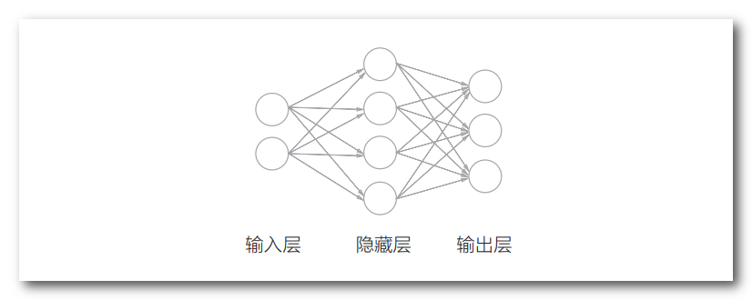
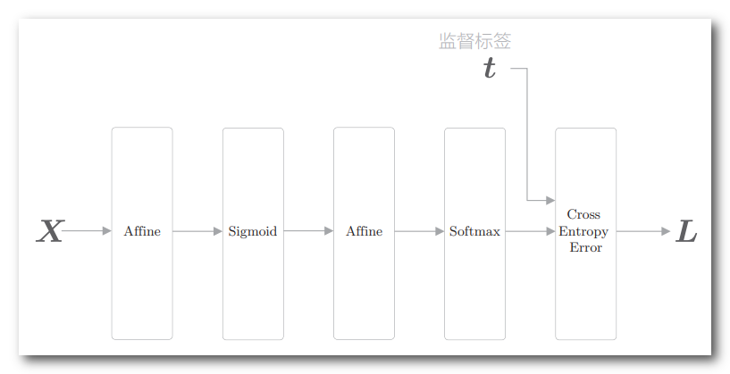
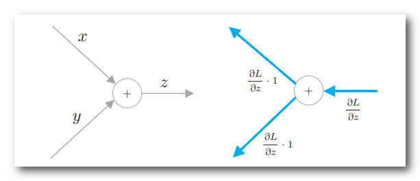
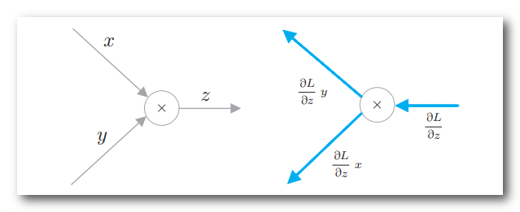
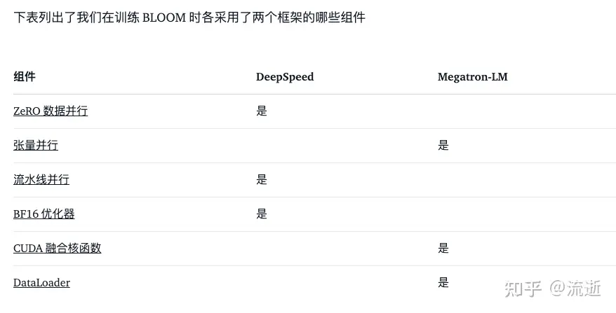

# 计算量 | 内存占用 | 并行计算 | Scaling Law 

> 参考资料:
>
> [A100/H100 太贵，何不用 4090？ - 知乎 (zhihu.com)](https://zhuanlan.zhihu.com/p/681841888)
>
> [现在LLM 的大小为什都设计成6/7B、13B和130B几个档次？](https://www.zhihu.com/question/627258986/answer/3262812950) 
>
> [分析transformer模型的参数量、计算量、中间激活、KV cache - 知乎 (zhihu.com)](https://zhuanlan.zhihu.com/p/624740065)

[TOC]

# 1 计算量

 ## 1.1 全连接神经网络

### 1.1.1 正向传播 

如图所示，这是一个双层(有权重的层是两层)全连接神经网络。

* 用 ⚪ 表示神经元，用箭头表示它们之间的连接。
* 在箭头上有权重，这个权重和对应神经元的值相乘，作为下一个神经元的输入。
* 此外，每个神经元还要加上一个不受前一层神经元影响的常数，这个常数称为偏置(bias)。

因为相邻两层神经元之间都存在由箭头表示的连接，所以这个网络被称为**全连接网络**。

我通常把神经元看作是Slot，有箭头的链接看作骨架，数据从一个Slot经过骨架滚动计算到另一个Slot填入，是一个前向的计算过程。

#### STEP 1 线性变换 - 矩阵乘法 

这里用 $(x_1，x_2)$ 表示输入层的数据，用 $w_{11}$ 和 $w_{21}$ 表示权重，用 $b_1$ 表示偏置。

这样一来，隐藏层的第 1 个神经元就可以如下进行计算(每个神经元均汇聚输入层数据的全部信息)：

$$
h_1 = x_1 w_{11} + x_2 w_{21} + b_1
$$

基于全连接层的变换可以通过矩阵乘法进行如下表示:

$$
\left(h_1, h_2, h_3, h_4\right)=\left(x_1, x_2\right)\left(\begin{array}{cccc}
w_{11} & w_{12} & w_{13} & w_{14} \\
w_{21} & w_{22} & w_{23} & w_{24}
\end{array}\right)+\left(b_1, b_2, b_3, b_4\right)
$$

可以简化为:

$$
\mathbf{h}=\mathbf{x}\mathbf{W}+\mathbf{b}
$$

其中，$\mathbf{h} \in \mathbb{R}^M$，$\mathbf{x} \in \mathbb{R}^N$，$\mathbf{W} \in \mathbb{R}^{N \times M}$，$\mathbf{b} \in \mathbb{R}^M$.

隐藏层共有 $M$ 个神经元，每个神经元的计算包含 $N$ 次乘法和 $N$ 次加法，其中 $N$ 为输入数据的维度 (当前示例中 $N=2，M=4$)。所以第一层的前向传播计算次数为 $2NM$ 次。

在这种情况下，如果我们有 $B$ 条数据同时输入，那么可以将输入矩阵表示为 $\mathbf{H}=\mathbf{XW}+\mathbf{b}$，其中 $\mathbf{X} \in \mathbb{R}^{B \times N}$，那么总共完成的计算次数为 $2BNM$​。

特例地，对应于Transformer，输入数据的特征维度 $N$ 和神经元个数 $M$ 通常都设置为隐藏层维度(Hidden Size) $H$，这时**每个Token的计算次数为 $2H^2$**，即包含 $H^2$ 次加法和 $H^2$ 次乘法。也就是说，如果序列长度(Sequence Length)设置为 $L$，那么经过一个全连接投影层时，总计算量为 $2LH^2$​ 次加乘运算。

同时， 我们可以看到参数量显然由输入和输出的维度决定， 在第一层前向传播中的参数量为 $P_1=NM_1$， 第二层为 $P_2=M_1M_2$， 所以对于多层神经网络来说， 其前向传播的计算量为 $2(NM_1+M_1M_2+...+M_{n-1}M_n)=2(P_1+P_2+...+P_n)=2P$， 即有结论， **前向线性变换的计算量为两倍的参数量**.

#### STEP 2 非线性变换 - 激活函数

全连接层的变换是线性变换。激活函数为其引入"非线性"效果。以 Sigmoid 函数为例:

$$
\sigma(x)=\frac{1}{1+\exp (-x)}
$$

这个函数对每个神经元的计算值进行一次非线性变换，计算次数只与神经元数 $M$ 有关，与输入维度 $N$ 无关。

相比于线性变换的矩阵乘法，这部分计算量通常可以忽略 ( 由于是仅关于 $M$ 的一次函数，阶数较低 )

>计算机中 计算 $\exp(x)$ 使用泰勒级数展开近似，假设使用前 10 项近似，则需要 10 次乘法和 9 次加法。
>
>输出神经元有 $n$ 个，所以分子部分共有 $9n$ 次加法和 $10n$ 次乘法。分母部分有求和符号，共有 $n-1$ 次加法。
>
>然后对于每个神经元，还有 1 次除法。所以 Softmax 函数的计算量近似为 $10n$ 次加法、$10n$ 次乘法和 $n$ 次除法。
>
>在实际的深度学习框架中，Sigmoid 函数通常使用高效的近似算法实现，如分段线性近似或查表法。

#### STEP 3 损失函数

在前向传播的最后一个阶段，我们需要计算损失(Loss)。

损失可以衡量模型输出与真实标签之间的差距，用于查看模型的训练情况，指导模型的迭代优化方向。

损失通常是一个标量值，计算神经网络的损失需要使用损失函数(Loss Function)。

进行多类别分类任务的神经网络通常使用交叉熵损失(Cross Entropy Loss)作为损失函数。

交叉熵损失由神经网络输出的各类别概率和监督标签(真实类别)计算得到。

Softmax 函数可以表示为:

$$
y_k=\frac{\exp \left(s_k\right)}{\sum_{i=1}^n \exp \left(s_i\right)}
$$

其中，$y_k$ 是当输出总共有 $n$ 个类别时，第 $k$ 个类别的 Softmax 函数输出。

如式所示，Softmax 函数的分子是第 $k$ 类的得分 $s_k$ 的指数函数，分母是所有类别得分的指数函数之和。由于仅在输出之前进行一次计算， 因此在较深的神经网络中， 这部分的计算量相比于线性变换的计算量可以忽略不计。

Softmax 函数输出的各元素取值范围在 0.0 到 1.0 之间。另外，如果将这些元素全部加起来，其和恰好为 1。因此，Softmax 的输出可以解释为一种概率分布。之后，这个概率分布会被输入到交叉熵损失函数中:

$$
L=-\sum_{k=1}^n t_k \log y_k
$$

其中，$t_k$ 是第 $k$ 个类别的真实标签(0或1)，$y_k$ 是第 $k$ 个类别的预测概率。交叉熵损失函数的输出是一个标量。

#### 小结

综上所述，该段落对神经网络前向传播过程中的计算量进行了详细分析，包括:

1. 一次线性变换(矩阵乘法)的计算量为 $2NM$ 或 $2BNM$，其中 $N$ 是输入维度，$M$ 是输出神经元个数，$B$ 是批次大小。
2. 非线性变换(激活函数)的计算量相对于线性变换可以忽略不计。
3. Softmax 函数和交叉熵损失函数的计算量也相对于线性变换可以忽略。
4. 多层神经网络前向线性变换的计算量和为(以参数量算) $2P$.

### 1.1.2 反向传播

假设有一个函数 $y = f(x)$。

此时，y 关于 x 的导数记为 $dy/dx$ 。这个 $dy/dx$ 的意思是变化程度，具体来说，就是 x 的微小（严格地讲，“微小”为 无限小）变化会导致 y 发生多大程度的变化. 

神经网络的学习目标是**找到一组参数，使得损失函数的值尽可能小**。

为了达到这个目标，我们需要**计算损失函数对于每个参数的导数或梯度**。

导数和梯度体现了**参数的微小变化对损失值的影响程度**，

因此，只要我得到了各个参数的梯度，我就知道参数的微小变化多大程度上影响了损失，这时候，我只需要反方向进行这些"微小变化"，我就能减小损失了，而减小损失等价于逼近真实答案. 

#### 1.1.2.1 链式法则

我们使用链式法则，来求解损失对参数的梯度.

设 $y=f(u)，u=g(x)$，那么根据链式法则，有:

$$
\frac{\mathrm{d} y}{\mathrm{d} x}=\frac{\mathrm{d} y}{\mathrm{d} u} \frac{\mathrm{d} u}{\mathrm{d} x}
$$

链式法则揭示了复合函数的导数计算方法。

假设 $y$ 是 $u$ 的函数，而 $u$ 又是 $x$ 的函数，即 $y$ 通过 $u$ 间接地依赖于 $x$，那么 $y$ 相对于 $x$ 的导数 $\frac{\mathrm{d} y}{\mathrm{d} x}$ 就等于 $y$ 相对于 $u$ 的导数 $\frac{\mathrm{d} y}{\mathrm{d} u}$ 乘以 $u$ 相对于 $x$ 的导数 $\frac{\mathrm{d} u}{\mathrm{d} x}$​。

这个法则让我们能够通过分解复杂的复合函数，逐层计算每个变量的导数，最终得到**损失函数对于神经网络中每个参数的导数。**

#### 1.1.2.2 计算图

计算图是一种直观地表示复合函数计算过程的方法。在计算图中，加法节点、乘法节点和矩阵乘法(MatMul)节点是三种最基本的运算节点。

##### ① 加法节点

对于加法节点，设 $z=x+y$，则有:

$$
\frac{\partial z}{\partial x}=1, \quad \frac{\partial z}{\partial y}=1
$$

这表明，当 $x$ 或 $y$ 发生微小变化时，$z$​ 会发生同样大小的变化。

##### ② 乘法节点

对于乘法节点，设 $z=xy$，则有:

$$
\frac{\partial z}{\partial x}=y, \quad \frac{\partial z}{\partial y}=x
$$

这意味着，当 $x$ 发生微小变化时，$z$ 的变化量等于 $y$ ; 当 $y$ 发生微小变化时，$z$ 的变化量等于 $x$​​。

##### ③ MatMul 节点

  

在这里我们明确一下，我们的目的是求各个参数的梯度来逆方向改变参数以减小损失，也是就是我们目的是要求解 $\frac{\partial L}{\partial W}$ .

求解参数的导数值，我们需要使用 $x$，这个 $x$ 是什么呢? 就是我们的前向传播的中间计算结果，也就是前向激活值.  

同时，我们的神经网络不止一层，我们需要继续反向传播求解其他层的参数梯度，因此我们也要根据 $W$ 来求解关于前向激活值的导数 $\frac{\partial L}{\partial x}$

而这个计算过程就需要使用 $W$，也就是参数值. 

#### 1.1.2.3 计算次数计算

我们以前面提到的两个输入四个神经元的例子为基础，分析反向传播过程中的计算次数。回顾一下，前向传播时隐藏层的计算可以表示为:

$$
\mathbf{h}=\mathbf{x}\mathbf{W}+\mathbf{b}
$$

其中 $\mathbf{h} \in \mathbb{R}^M，\mathbf{x} \in \mathbb{R}^N，\mathbf{W} \in \mathbb{R}^{N \times M}，\mathbf{b} \in \mathbb{R}^M$，$M=4，N=2$。 

现在，假设我们已经得到了损失函数 $L$ 关于 $\mathbf{h}$ 的梯度 $\mathrm{d}\mathbf{h} \in \mathbb{R}^M$。

根据链式法则和矩阵乘法节点的反向传播公式，可以计算损失函数关于 $\mathbf{W}$ 和 $\mathbf{x}$ 的梯度:
$$
\mathrm{d}\mathbf{W}=\mathbf{x}^T \mathrm{d}\mathbf{h}, \quad \mathrm{d}\mathbf{x}=\mathrm{d}\mathbf{h} \mathbf{W}^T
$$
其中 $\mathrm{d}\mathbf{W} \in \mathbb{R}^{N \times M}，\mathrm{d}\mathbf{x} \in \mathbb{R}^N$。 

首先，计算 $\mathrm{d}\mathbf{W}$ 需要将一个 $N$ 维行向量 $\mathbf{x}^T$ 乘以一个 $M$ 维列向量 $\mathrm{d}\mathbf{h}$，得到一个 $N \times M$ 的矩阵。

这个过程包含 $NM$ 次乘法和 $NM$ 次加法，共 $2NM$ 次浮点数运算。 

然后，计算 $\mathrm{d}\mathbf{x}$ 需要将一个 $M$ 维行向量 $\mathrm{d}\mathbf{h}$ 乘以一个 $M \times N$ 的矩阵 $\mathbf{W}^T$，得到一个 $N$ 维列向量。

这个过程同样包含 $NM$ 次乘法和 $NM$ 次加法，共 $2NM$ 次浮点数运算。 

因此，反向传播过程中，计算这一层神经元相关的所有梯度共需要 $4NM$​​ 次浮点数运算。

同样的，这一层的参数量为 $P=NM$ ，计算这一层神经元相关的所有梯度共需要 $4P$ 次浮点数运算

**( 从这里 $\mathrm{d}\mathbf{W}$ 等反向传播完毕用以进行参数的更新，$\mathrm{d}\mathbf{x}$ 继续向前进行反向传播)**

如果考虑批量大小为 $B$ 的情况，即 $\mathbf{X} \in \mathbb{R}^{B \times N}，\mathbf{H} \in \mathbb{R}^{B \times M}$，那么反向传播的计算次数为 $4BNM$，或 $4P$. 可见，批量大小同样是影响反向传播计算代价的一个重要因素。 

#### 小结

综上所述，反向传播的计算次数分析表明: 

1. 对于一个矩阵乘法节点，反向传播需要计算两个梯度项: $\mathrm{d}\mathbf{W}$ 和 $\mathrm{d}\mathbf{x}$，分别对应参数梯度和输入梯度。

   每一项的计算次数都与前向传播中矩阵乘法的计算次数同阶，为 $2NM$​。 

1. 我们目标是使用 $\mathrm{d}\mathbf{W}$ 来进行当前权重层的权重更新，我们同样需要 $\mathrm{d}\mathbf{x}$ 继续反向传播求其他层的权重梯度. 因此，反向传播的计算资源为 $4NM$

1. 这里的 $M$ 指当前神经元个数，这里的 $N$​ 指的是广义的输入层，即输入当前层上层的输出的维度.  NM 实际上为 一层全连接神经网络的参数量 $P$，反向传播的计算量即为 $4P$ 次计算.

综上，可得 : **全连接神经网络中前向传播和反向传播的需要的计算资源需要6倍参数量的基本计算(加法或乘法).** 

## 1.2 Transformer 

Transformers由多个Encoder层和Decoder层组成。Decoder 相当于一个简化的Encoder，重点分析Encoder层的计算复杂度。

Encoder层主要由两个子层构成: Multi-Head Attention 和 Feed Forward Neural Network。

### 1.2.1 Multi-Head Attention

Multi-Head Attention是Transformers的核心组件之一。它允许模型在不同的表示子空间中并行地计算Attention，从而捕捉输入序列中的不同方面的信息。

假设我们有 $N$ 个长度为 $L$ 的输入序列，每个序列的嵌入维度为 $D$，Multi-Head Attention的头数为 $H$，每个头的维度为 $D_H=D/H$​。

#### ① 线性变换

首先，我们需要对输入序列进行线性变换，以获得Query矩阵 $\mathbf{Q}$、Key矩阵 $\mathbf{K}$ 和Value矩阵 $\mathbf{V}$。这三个矩阵的维度都是 $N \times L \times D$。

线性变换的计算公式如下:

$$
\begin{aligned}
\mathbf{Q} &= \mathbf{X}\mathbf{W}^Q \\
\mathbf{K} &= \mathbf{X}\mathbf{W}^K \\
\mathbf{V} &= \mathbf{X}\mathbf{W}^V
\end{aligned}
$$

其中，$\mathbf{X} \in \mathbb{R}^{N \times L \times D}$ 是输入序列，$\mathbf{W}^Q，\mathbf{W}^K，\mathbf{W}^V \in \mathbb{R}^{D \times D}$ 是可学习的权重矩阵。

根据前面对全连接层计算复杂度的分析，

这三个线性变换的计算次数都是 $2NLD^2$。三个变换，总的计算次数为 $6NLD^2$。

#### ② Scaled Dot-Product Attention

接下来，我们需要计算Scaled Dot-Product Attention。

对于每个头，我们首先将 $\mathbf{Q}$，$\mathbf{K}$，$\mathbf{V}$ 划分为 $H$ 个子矩阵，每个子矩阵的维度为 $ N \times L \times D_H$。然后，对于每个头，我们计算如下的Attention:
$$
\operatorname{Attention}(\mathbf{Q}_h, \mathbf{K}_h, \mathbf{V}_h) = \operatorname{softmax}\left(\frac{\mathbf{Q}_h\mathbf{K}_h^T}{\sqrt{D_H}}\right)\mathbf{V}_h
$$

其中，$\mathbf{Q}_h，\mathbf{K}_h，\mathbf{V}_h \in \mathbb{R}^{N \times L \times D_H}$ 是第 $h$ 个头对应的 Query、Key和Value 矩阵。

这个过程可以分为三个步骤: 

1. 计算 $\mathbf{Q}_h\mathbf{K}_h^T$。这需要 $2NL^2D_H$ 加乘运算 (同全连接层的前向传播计算)
2. 对结果除以 $\sqrt{D_H}$ 并应用 $\operatorname{softmax}$ 函数。这部分的计算量同样的相比于矩阵乘法可以忽略。
3. 将 $\operatorname{softmax}$ 的结果与 $\mathbf{V}_h$ 相乘。这需要 $2NL^2D_H$ 次加乘运算

将这三个步骤的计算次数相加，得到计算一个头的 Attention 需要约 $4NL^2D_H$ 次加乘运算 

所有头的Attention需要约 $4NL^2D$ 次 加乘运算. 

#### ③ 线性变换

最后，我们需要将 $H$ 个头的Attention结果拼接起来，并应用另一个线性变换:

$$
\mathbf{H} = \operatorname{Concat}(\operatorname{head}_1, \ldots, \operatorname{head}_H)\mathbf{W}^O
$$

其中，$\mathbf{W}^O \in \mathbb{R}^{D \times D}$ 是可学习的权重矩阵。

拼接操作不需要浮点数运算。线性变换需要 $2LND^2$ 次浮点数运算。

综上所述，Multi-Head Attention的总计算次数为:

$$
6LND^2 +2LND^2 + 4NL^2D = 8NLD^2 + 4NL^2D
$$

### 1.2.2 Feed Forward Neural Network

Feed Forward Neural Network (FFN) 是Transformers Encoder层的第二个子层。它由两个全连接层组成，中间有一个非线性激活函数(通常是ReLU)。

假设FFN的隐藏层维度为 $D_{FF}$。那么，FFN的计算公式为:

$$
\operatorname{FFN}(\mathbf{X}) = \operatorname{ReLU}(\mathbf{X}\mathbf{W}_1 + \mathbf{b}_1)\mathbf{W}_2 + \mathbf{b}_2
$$

其中，$\mathbf{X} \in \mathbb{R}^{N \times L \times D}$ 是输入序列，$\mathbf{W}_1 \in \mathbb{R}^{D \times D_{FF}}，\mathbf{b}_1 \in \mathbb{R}^{D_{FF}}$ 是第一个全连接层的权重和偏置，$\mathbf{W}_2 \in \mathbb{R}^{D_{FF} \times D}，\mathbf{b}_2 \in \mathbb{R}^D$ 是第二个全连接层的权重和偏置。

根据前面对全连接层计算复杂度的分析，第一个全连接层的计算次数为 $2NLD \cdot D_{FF}$，第二个全连接层的计算次数为 $2NLD_{FF} \cdot D$。

ReLU激活函数的计算次数相对于全连接层可以忽略不计。

因此，FFN的总计算次数为:

$$
2LND \cdot D_{FF} + 2LND_{FF} \cdot D = 4LND \cdot D_{FF}
$$

BERT 的 $D_{FF}$ = 4 D ，

故 FFN 的计算次数可以 算为
$$
16NLD^2
$$

### 1.2.3 Encoder层的总计算次数

将Multi-Head Attention和FFN的计算次数相加，得到一个Encoder层的总计算次数:

$$
8NLD^2 + 4NL^2D + 16NLD^2
$$

如果Transformers有 $E$ 个Encoder层，那么所有Encoder层的总计算次数为:

$$
E(24NLD^2+4NL^2D)
$$

从这个公式可以看出，Transformers Encoder 的计算复杂度主要取决于: 

1. 序列长度 $L$
2. 隐藏层维度 $D$
3. Batch $N$ 
4. Encoder 层 个数 $E$

### 1.2.4 logits 层计算 

logits是指模型输出层之前的未归一化的分数或预测值。更具体地说: 语言模型试图预测下一个单词的概率分布。假设词汇表大小为V，模型需要输出一个长度为V的向量，向量中每个元素对应一个词，表示该词被预测为下一个词的可能性有多大。

这个长度为V的向量通常是通过一个线性层和激活函数(如softmax)得到的。在应用softmax激活函数之前，线性层的输出就是未归一化的原始分数，称为logits。

而这个线性层的计算，计算量同样不可忽略. 

我们假设词表大小为 $V$ ，矩阵乘法(线性变换)的输入输出分别为 $NLD$ 和 $DV$  ，则这部分的计算量为 $2NLDV$

## 1.3 LLM 计算量的讨论

综上所述，LLM 的计算量为
$$
E(24NLD^2+4NL^2D) +2NLDV
$$
当隐藏维度 $D$ 比较大，且远大于序列长度 $L$ 时，我们可以忽略一次项，这时，计算量可以近似为 $E(24NLD^2)$​ . 

这里的计算相当于我们只考虑线性层计算，回忆下前面说的全连接神经网络，序列长度 $L$ 对应 $L$ 个 Tokens. 

这时我们可以将计算量近似估计为每个Token的6倍参数量(一个Epoch)。

这个估计考虑了前向传播和反向传播的计算量，以及每次计算所涉及的乘法和加法操作。

因此，我们可以给出LLM训练计算量的一个粗略估计公式:

$$
\text{LLM训练计算量} \approx 6 \times \text{模型的参数量} \times \text{训练数据的Token数}
$$

> 
> $$
> 6 \times 174600 \times 10^6 \times 300 \times 10^9=3.1428 \times 10^{23} \text { flops }
> $$

## 1.4 LLM 训练时间的讨论

计算计算端到端训练的GPU利用率时，不仅要考虑前向传递和后向传递的计算时间，要考虑 **CPU加载数据**、**优化器更新**、**多卡通信和记录日志** 的时间，一般来讲，**GPU利用率一般在 0.3∼0.55 之间**。

**在给定训练tokens数、硬件环境配置的情况下，训练transformer模型的计算时间为**：
$$
\text { 训练时间 } \approx \frac{6 \times \text { tokens数 } \times \text { 模型参数量 }}{G P U \text { 数 } \times G P U \text { 峰值 } f l o p s \times G P U \text { 利用率 }}
$$
通常情况下，为了节省显存占用，我们会使用一种 激活检查点 的方法，这种方法需要我们一次迭代中进行两次的前向传播，故训练时间为
$$
\text { 训练时间 } \approx \frac{8 \times \text { tokens数 } \times \text { 模型参数量 }}{G P U \text { 数 } \times G P U \text { 峰值 } f l o p s \times G P U \text { 利用率 }}
$$

> 以GPT3-175B为例，在1024张40GB显存的A100上，在300B tokens的数据上训练175B参数量的GPT3。
>
> 40GB显存A100的峰值性能为312TFLOPS，设GPU利用率为0.45，
>
> 则**所需要的训练时间为34天，这与 [paper](Narayanan D，Shoeybi M，Casper J，et al. Efficient large-scale language model training on gpu clusters using megatron-lm[C]//Proceedings of the International Conference for High Performance Computing，Networking，Storage and Analysis. 2021: 1-15.) 中的训练时间是对得上的**。

## 1.5 Transformers math 101

[Transformer Math 101 | EleutherAI Blog](https://blog.eleuther.ai/transformer-math/)

The basic equation giving the cost to train a transformer model is given by:
$$
C \approx\tau T=6 P D 
$$
where:

* $C$ is the compute required to train the transformer model，in total floating point operations · $C=C_{\mathrm{f o r w a r d}}+C_{\mathrm{b a c k w a r d}}$ 
* $C_{\mathrm{f o r w a r d}} \approx2 P D$ 
* $C_{\mathrm{b a c k w a r d}} \approx4 P D$ 
* $\tau$ is the aggregate throughput of your hardware setup $( \tau=( \mathrm{N o. ~ G P U s} ) \times( \mathrm{A c t u a l ~ F L O P s} / \mathrm{G P U} )$ )，in FLOPs
* $T$ is the time spent training the model，in seconds
* $P$ is the number of parameters in the transformer model
* $D$ is the dataset size，in tokens

### ① 数据集 v.s. 参数量

* 对于大多数应用场景，应该**首先确定推理成本，然后在此成本下训练尽可能大的模型，然后为这个模型使用尽可能多的数据**. 

* 为了目标是最大化性能同时最小化训练模型的GPU-小时成本，即训练"计算最优"的语言模型，那么可以使用下述公式: 
  $$
   D=20P
  $$
  这能使如1000 GPU每小时与1 GPU每1000小时成本近似相同，(考虑GPU之间的通信)

* 不建议训练低于**200B tokens** 的大型语言模型(LLM)，因为虽然对许多模型来说这是"计算最优",但生成的模型通常质量很差。

### ② 计算量工程考虑

1. Transformers 的计算成本通常以 GPU 小时或 FLOP 秒来衡量。

2. GPT-NeoX 模型在 A100 GPU 上,使用普通注意力机制可达 150 TFLOP/s，使用 Flash Attention 可达180 TFLOP/s。

   这与其他大规模高度优化库的性能水平相当,如 Megatron-DS 在 A100 上可达 137-163 TFLOP/s。

   **这个数值 大概在A100计算量峰值的50%左右**

3. 一个经验法则是,在 A100 GPU 上,你通常应该能够达到大约 120 TFLOP/s 的性能水平。**(最高计算量的38%)** 

   如果低于 115 TFLOP/s,可能就有什么地方出了问题,要检查模型或硬件配置。

4. 使用高质量互连网络(如 InfiniBand)时，可以在数据并行维度上实现线性或亚线性扩展

   (即增加数据并行度,整体吞吐量几乎可以线性增加)。

# 2 内存占用

## 2.1 Transformers based 模型参数量

**以 GPT - 3 为例**

首先，GPT-3采用了Transformer的架构，其主要组成部分是多个Transformer Blocks(变换器块)。

假设 Transformer Blocks的数量为 $N$​，每个Block内部包含一个 Multi-head Self-attention 层和一个 Feed forward 层。

### **① Self-attention 层**

在Self-attention层中，主要的参数来自三个线性变换矩阵$\mathbf{Q}$，$\mathbf{K}$和$\mathbf{V}$，以及Attention计算完成后经过的投影层. 

设词嵌入维度为$d_{model}$，头的数量为$n_{head}$，则每个头的维度为$d_k=d_{model}/n_{head}$。三个变换矩阵的维度分别为 $d_{model} \times d_k$，$d_{model} \times d_k$ 和 $d_{model} \times d_k$。

有: 
$$
\begin{aligned}
 n_{self-attn} &= N \times \Big[3 \times (d_{model} \times d_k) \times n_{head} \Big] \\
              &= 3 \times N \times d_{model}^2
\end{aligned}
$$
加上最后经过的投影层维度: 
$$
N\times d_{model}^2
$$
共有参数量
$$
4 \times N \times d_{model}^2
$$

### ② Feed forward 层

接下来是Feed forward层，它由两个线性变换和一个非线性激活函数组成。

设隐藏层维度为$d_{ff}$，则两个线性变换的参数量分别为$d_{model} \times d_{ff}$和$d_{ff} \times d_{model}$。Feed forward层的参数量为:
$$
n_{ff} = N \times \Big[2 \times (d_{model} \times d_{ff}) \Big] = 2 \times N \times d_{model} \times d_{ff}
$$
我们取经典参数 隐藏层维度 = 4 ，这部分的参数量为
$$
n_{ff} = 8 \times N \times d_{model}^2
$$

### ③ 词嵌入矩阵

除了Transformer部分，词嵌入矩阵也贡献了大量参数。设词表大小为$|V|$，词嵌入维度为$d_{model}$，则词嵌入矩阵的参数量为:
$$
n_{embed} = |V| \times d_{model}
$$
最后，输出层是一个$d_{model} \times |V|$的矩阵，参数量为:

$$
n_{output} = d_{model} \times |V|
$$
综上所述，GPT-3的总参数量为 ( LN 层 以及 Positional Embedding 层占比很小)
$$
\begin{aligned}
n_{total} &= n_{self-attn} + n_{ff} + n_{embed} + n_{output} \\
          &= 12 \times N \times d_{model}^2 + 2|V|d_{model}
\end{aligned}
$$
> 以GPT-3的超参数为例，词表大小$|V|$=50257 ，最大序列长度 $n_{ctx}$=2048，层数$N$=96，词嵌入维度$d_{model}$=12288，隐藏层维度$d_{ff}$= 4 × d_model，头数$n_{head}$=96。
>
> 将这些值代入上式，可以计算出:
> $$
> \begin{aligned}
> n_{total} &= 12   ×   96   ×   12288   ×   12288   +   2   ×   50257   ×   12288 = 175,181,291,520 ≈175B
> \end{aligned}
> $$
>

## 2.2 显存占用

### 2.2.1 显存占用

大型语言模型(LLM)的训练是一个计算资源密集型的过程，需要大量的GPU内存。

在训练过程中，GPU内存的占用主要包括以下几个部分:

1. **模型参数存储:** 

   模型参数是指**模型中的权重和偏置等可学习的变量**。

   对于一个有$N$个参数的模型，假设使用$P$位精度存储每个参数，则模型参数存储占用的内存为 $M_p=N\times P/8$ 字节。

   例如，一个有130亿个参数的模型，如果使用32位浮点数(FP32)存储，则模型参数占用内存为$M_p=13\times10^9\times32/8=52$ GB。

2. **梯度存储:**

   在反向传播过程中，需要计算每个参数的梯度。

   梯度的存储通常与参数的存储精度相同。因此，梯度存储占用的内存也为$M_g=N\times P/8$​ 字节。

   同样的，这部分参数内存占用也为 $52GB$

3. **优化器状态存储:**

   优化器(如Adam)需要为每个参数维护一些状态变量，如一阶动量和二阶动量的估计值。

   假设优化器为每个参数维护$S$个状态变量，每个状态变量使用$P$位精度存储，则优化器状态存储占用的内存为 $M_o=S\times N\times P/8$ 字节。

   以Adam优化器为例，它为每个参数维护2个状态变量(一阶动量和二阶动量的估计值)，因此 $S=2$​。

   那么这部分的参数占用就为，$104GB$ 

4. **激活值存储:** 

   在前向传播过程中，每一层的输出(激活值)需要保存在内存中，以备反向传播时使用。

   设模型有$L$层，每层的输出张量形状为$[B，D_l]$，其中$B$为批大小，$D_l$为第$l$层的输出维度。

   假设激活值使用$P$位精度存储，则激活值占用的内存为 $M_a=B\times\sum_{l=1}^{L}D_l\times P/8$ 字节。

> **数据批次存储: 数据批次存储的占用量与模型参数量没有关系，这部分的占用几乎可以忽略不计**
>
> 在训练过程中，每个数据批次需要存储在GPU内存中。
>
> 设数据批次的形状为$[B，D_{in}]$，其中$D_{in}$为输入数据的维度。
>
> 假设数据批次使用$P$位精度存储，则数据批次占用的内存为 $M_d=B\times D_{in}\times P/8$ 字节。

而在推理过程中，没有优化器状态和梯度，也不需要保存中间激活。**少了梯度、优化器状态、中间激活，模型推理阶段占用的显存要远小于训练阶段**。模型推理阶段，占用显存的大头主要是模型参数，如果使用float16来进行推理，**推理阶段模型参数占用的显存大概是** 2倍参数量的 bytes

如果使用KV cache来加速推理过程，**KV cache也需要占用显存**，大约是模型参数显存的0.5倍。

此外，输入数据也需要放到GPU上，还有一些中间结果（推理过程中的中间结果用完会尽快释放掉），不过这部分占用的显存是很小的，可以忽略。

### 2.2.2 显存优化策略

优化显存占用的方法包括:

① **混合精度训练:**

**在训练过程中，使用FP16存储模型参数和激活值，使用FP32存储优化器状态和梯度**。

这样可以在保证训练稳定性的同时减少显存占用。激活值为显存占用的大头. 

② **梯度累加:**

将多个小批次的梯度累加起来，然后再进行一次参数更新。这样可以增大有效的批大小，来减少显存占用. 

即同Batch Size下，梯度累加策略显存占用更小. 

③ **激活值检查点:**

在前向传播过程中，只保存部分层的激活值(检查点)，其他层的激活值在反向传播时重新计算。

这样可以减少激活值的显存占用，但会增加计算量。

#### ① 混合精度训练 

 

为了节省显存(前向激活存储值), 模型常使用混合精度训练 (AMP), 混合精度训练是一种结合了 float32 和 float16 两种数据类型的训练方法，旨在最大限度地提高 GPU 张量核心的吞吐量，以加速训练过程, 同时**保持收敛性**. 

1) fp32 训练很稳定，但内存开销大，而且无法利用英伟达™（NVIDIA®）GPU 张量内核；
2) fp16 训练很稳定，但难以收敛。

##### 1 混合精度训练流程

**STEP 1 模型初始化:**

- 将模型的参数初始化为 float32 类型。
- 创建 float32 类型的优化器状态 (如动量、梯度平方和等)。

**STEP 2 训练循环:**

对于每个训练迭代，执行以下步骤:

a. 前向传播:
   - 将 float32 类型的模型参数转换为 float16 类型。
   - 以 float16 精度执行前向传播，计算模型的输出(Activation)和损失函数。
   - 将 前向传播过程中的 Activations 以 float16 精度存储，以节省显存。

b. 反向传播:
   - 以 float16 精度计算损失函数关于模型输出的梯度。
   - 执行梯度缩放 (Gradient Scaling)，将损失函数的梯度乘以一个比例因子(如1024)，以避免 float16 梯度的下溢问题。
   - 以 float16 精度执行反向传播，计算模型参数的梯度。

c. 梯度优化:
   - 将 float16 类型的模型梯度转换为 float32 类型。
   - 对 float32 类型的模型梯度应用梯度缩放的反向操作，将其除以之前的比例因子。
   - 使用优化器 (如Adam)以 float32 精度更新模型参数，同时更新优化器状态。
   - 将更新后的 float32 类型的模型参数保存，用于下一次迭代的前向传播。

**STEP 3 : 模型保存和推理:**

- 将训练完成的模型参数以 float32 精度保存，以确保模型的通用性和兼容性。
- 在推理阶段，可以根据需求选择使用 float32 或 float16 精度进行预测。

##### 2 混合精度训练优势

1. 加速计算:
   - 现代的 GPU 和深度学习加速器(如 NVIDIA Tensor Cores)对 float16 精度的计算有专门的优化。
   - 使用 float16 进行前向传播和反向传播可以显著加速计算，通常可以提高 2-3 倍的训练速度。
   - 虽然混合精度训练需要额外的精度转换开销，但整体上仍然能够显著加速训练过程。
2. 节省显存:
   - float16 精度的数据占用的内存只有 float32 的一半。
   - 虽然混合精度训练需要同时存储两种精度的参数和梯度，但相比于直接使用 float32，仍然能够节省显存。因为这里节省的是 **激活值** 的显存占用
   - 节省的显存可以用于训练更大的模型或使用更大的批次大小(batch size)，从而进一步提高训练效率。

#### ② 激活值检查点

在标准的反向传播算法中，我们需要在前向传播过程中存储每一层的激活值，以便在反向传播时计算梯度。然而，对于深层网络，存储所有层的激活值会消耗大量的显存资源。激活值检查点技术通过折衷计算时间和显存占用，有效地缓解了这个问题。

激活值检查点的核心思想是: 在前向传播过程中，只存储部分层的激活值，而不是存储所有层的激活值。在反向传播过程中，当需要计算某一层的梯度时，如果该层的激活值没有被存储，我们可以重新计算该层以及之前层的前向传播，以获得所需的激活值。

激活值检查点的流程如下:

1. 前向传播:
   - 在前向传播过程中，根据预先定义的检查点策略，选择性地存储某些层的激活值。
   - 对于未被选为检查点的层，其激活值在计算完后向传播所需的梯度后即可丢弃，以节省显存。

2. 反向传播:
   - 在反向传播过程中，按照相反的顺序遍历神经网络的层。
   - 对于每一层，检查其激活值是否已经存储:
     - 如果该层的激活值已经存储(即为检查点)，则直接使用存储的激活值计算梯度。
     - 如果该层的激活值未被存储，则需要重新计算该层以及之前层的前向传播，以获得所需的激活值。
   - 计算当前层的梯度，并将其传递到前一层。
   - 重复上述过程，直到到达神经网络的第一层。

3. 检查点策略:
   - 激活值检查点的关键在于选择合适的检查点策略，即决定哪些层的激活值应该被存储。
   - 常见的检查点策略包括:
     - 每隔固定数量的层设置一个检查点。
     - 在计算复杂度较高的层(如卷积层)设置检查点。
     - 根据网络的拓扑结构和依赖关系动态选择检查点。
   - 选择合适的检查点策略可以在显存占用和计算时间之间取得平衡，并根据具体的任务和资源限制进行调整。

激活值检查点技术可以显著减少深度学习模型训练过程中的显存占用，使得在有限的硬件资源下训练更大、更深的神经网络成为可能。然而，这种技术也引入了额外的计算开销，因为某些层的前向传播可能需要重复计算。因此，在实践中，需要根据具体的任务、模型架构和硬件条件，权衡激活值检查点带来的显存节省和计算时间增加，以选择最优的策略。

许多深度学习框架，如 PyTorch 和 TensorFlow，都提供了激活值检查点的实现和 API，使得开发者能够方便地应用这一技术，以更高效地训练大型神经网络模型。

> 在 LLM 训练中，现代 GPU 的瓶颈通常是内存，而不是 FLOP。
>
> 因此，激活重新计算/检查点 是一种非常流行的方法，可以用降低内存成本来换取额外的计算成本。
>
> 激活重计算/检查点法的工作原理是重新计算某些层的激活，而不是将其存储在 GPU 内存中。内存的减少取决于我们在决定清除哪些层时的选择性，但 Megatron 的选择性重新计算方案如下图所示：
>
> 
>
> 其中，红色虚线表示 A100-80GB GPU 的内存容量，"目前工作 "表示应用选择性激活重计算后的内存需求。
>
> The basic equation giving the memory required to store activations for a transformer model is given by
>
> ① 不激活检查点:  $s b h L ( 1 0+\frac{2 4} {t}+5 \frac{a \cdot s} {h \cdot t} )$​ bytes
>
> ② 激活部分检查点:  $s b h L ( 1 0+\frac{2 4} {t} )$ bytes
>
> ③ 重新计算所有: $2 · sbhL $​ bytes (只需要保存每层的)
>
> where:
>
> * $s$ is the sequence length, in tokens
> * $b$ is the batch size per GPU
> * $h$ is the dimension of the hidden size within each transformer layer
> * $L$ is the number of layers in the transformer model
> * $a$ is the number of attention heads in the transformer model
> * $t$ is the degree of tensor parallelism being used (1 if not)
> * We assume no sequence parallelism is being used
> * We assume that activations are stored in fp16
>
> 所需的额外重新计算量也取决于方法的选择性，但它以一个完整的额外前向通程为界。因此，前向遍历的更新计算成本为
> $$
> 2 P D \leq C_{\mathrm{f o r w a r d}} \leq4 P D
> $$
>

### 2.2.3 优化后显存占用

#### ① 模型参数 反向梯度 优化器状态 

使用 AMP 参数计算. 

假设模型共有 $P$ 参数量

① 模型使用 fp32 进行参数存储1 , 优化器使用AdamW, 两个优化器变量(一阶动量和二阶动量)维护一个参数. 这两个变量也是fp32的. 

* 这部分共有 $12P$ Bytes 参数量 ( fp32 模型参数 + fp 32 一阶动量 + fp 32 二阶动量 )

② 梯度求解过程, fp32模型参数 量化 fp16 参数副本, 前向传播,  反向传播得到fp16模型梯度

* 这部分共有 $4P$ Bytes 参数量 ( fp16 参数副本 + fp16 参数梯度 )

③ 参数更新过程, fp16模型梯度, 转换为fp32模型梯度, 优化器使用fp32 模型参数, 梯度, 及优化器变量1进行参数更新

* 这部分共有 $4P$ Bytes 参数量 (fp32 参数梯度 )

因此 对每一个可训练的参数，占用了 
$$
(2+4)+(2+4)+(4+4)=20 bytes
$$

> 如果不使用AMP混合精度训练, 参数占用为 fp32 模型参数 + fp 32 一阶动量 + fp 32 二阶动量 + fp 32 参数梯度 共有 $16P$ bytes 的占用. 这里变为 $20P$ , 扩大了参数的占用而减小了前向传播过程中 前向激活值的显存占用. 

#### ② 激活值

这里的激活（activations）指的是：**前向传递过程中计算得到的，并在后向传递过程中需要用到的所有张量. **这里的激活不包含模型参数和优化器状态，但包含了dropout操作需要用到的mask矩阵。同时，使用混合精度训练的时候，中间激活一般占用 2 个 bytes

在分析中间激活的显存占用时，只考虑激活占用显存的大头，忽略掉一些小的buffers。

对于 layer normalization，计算梯度时需要用到层的输入、输入的均值 $μ$ 和方差 $σ^2$ 。输入包含了 $NLD$ 个元素，而输入的均值和方差分别包含了 $NL$ 个元素。由于 ℎ 通常是比较大的（千数量级）。因此，对于layer normalization，中间激活近似估计为 $NLD$

##### 1 Self-Attention 激活值计算

self-attention块的计算公式如下
$$
\begin{aligned}
&Q=x W_Q, K=x W_K, V=x W_V\\
&x_{\text {out }}=\operatorname{softmax}\left(\frac{Q K^T}{\sqrt{h}}\right) \cdot V \cdot W_o+x
\end{aligned}
$$

1. 对于 Q K V 需要保存他们的共同的输入 $x$ ，这就是中间激活. (请回想一下，我们需要计算$W$的梯度，偏导数的一个因子是 $x$ ) . 

   $x$ 的形状为 $NLD$ ，显存占用就为 $2NLD$

2. softmax操作需要保存其输入 $QK^T/\sqrt{h}$，形状为 $NLL$，占用显存 $2NLL$​​。

3. 计算完 softmax 函数后，会进行dropout操作。需要保存一个mask矩阵，mask矩阵的形状与QK^T相同，占用显存大小为 NLL

4. 计算 V 的attention ，即 Score × V ，Score 显存占用为 $2NLL$​ ，score 的维度. 

5. 上述 234 步 使用的显存是一个头的，总共有 $5NLLa$ 的显存占用

6. $Q$，$K$，$V$ 三个矩阵各自的形状是 $NLh$ ($h$是attention head的数量)，因此它们一共占用 $6NLh=6NLD$ 的显存 

7. 计算输出映射以及一个dropout操作。输入映射需要保存其输入，大小为 $2NLD $ ；dropout需要保存mask矩阵，大小为 $NLD$ 。

   二者占用显存大小合计为 $3NLD$​​。

共计约 
$$
11NLD + 5NLLa
$$

##### 2 MLP 层中间激活

$$
x=f_{\text {gelu }}\left(x_{\text {out }} W_1\right) W_2+x_{\text {out }}
$$

1. 第一个线性层需要保存其输入，占用显存大小为 $2NLD$ 。
2. 激活函数需要保存其输入，占用显存大小为 $8NLD$ 。$8=2×4$
3. 第二个线性层需要保存其输入，占用显存大小为 $8NLD$ 。
4. 最后有一个dropout操作，需要保存mask矩阵，占用显存大小为 $NLD$ 。

对于MLP块，需要保存的中间激活值为 $19NLD$

##### 3 其他 LN 层

self-attention块和MLP块分别对应了一个layer normalization。每个layer norm需要保存其输入，大小为 $2NLD$，2个layer norm需要保存的中间激活为 $4NLD$​

综上，每个 Encoder 层/ decoder层 需要保存的激活值大小可近似为 $34NLD+5NLLa$ 

也就是说，与 分头数量 隐藏层维度 以及输入长度 以及 Batchsize 有关

> ### 另一种计算方法 (估算)
>
> 对于GPT-3模型，每个Decoder层包括两个子层:Self-Attention层和前馈神经网络(Feed-Forward Network，FFN)层。
>
> 每个子层都会产生前向激活，需要存储在显存中。
>
> 设批次大小为$B$，序列长度为$L$，隐藏层维度为$H$，Decoder层数为$N_d$，每个激活值使用$P$位精度存储。
>
> **① Self-Attention层:**
>
>  在Self-Attention层中，对于每个头(head)，都需要计算三个投影矩阵:
>
>  - 查询矩阵(Query matrix) $Q$
>  - 键矩阵(Key matrix) $K$
>  - 值矩阵(Value matrix) $V$
>
>  设Self-Attention层的头数为$N_h$，每个头的维度为$H_h=H/N_h$。
>
>  1. 投影矩阵的计算:
>     对于每个头，投影矩阵的形状为$[B，L，H_h]$。因此，所有投影矩阵的总激活显存占用为:
>
>     $M_{proj} = 3 \times N_h \times B \times L \times H_h \times P/8$
>
>     $= 3 \times B \times L \times H \times P/8$
>
>
>  2. Self-Attention的输出:
>
>     Self-Attention的输出是所有头的输出拼接后的结果，形状为$[B，L，H]$​。因此，Self-Attention输出的激活显存占用为:
>
>     $M_{sa\_out} = B \times L \times H \times P/8$
>
>  综上，Self-Attention层的前向激活显存占用为:
> $$
>  M_{sa} = 4 ×B \times L \times H \times P/8
> $$
>
> **② FFN层:**
>
>  FFN层包括两个线性变换和一个激活函数。设FFN层的隐藏层维度为$H_{ffn}$​，则FFN层的前向激活显存占用为:
>
>  $M_{ffn} = B \times L \times H_{ffn} \times P/8$
>
>  通常，为了加速计算和减少显存占用，可以在计算完第一个线性变换的输出后，立即计算激活函数并再次计算第二个线性变换，而不需要存储第一个线性变换的输出。
>
>  因此，FFN层的前向激活显存占用可以近似为:
>
>  $M_{ffn} \approx B \times L \times H \times P/8$
>
> 综上，每个Decoder层的前向激活显存占用为:
>
> $M_{d} = M_{sa} + M_{ffn} \approx 5 \times B \times L \times H \times P/8$
>
> 总的Decoder部分的前向激活显存占用为:
>
> $M_{total} = N_d \times M_{d} \approx 5 \times N_d \times B \times L \times H \times P/8$
>
> 以GPT-3的175B参数模型为例，其中:
>
> - 批次大小$B=1$
> - 序列长度$L=2048$
> - 隐藏层维度$H=12288$
> - Decoder层数$N_d=96$
> - 激活值精度$P=16$ (FP16)
>
> 则GPT-3的Decoder部分的前向激活显存占用约为:
>
> $M_{total} \approx 5 \times 96 \times 1 \times 2048 \times 12288 \times 16/8$
>
> $\approx 240$ GB
>
> 
>
> 可以看出，即使对于批次大小为1的情况，GPT-3的前向激活显存占用也非常巨大。
>
> 这也是为什么训练和推理GPT-3等大型语言模型需要使用高端的GPU或TPU，并采用各种显存优化技术(如激活值检查点、混合精度训练等)的原因。

### 2.2.4 中间激活 v.s. 模型参数

在一次训练迭代中，模型参数（或梯度）占用的显存大小只与模型参数量和参数数据类型有关，与输入数据的大小是没有关系的。

优化器状态占用的显存大小也是一样，与优化器类型有关，与模型参数量有关，但与输入数据的大小无关。

> 以GPT3-175B为例，我们来直观地对比下模型参数与中间激活的显存大小。GPT3的模型配置如下。我们假设采用混合精度训练，模型参数和中间激活都采用float16数据类型，每个元素占2个bytes。
>
> | 模型名 | 参数量 | 层数 | 隐藏维度 | 注意力头数 |
> | ------ | ------ | ---- | -------- | ---------- |
> | GPT3   | 175B   | 96   | 12288    | 96         |
>
> GPT3的模型参数量为175B，占用的显存大小为 350 GB 。GPT3模型需要占用350GB的显存。序列长度 s 为 2048 
>
> 当 $N=1$ 时，中间激活占用显存为
> $\left(34NLD + 5NLLa\right) * l=275，414，777，856 b y t e s \approx 275 G B$ ，大约是模型参数显存的 0.79 倍。
>
> 当 $N=64$ 时，中间激活占用显存为
> $\left(34NLD + 5NLLa\right) * l=17，626，545，782，784 b y t e s \approx 17.6 T B$ ，大约是模型参数显存的 50倍。
>
> 当 $N=128$ 时，中间激活占用显存为
> $\left(34NLD + 5NLLa\right) * l=35，253，091，565，568 b y t e s \approx 35.3 T B$ ，大约是模型参数显存的 101倍。
>
> 可以看到随着批次大小的增大，中间激活占用的显存远远超过了模型参数显存。通常会采用**激活重计算**技术来减少中间激活，理论上可以将中间激活显存从代价是增加了一次额外前向计算的时间，本质上是“时间换空间”。

## 2.3 LLM 显存占用量

### 2.3.1 训练阶段

在训练大语言模型时，模型的显存占用主要由以下几个部分组成:模型参数、梯度、优化器状态和激活值。

其中，优化器状态通常占据了最大的显存空间。

对于一个具有$N$个参数的大语言模型，其训练过程中的显存占用量可以估算如下:

* 模型参数存储(使用16位浮点数): $2 \times N$ 字节
* 模型参数存储(使用32位浮点数): $4 \times N$ 字节
* 模型梯度存储(使用16位浮点数): $2 \times N$​ 字节
* 模型梯度存储(使用32位浮点数): $4 \times N$ 字节
* 优化器状态存储(使用32位浮点数，以Adam优化器为例): $2 \times 4 \times N$ 字节

综上，模型参数、梯度和优化器状态的总存储量约为: $20 \times N$ 字节

* 激活值存储(使用16位浮点数): $2 \times 5 \times B \times L \times H$ 字节
  * $B$表示批次大小(Batch Size)
  * $L$表示Decoder层的数量
  * $H$表示隐藏层的维度(Hidden Size)

### 2.3.2 推理阶段

在推理阶段，大语言模型的显存占用主要由模型参数组成:

* 模型参数存储(使用16位浮点数): $2 \times N$​ 字节
* KV cache N 字节

综上，共有 $3N$ 字节

> 另有一说, 会有少量与模型参数量大小无关的花销, 这些花销一般不到 $20\%$ | 未有 KV cache​
>
> 所以有如下等式: ([Transformer Inference Arithmetic | kipply's blog](https://kipp.ly/transformer-inference-arithmetic/))
> $$
> \mathrm{T o t a l ~ M e m o r y}_{\mathrm{I n f e r e n c e}} \approx( 1. 2 ) \times\mathrm{M o d e l ~ M e m o r y}
> $$

> #### KV cache 的计算量分析
>
> > [大模型推理加速：看图学KV Cache - 知乎 (zhihu.com)](https://zhuanlan.zhihu.com/p/662498827)
> >
> > [LLM（二十）：漫谈 KV Cache 优化方法，深度理解 StreamingLLM - 知乎 (zhihu.com)](https://zhuanlan.zhihu.com/p/659770503)
> >
> > [[LLM\]KV cache详解 图示，显存，计算量分析，代码 - 知乎 (zhihu.com)](https://zhuanlan.zhihu.com/p/646577898)
>
> KV cache 用于 Self-Attention 层的计算, 旨在用空间换时间. 
>
> 没有使用 KV cache 的计算量 为 : (记 Embedding Size 为 H)
>
> 第一个Token 的 QK 计算量为 $1×H×1$ QKT×V 计算次数为 $1 × 1 × H$ -> 合计为 $2 × H × 1^2$
>
> 第二个Token 计算量为 $2 × H × 2^2$
>
> 长为 L 的 序列 , 第 L 的计算量为 $2 × H × L^2$
>
> ---
>
> 使用 KV cache 
>
> 第一个Token 的 QK 计算量为 $1×H×1$ QKT×V 计算次数为 $1 × 1 × H$ 合计为 $2 × H × 1^2$
>
> 第二个Token 的 QK 计算量为 $1×H×2$ QKT×V 计算次数为 $1 × 2 × H$  合计为 $2 × H × 2 $
>
> 长为 L 的 序列 , 第 L 的计算量为 $2 × H × L$

通过上述分析可以看出，在训练阶段，大语言模型的显存占用量远大于推理阶段。这主要是因为训练阶段需要额外存储梯度和优化器状态，并且需要更大的批次大小和更多的Decoder层来实现更好的训练效果。

# 3 LLM 并行训练

> **[从啥也不会到DeepSpeed————一篇大模型分布式训练的学习过程总结 - 知乎 (zhihu.com)](https://zhuanlan.zhihu.com/p/688873027) -> [Important]**

随着语言模型规模的不断增长，单机训练已经无法满足超大规模语言模型的计算需求。

为了训练具有数十亿、乃至上万亿参数的语言模型，并行训练技术成为了必不可少的手段。本章将介绍几种常用的并行训练方法，包括数据并行、流水线并行和张量并行，并分析它们的适用场景、优缺点以及实现方式。

随着语言模型规模不断增大，单机训练已经无法满足计算和内存的需求。为了训练更大规模的语言模型，并行训练技术应运而生。并行训练通过将模型和数据分布到多个设备上，利用多个设备的计算能力和内存资源，从而实现大规模语言模型的高效训练。本章将介绍几种常见的并行训练方法，包括数据并行、流水线并行和张量并行。

## 3.1 数据并行 [Data Parallelism]

数据并行是最简单、最常用的一种并行训练方式。

其基本思想是将训练数据分割成多个子集，然后在每个设备上放置模型的完整副本，每个设备使用一个数据子集进行训练。

在训练过程中，各个设备独立计算各自的梯度，然后通过集合通信(如AllReduce)将梯度聚合，更新模型参数。

**所以说，这种情况下，需要通信的是所有参数的梯度，而这个量级与模型的参数量相当，因此这个通信确实非常花费时间**

具体而言，在每个训练步骤中:

1. 每个设备读取一个批次的训练数据，计算前向传播，得到损失函数; 
2. 每个设备根据损失函数计算梯度;
3. 所有设备上的梯度进行聚合(如求平均)，得到最终的梯度;
4. 每个设备使用聚合后的梯度更新自己的模型参数。

数据并行的优点在于:
1. 实现简单，易于理解和实现。
2. 加速效果显著，训练速度随设备数量线性增长。
3. 适用于任意模型结构，通用性强。

但数据并行也存在一些局限:
1. 每个设备需要存储完整的模型副本，内存消耗大。当模型较大时，设备数量受到内存限制。
2. 设备间需要频繁进行梯度通信，通信开销大。
3. 批大小(batch size)随设备数量线性增长，可能导致收敛精度下降。

尽管如此，数据并行仍是目前最主流的并行训练方式，适用于多数常见的训练任务。

## 3.2 模型并行 [Model Parallelism]

当模型规模进一步增大时，即使使用数据并行，单个设备的内存也无法容纳完整的模型。此时需要使用模型并行技术，将模型切分到多个设备。根据模型切分的维度，模型并行主要分为流水线并行和张量并行两种。

### 3.2.1 流水线并行 [Pipeline Parallelism]

> [图解大模型训练之：流水线并行（Pipeline Parallelism），以Gpipe为例 - 知乎 (zhihu.com)](https://zhuanlan.zhihu.com/p/613196255)

在训练大规模语言模型(LLM)时，由于模型参数量巨大，单个GPU无法容纳整个模型。

Pipeline并行是一种模型并行策略，它将模型的不同层划分到多个GPU上，以实现模型的分布式训练。具体来说，对于一个由$L$个连续层组成的模型，我们将其均匀地划分到 $N$ 个GPU上，每个GPU负责 $L/N$ 个连续的层。数据以流水线的方式在GPU之间传递和处理，从而实现并行计算。

####  - 详细算法

假设我们有一个大小为$B$的批次，每个样本通过模型后会产生一个损失值。

我们将批次划分为$N$个大小为$B/N$的小批次(mini-batch)，其中$N$是pipeline的并行度(即GPU数)。

定义$f_i(x)$为第$i$个GPU上的子模型，它接收输入$x$并产生输出$y_i=f_i(x)$​。pipeline并行的前向传播和反向传播过程如下:

1. 前向传播: [前向传播结束后，反向传播再开始，需要对所有的mini-batch求解平均损失值]
   - 对于第一个GPU($i=1$)，它接收第一个mini-batch $x_1$并计算$y_1=f_1(x_1)$，然后将 $y_1$ 传递给第二个GPU。
   - 对于中间的GPU($1<i<N$)，它接收前一个GPU的输出$y_{i-1}$，计算$y_i=f_i(y_{i-1})$，并将$y_i$传递给下一个GPU。
   - 对于最后一个GPU($i=N$)，它接收$y_{N-1}$，计算$y_N=f_N(y_{N-1})$，并将$y_N$用于计算损失函数$\mathcal{L}(y_N，t)$，其中$t$是标签。
   - 重复以上步骤，直到所有mini-batch都经过最后一个GPU，即完成一个完整批次的前向传播。

2. 反向传播:
   - 对于最后一个GPU($i=N$)，它根据损失函数计算梯度$\frac{\partial \mathcal{L}}{\partial y_N}$，并将其传递给前一个GPU。
   - 对于中间的GPU($1<i<N$)，它接收后一个GPU传来的梯度$\frac{\partial \mathcal{L}}{\partial y_i}$，根据链式法则计算$\frac{\partial \mathcal{L}}{\partial y_{i-1}}=\frac{\partial \mathcal{L}}{\partial y_i} \cdot \frac{\partial y_i}{\partial y_{i-1}}$，并将其传递给前一个GPU。同时，它还计算自己的参数梯度$\frac{\partial \mathcal{L}}{\partial \theta_i}=\frac{\partial \mathcal{L}}{\partial y_i} \cdot \frac{\partial y_i}{\partial \theta_i}$，其中$\theta_i$是第$i$个GPU上的模型参数。
   - 对于第一个GPU($i=1$)，它接收$\frac{\partial \mathcal{L}}{\partial y_1}$，计算自己的参数梯度$\frac{\partial \mathcal{L}}{\partial \theta_1}=\frac{\partial \mathcal{L}}{\partial y_1} \cdot \frac{\partial y_1}{\partial \theta_1}$。
   - 重复以上步骤，直到所有mini-batch的梯度都经过第一个GPU，即完成一个完整批次的反向传播。
   - 所有GPU更新自己的参数$\theta_i \leftarrow \theta_i - \alpha \cdot \frac{\partial \mathcal{L}}{\partial \theta_i}$，其中$\alpha$​是学习率。

在实践中，我们通常会等待所有mini-batch完成前向传播，然后合并它们的损失，再开始反向传播。这样可以获得更稳定的梯度估计，有利于模型收敛。同时，我们也可以通过梯度累积等技术，在延迟和梯度质量之间进行权衡。

#### - 特点

1. 设备间模型切分均匀，单个设备的内存占用大幅降低。
2. 设备间传递的是中间激活值，通信量相对于数据并行减少。 但依然引入了额外的通信开销
3. 流水线并行引入了"bubble"(**流水线填充和刷新阶段)**，存在一定的计算资源浪费。
4. 流水线的吞吐量取决于最慢的一层，因此要尽量使各设备负载均衡。

总的来说，流水线并行在模型规模较大，但层间计算量**差异不大时效果较好**。

流水线并行在推理阶段可以实现很高的设备利用率和吞吐量，但在训练时，由于前后向流水线相互依赖，整个**流水线的效率取决于最慢的阶段，并且需要缓存大量的中间激活值**。

> 在流水线并行(Pipeline Parallelism)中，并不是将模型划分成越多的流水级(pipeline stages)越好，也不应该让每个GPU只计算一层。
>
> 过深的流水线会带来一系列问题: (流水级: 每个GPU负责的连续的层数 )
>
> 1. **内存消耗大幅增加**
>
>    在流水线并行中，每个流水级在正向传播时会产生中间激活值(activation)，这些值需要被缓存，以供反向传播时计算梯度。假设模型被划分为$N$个流水级 ，则一个中间激活值需要经过前向$N-1$级和反向$N-1$级，即总共$2N-2$轮后才能被使用和释放。而每一轮都会产生新的中间激活值，因此实际上需要同时保存$2N-1$份中间状态。当$N$较大时，这会消耗大量的内存资源。
>
>    令流水级内存消耗为$M_s$，则总的额外内存消耗$M_e$为:
>    $$
>    M_e = (2N-1) \times M_s
>    $$
>
> 2. **通信开销显著提高**
>
>    在流水线并行中，相邻的流水级之间需要传递中间激活值和梯度。
>
>    流水级数越多，流水线的深度越深，设备间通信的总数据量和次数就越多。频繁的通信会带来额外的延迟，影响训练速度。
>
>    令流水级间通信延迟为$L_c$，则流水线并行带来的总通信延迟$L_p$为:
>
>    $$
>    L_p = 2(N-1) \times L_c
>    $$
>
> 3. **批大小受到限制**
>
>    为了让流水线饱和并高效运行，每一轮需要同时在流水线中传递多个数据样本。最理想的情况是每个流水级都在计算，不存在空闲，此时样本数需要等于流水级数$N$。再考虑到数据并行也会增加批大小，最终的总批大小会非常大。而过大的批大小可能影响模型的收敛速度和最终精度。
>
> 综上所述，流水级数并非越多越好，需要在内存容量、通信开销和批大小之间仔细权衡。在资源允许的情况下，适当减少流水级数，可以缓解内存压力，降低通信开销，并使用更合理的批大小，从而获得更优的性能和效果。具体的划分策略还需要根据模型的特点、硬件配置等因素进行调整和优化。**因此，在内存容量足够且对批大小不敏感的情况下，最好还是少划分一些流水级。**

### 3.2.2 张量并行 [Tensor Parallelism]

张量并行是一种将模型在**宽度维度上切分的并行方式**. 

核心思想是**将层内的计算划分到不同设备**，例如矩阵乘法、张量变换等. 与流水线并行的层间划分不同，张量并行在层内**实现计算和通信，避免了激活值反复在层间传输造成的开销**，而且设备间可以并发计算，加速训练过程。

具体来说，是将模型的部分张量(如权重、梯度、激活值等)分割到多个设备，每个设备只计算和存储张量的一个分片。

例如，可以将一个大的矩阵乘法运算拆分为多个小的矩阵乘法，分布到多个设备上计算。

以最常见的矩阵乘法张量并行为例:

* 假设有M个设备，需要计算形状为 (b，n) 和 (n，m) 的两个矩阵A和B的乘积。
* 我们可以将矩阵A和C划分为 (b，n/M) 和 (n/M，m) 的子矩阵，分别发送到M个设备。
* 然后每个设备计算对应的 (b，n/M) · (n/M，m) 的矩阵乘法，得到形状为 (b，m) 的结果矩阵。
* 最后将所有设备上的结果矩阵相加，即可得到最终的乘积矩阵。

张量并行的特点如下:
1. 设备间切分粒度细，可以支持更大规模的模型。
2. 设备间需要大量进行跨设备张量计算，涉及密集的集合通信操作。
3. 张量并行的吞吐量会受到通信带宽的制约，对设备间互联提出很高要求。
4. 张量并行实现复杂，需要对模型计算图进行细粒度的切分和编排。

张量并行的优点是通信开销小、并行效率高，且实现相对简单; 

缺点是适用范围有限，仅对部分张量运算有效**，难以应用到模型的所有层**。

而且张量并行算法通常需要根据模型架构和硬件配置进行定制化设计，缺乏通用性。

###  3.2.3 张量并行 与 流水线并行

张量并行(Tensor Parallelism)是一种将深度学习模型的单层计算和参数分布到多个设备上的并行策略。与数据并行(Data Parallelism)通过复制模型并分配数据的方式不同，张量并行将一层的运算和权重矩阵切分到不同的设备上。它可以帮助我们解决单个GPU内存不足以容纳整个模型的问题，同时还能减少流水线并行中的流水级数量和所需的批大小。

在前面的例子中，我们看到如果将LLaMA-70B模型分配到80个GPU上，每个GPU负责一层，就会产生80个流水级。这样的流水线过长，导致需要存储大量的中间状态，并且需要很大的批大小来充分利用流水线。

而如果我们引入张量并行，情况就会有所改善。假设我们使用8路张量并行，即将每一层的运算和参数分散到8个GPU上。这样，原本需要80个GPU才能放下的模型，现在只需要$\frac{80}{8}=10$个这样的张量并行群就可以了。换言之，我们将流水线的层数从80减少到了10。

这种减少带来了两个好处:

1. **中间状态存储压力降低:**

   设流水线的层数为$L$，每层的中间状态数量为$S$，则流水线总共需要存储的中间状态数量为$2LS$。在不使用张量并行时，$L=80$，总的中间状态数量为$2\times80\times{S}=160S$。而使用8路张量并行后，$L=10$，中间状态数量降低为$2\times10\times{S}=20S$，大大缓解了内存压力。

2. **所需批大小降低:**

   设流水线的层数为$L$，张量并行的路数为$T$，则为了充分利用流水线并行，我们需要同时在流水线中传递$\frac{L}{T}$个批次的数据。在不使用张量并行的情况下，即$T=1$时，批大小需要达到$L=80$。而在使用8路张量并行后，批大小只需要达到$\frac{L}{T}=\frac{10}{8}=1.25$。这有助于降低总的批大小，从而减少对模型收敛速度和精度的影响。

   之所以张量并行可以降低批大小，是因为张量并行的几个GPU是在同时处理同一个输入数据。在上面的例子中，8个GPU共同计算一层，处理的是同一个输入。因此，尽管我们仍然需要10个batch来填满流水线，但每个batch在张量并行的8个GPU上都得到了计算，相当于批大小翻了8倍。

当然，张量并行也引入了一些额外的通信开销，因为张量并行的GPU之间需要频繁地交换数据。

此外，并非所有的模型层都适合进行张量并行，例如Batch Normalization等对batch维度有依赖的层就难以进行切分。

因此在实践中，我们常常将张量并行与数据并行、流水线并行等策略混合使用，在兼顾内存占用、通信开销和计算效率的同时，尽可能地提高训练速度。总的来说，张量并行是训练超大规模语言模型的重要工具，它与其他并行策略一起，帮助我们攻克了众多技术挑战。

## 3.3 计算框架 

> [模型并行训练：为什么要用Megatron，DeepSpeed不够用吗？ - 知乎 (zhihu.com)](https://zhuanlan.zhihu.com/p/670958880)
>
> [deepspeed 详解-源码分析 — 张振虎的博客 张振虎 文档 (zhangzhenhu.com)](https://www.zhangzhenhu.com/deepspeed/index.html)

| LLM 训练框架           | 介绍                                                         |
| ---------------------- | ------------------------------------------------------------ |
| **DeepSpeed**          | 这是一个用于加速深度学习模型训练的[开源库](https://www.zhihu.com/search?q=开源库&search_source=Entity&hybrid_search_source=Entity&hybrid_search_extra={"sourceType"%3A"answer"%2C"sourceId"%3A3327094146})，由微软开发。 支持[分布式训练](https://www.zhihu.com/search?q=分布式训练&search_source=Entity&hybrid_search_source=Entity&hybrid_search_extra={"sourceType"%3A"answer"%2C"sourceId"%3A3327094146})、模型并行和数据并行。 包括内存优化技术，如[梯度累积](https://www.zhihu.com/search?q=梯度累积&search_source=Entity&hybrid_search_source=Entity&hybrid_search_extra={"sourceType"%3A"answer"%2C"sourceId"%3A3327094146})和激活检查点，以降低内存需求。 DeepSpeed 可以与流行的深度学习框架（如 PyTorch）无缝集成。 |
| **Megatron**           | Megatron 是 NVIDIA 开发的一个用于训练大规模 transformer 模型的项目。 它基于 [PyTorch 框架](https://www.zhihu.com/search?q=PyTorch 框架&search_source=Entity&hybrid_search_source=Entity&hybrid_search_extra={"sourceType"%3A"answer"%2C"sourceId"%3A3327094146})，实现了高效的并行策略，包括模型并行、数据并行和管道并行。 Megatron 还采用了[混合精度训练](https://www.zhihu.com/search?q=混合精度训练&search_source=Entity&hybrid_search_source=Entity&hybrid_search_extra={"sourceType"%3A"answer"%2C"sourceId"%3A3327094146})，以减少内存消耗并提高计算性能。 |
| **Megatron-LM**        | Megatron-LM 是在 Megatron 的基础上，结合了 DeepSpeed 技术的 NVIDIA做的项目。 它旨在进一步提高训练大规模 transformer 模型的性能。 Megatron-LM 项目包括对多种 transformer 模型（如 [BERT](https://www.zhihu.com/search?q=BERT&search_source=Entity&hybrid_search_source=Entity&hybrid_search_extra={"sourceType"%3A"answer"%2C"sourceId"%3A3327094146})、[GPT-2](https://www.zhihu.com/search?q=GPT-2&search_source=Entity&hybrid_search_source=Entity&hybrid_search_extra={"sourceType"%3A"answer"%2C"sourceId"%3A3327094146}) 和 T5）的支持，以及一些预训练模型和脚本，主导[Pytorch](https://www.zhihu.com/search?q=Pytorch&search_source=Entity&hybrid_search_source=Entity&hybrid_search_extra={"sourceType"%3A"answer"%2C"sourceId"%3A3327094146})。 |
| **Megatron-DeepSpeed** | 采用了一种名为 ZeRO (Zero Redundancy Optimizer) 的内存优化技术，以降低内存占用并提高扩展性， 提供了一些其他优化功能，如梯度累积、激活检查点等。 Megatron-DeepSpeed 支持多个深度学习框架，包括 PyTorch、TensorFlow 和 [Horovod](https://www.zhihu.com/search?q=Horovod&search_source=Entity&hybrid_search_source=Entity&hybrid_search_extra={"sourceType"%3A"answer"%2C"sourceId"%3A3327094146}) |

> | 模型       | 机器/显卡         | tensor并行     | pipeline并行   | 数据并行                                       |
> | ---------- | ----------------- | -------------- | -------------- | ---------------------------------------------- |
> | GLM130B    | 96机 8卡 40G A100 | tp=4           | pp=8           | dp=24，zero stage1                             |
> | BLOOM      | 48机 8卡 80G A100 | tp=4           | pp=12          | dp=8，zero stage1                              |
> | OPT        | 124机8卡80G A100  | tp=8           | 没提           | Fully Sharded Data Parallel，类似于zero stage3 |
> | Baichuan-2 | 128机8卡80GA800   | 用了，没具体讲 | 没提           | zero stage3数据并行                            |
> | LLaMA1-65B | 256机8卡 80G      | 用了，没具体讲 | 用了，没具体讲 | 没提到，疑似用了                               |
>
> Megatron中tensor并行数、pipeline并行数、数据并行数等各并行参数如何确定取值范围？
>
> huggingface.co/docs/transformers/main/en/perf_train_gpu_many
>
> #### Tensor并行数
>
> tensor并行无气泡等额外计算；但是同步的数据量大，需要快的网络，因此都是在单个机器上；模型太大，单个层在gpu放不下，也得tensor并行。
>
> **放得下单层 <= tensor并行数 <= 单机卡数**
>
> #### Pipeline并行数
>
> pp通信快，适合通信慢模型大到单卡/单机放不下的场景；存在气泡；tensor并行放不下，再用pipeline并行。
>
> 多大机器能放的下模型参数，这个得具体算一下，计算方法可参考：
>
> [回旋托马斯x：分析transformer模型的参数量、计算量、中间激活、KV cache](https://zhuanlan.zhihu.com/p/624740065)
>
> 通过micro batch来减少pipeline并行的气泡，提高训练效率。
>
> **放得下模型参数 <= tensor并行数 \* pipeline并行数 。 pipeline并行数通常能整除层数，或者考虑embedding 层的时候能整出(层数+2)。**
>
> #### 数据并行数
>
> 有更多机器，就数据并行；数据并行常用 deepspeed zero 数据并行，stage需要额外注意。
>
> **数据并行数 = 机器数 / tensor并行数 / pipeline并行数。**

## 3.4 GPU 硬件指标 对并行训练影响

GPU 并行训练主要有三种并行方式: 数据并行、流水线并行和张量并行。不同的并行方式对通信带宽和通信时延的要求是不一样的

### 3.4.1 GPU硬件指标概述

|                            | H100  | A100  | 4090 |
| -------------------------- | ----- | ----- | ---- |
| Tensor FP 16 算力 (Tflops) | 989   | 312   | 330  |
| Tensor FP 32 算力 (Tflops) | 495   | 156   | 83   |
| 内存容量                   | 80    | 80    | 24   |
| 内存带宽 (TB/s)            | 3.35  | 2     | 1    |
| 通信带宽 (GB/s)            | 900   | 900   | 64   |
| 通信时延 (us)              | ~1    | ~1    | ~10  |
| 售价 ($)                   | 30000 | 15000 | 1600 |

在训练大型语言模型(LLM)时，GPU硬件指标对模型训练和推理性能有着重要影响。

下面我们将针对表格中列出的几个关键指标进行详细阐述:

1. **算力 (Tensor FP16/FP32)**：

   以每秒执行的万亿次浮点运算(Tflops)来衡量GPU的计算能力。

   FP16即半精度浮点数，每个数占16bit; FP32即单精度浮点数，每个数占32bit。

   在深度学习中，FP16可以在保证精度的前提下大幅提升运算速度和降低显存占用。

2. 显存容量：

   GPU自带的高速缓存，用于存储模型参数、中间激活值(activation)、优化器状态等。

   显存容量直接限制了单卡可训练的最大模型规模。

3. 显存带宽：

   **GPU访问显存的速度**，即每秒可传输的数据量，单位为TB/s。

   高带宽意味着数据可以更快地**在GPU和显存间传输**，从而提升整体性能。

4. 通信带宽：

   GPU间传输数据的速度，单位为GB/s。

   在**多卡并行训练**时，GPU需要频繁交换梯度、参数等信息，因此通信带宽是影响训练速度的关键因素。

5. 通信延迟：

   GPU间通信的延迟，即从**发出数据到接收到数据所需的时间**，单位为微秒(us)。

   低延迟可以减少GPU间同步等待的时间开销。

### 3.4.2 数据并行 (Data Parallelism)

在数据并行中，每个 GPU 拥有模型的完整副本，并独立处理不同的数据子集。

设 $N$ 为 GPU 数量，$B$ 为单卡的 batch size，$S$ 为训练样本总数，$D$ 为模型参数总数。

那么在数据并行下，有效的全局 batch size 为 $N \times B$，每个epoch需要的迭代次数为 $\frac{S}{N \times B}$。

在每次迭代结束时，各 GPU 需要进行梯度同步，即 all-reduce 操作。假设模型参数为 $W$，各 GPU 上的梯度为 $\nabla W_1，\nabla W_2，...，\nabla W_N$，则 all-reduce 的结果是:

$$
\nabla W_{sync} = \frac{1}{N} \sum_{i=1}^N \nabla W_i
$$
可见，all-reduce 操作需要在 GPU 间传输共计 $2(N-1)D$ 个浮点数。

当模型参数量 $D$ 较大时，梯度同步开销会成为训练速度的瓶颈，对通信带宽要求很高。而all-reduce的延迟为 $2(N-1)$ 次peer通信的时延，与通信时延关系不大。

### 3.4.3 流水线并行 (Pipeline Parallelism) 

流水线并行将模型切分为若干段，每段放置在不同的 GPU 上。

设切分的段数为 $K$，理想情况下 $K=N$。前向传播时，每个 GPU 只计算自己负责的那一段，并将中间结果传递给下一段;

反向传播时，每个GPU计算自己负责那段的梯度，并回传给上一段。

因此，流水线并行每次迭代需要 $2(K-1)$ 次 GPU 间通信，每次通信量等于相邻两段的激活张量尺寸。

设激活张量元素数量为 $A$，则训练一个epoch所需的通信量为:
$$
\frac{2S(K-1)A}{B}
$$
可见，流水线并行的通信量正比于样本数 $S$，但与参数量 $D$ 无关。当切分段数 $K$ 较多时，通信时延会严重影响训练速度。

但由于流水线并行的通信量相对较小，对通信带宽要求不高。

### 3.4.4 张量并行 (Tensor Parallelism)

张量并行也是将模型切分到多个 GPU，但切分发生在算子内部的张量维度上。例如，可以在 Transformer 的自注意力计算时，将 $Q$、$K$、$V$ 矩阵按行切分到多个 GPU。

设切分维度的长度为 $L$，张量并行需要在 $N$ 个 GPU 间进行 $L$ 次 all-reduce 操作，每次 all-reduce 的数据量为 $\frac{D}{N}$。因此，训练一个 epoch 张量并行所需的通信量为:

$$
\frac{2SLD}{NB}
$$
可见，张量并行的通信量 与 模型参数量 $D$ 成正比，且依赖于切分维度 $L$。 $L$ 越大，通信量越大，对通信带宽的压力也越大。此外，张量并行中 all-reduce 操作的次数多，通信时延也是一个需要关注的问题。

综上，不同的并行方式对通信带宽和通信时延的敏感程度是不一样的:

- **数据并行的通信瓶颈主要在通信带宽，而不在通信时延**
- **流水线并行的通信瓶颈主要在通信时延，而不在通信带宽**  
- **张量并行对通信带宽和通信时延都有较高要求**

在实践中，需要根据模型的特点、硬件配置、训练数据量等因素，权衡采用何种并行方式，以达到训练速度和成本的最佳平衡。当前业界较为常用的是将数据并行、流水线并行、张量并行多种方法结合使用。

## 3.5 如何计算特定参数量下的显存占用

在深度学习模型的训练过程中，显存占用是一个非常重要的考量因素。

首先，不同的训练框架对显存占用有着不同的影响。

在预训练(pre-training)和指令微调(SFT)阶段，通常会采用Megatron框架，因为其提供了更丰富的并行选项。

而在纯SFT阶段，可能会选择DeepSpeed框架，或者在Hugging Face模型骨架的基础上实现自定义框架。

本文将以Megatron框架为例进行说明。

### 3.5.1 显存占用

在Megatron框架下，模型和优化器的显存占用可以用以下公式计算:

$$
显存占用 = 模型参数量 \times 18
$$
其中，18这个系数的来源如下:

$$
18 = 2(\text{半精度模型参数}) + 4(\text{单精度梯度}) + 4(\text{单精度模型参数副本}) + 4(\text{单精度一阶动量}) + 4(\text{单精度二阶动量})
$$
需要注意的是，在混合精度训练时，Megatron存储的梯度并不是半精度的，而且没有存储 半精度梯度副本(与DeepSpeed不同)

而是利用APEX算子直接计算单精度的梯度，存储在parameter.main_grad中。

以13B参数量的模型为例，在序列长度为4096的情况下，模型和优化器的显存占用为:

$$
显存占用 = 13\text{B} \times 18 = 234\text{GB}
$$
这意味着至少需要4张80GB显存的GPU才能装下该模型。

除了模型和优化器，正向传播过程中的中间变量也会占用显存。

这部分显存占用可以用以下公式近似计算:
$$
中间变量显存占用 = 40 \times \text{SHL}
$$
其中，$\text{SHL} = 序列长度 \times 隐层维度 \times 模型层数$。以上述13B模型为例，中间变量显存占用为:

$$
中间变量显存占用 = 40 \times 4096 \times 5120 \times 40 = 34\text{GB}
$$

### 3.5.2 并行策略对显存占用的影响

> #### Zero-1数据并行
>
> 在数据并行中，每个GPU上都有一份完整的模型副本，并且每个GPU处理不同的数据子集。
>
> Zero-1数据并行是一种优化的数据并行方式，旨在减少模型在每个GPU上的冗余存储。
>
> 在普通的数据并行中，模型在每个GPU上都有一份完整的副本，包括优化器状态(如动量、梯度等)。
>
> 这导致了显存的浪费。
>
> Zero-1通过**将优化器状态划分到不同的GPU上，减少了每个GPU上的冗余存储。**
>
> 具体而言，在Zero-1中，**模型参数和梯度**仍然在每个GPU上都有一份完整的副本，但优化器状态(如一阶动量、二阶动量等)被划分到不同的GPU上。因此，模型和优化器的显存占用系数变为:
>
> $$
> 显存占用系数 = 6 + \frac{12}{\text{Zero并行数}}
> $$
> 其中，6 对应着模型参数和梯度的占用(2倍半精度参数 + 4倍单精度梯度)，而优化器状态的占用 (4倍模型单精度参数副本 + 4倍单精度一阶动量 + 4倍单精度二阶动量) 被平均到每个GPU上，因此除以了Zero并行数。

接下来，我们讨论不同并行策略对显存占用的影响。

如果采用 Zero-1数据并行，那么模型和优化器的显存占用系数变为:

$$
显存占用系数 = 6 + \frac{12}{\text{Zero并行数}}
$$
然而，在数据并行下，每张卡都需要存储完整的一条数据，因此每张卡需要34GB显存用于存储正向传播的中间变量。

可用显存只有80GB - 34GB = 46GB，无法满足以下不等式:
$$
13\text{B} \times (6 + \frac{12}{\text{Zero并行数}}) < 46\text{GB}
$$
这意味着无论如何也无法将模型装入显存。

如果采用Pipeline并行，那么模型和显存占用系数变为:

$$
显存占用系数 = \frac{18}{\text{Pipeline并行数}}
$$
同时，正向传播的中间变量也会平均分配到每张卡上，占用显存为:

$$
中间变量显存占用 = \frac{34\text{GB}}{\text{Pipeline并行数}}
$$
因此，我们可以列出以下不等式:

$$
13\text{B} \times \frac{18}{\text{Pipeline并行数}} + \frac{34\text{GB}}{\text{Pipeline并行数}} < 80\text{GB}
$$
解得Pipeline并行数需要大于等于4，即至少需要4张卡才能装下模型。

此时每张卡的显存占用为67GB，其中模型和优化器占用58.5GB，正向传播占用8.5GB。

然而，Pipeline并行中存在一个排除显卡占空泡沫以提高效率的操作，即1F1B交错式并行。

> #### 1F1B交错式并行
>
> 1F1B交错式并行是一种Pipeline并行的优化策略，旨在提高GPU利用率和训练效率。
>
> 在普通的Pipeline并行中，模型被划分为多个阶段，每个阶段在不同的GPU上执行。每个GPU依次处理数据，完成自己负责的阶段后，将中间结果传递给下一个GPU。这种方式存在着"气泡"(bubble)问题，即在某些时刻，部分GPU处于空闲状态，等待上一阶段的输出。
>
> 1F1B交错式并行通过将**前向计算和反向传播交错执行**来缓解这个问题。具体而言**，每个GPU在完成当前数据的前向计算后，不会立即进行反向传播，而是立即开始下一个数据的前向计算。这样，GPU可以在等待上一阶段输出的同时，继续进行有意义的计算。**
>
> 但是，1F1B交错式并行也引入了新的问题。由于前向计算和反向传播是交错进行的，每个GPU需要存储多个中间结果，直到相应的反向传播到达。这增加了显存占用。GPU需要存储的中间结果数量取决于its在Pipeline中的位置，最多需要存储"Pipeline并行数 - 卡序号 + 1"个中间结果。
>
> 因此，1F1B交错式并行在提高GPU利用率的同时，也增加了显存占用。
>
> 在实践中，需要根据具体情况权衡二者，选择合适的并行策略和并行数。

在这种情况下，每张卡在正向传播后不会立即释放显存，而是继续计算下一条数据的正向传播，直到n轮之后，第一条数据的反向传播才会从后面传回来，此时才会释放第一条数据占用的显存。这里的n实际上等于"Pipeline并行数 - 卡序号 + 1"。

因此，第一张卡的负载最为严重，最多会记录4条数据的正向传播。

第一张卡用于记录正向传播的显存占用峰值为:
$$
第一张卡正向传播显存占用 = 8.5\text{GB} \times 4 = 34\text{GB}
$$
加上58.5GB的模型和优化器占用，第一张卡的总显存占用将超过80GB，导致显存不足。

类似地，第二张卡和第三张卡也会出现显存不足的问题，只有第四张卡能够正常工作。

为了解决这个问题，有两种方案:

将batch size设为1，相当于关闭了1F1B操作。但是在序列长度为4096的情况下，batch size通常为1024，因此这不是一个可行的方案。

再增加4张卡，总共使用8张卡。将8张卡分为两组，每组4张卡组成Pipeline并行，两组之间使用Zero-1并行。

此时，单卡的显存占用不等式为:
$$
13\text{B} \times (\frac{6}{\text{Pipeline并行数}} + \frac{12}{\text{Pipeline并行数} \times \text{Zero并行数}}) + 34\text{GB} < 80\text{GB}
$$
代入数值，得到:

$$
13\text{B} \times (1.5 + 1.5) + 34\text{GB} = 73\text{GB} < 80\text{GB}
$$
因此，8张卡的配置能够满足显存需求。具体而言，1号卡和2号卡占用73GB显存，3号卡和4号卡占用64GB显存，5号卡和6号卡占用56GB显存，7号卡和8号卡占用47.5GB显存。实际情况下，每张卡的显存占用可能会略高于理论值，但8张卡的配置确实可以满足需求。

当然，也可以将全部8张卡用于Pipeline并行。此时，单卡显存占用为:

$$
单卡显存占用 = 13\text{B} \times \frac{18}{8} + 34\text{GB} = 63.25\text{GB}
$$
除了Pipeline并行，还可以使用Tensor并行(TP)。但TP有两个问题需要注意:

1. 在Transformer结构下，TP每两次矩阵乘法就需要进行一次卡间通信，通信量较大。

2. Norm层需要对最后一个维度整体进行归一化，因此Norm层的参数在每个TP上都必须是完整的，不能切分。这会导致每张卡上都存储了重复的Norm层参数，造成一定的显存浪费，但所幸这部分占用并不多。

同时，TP也有两个优点:

1. 当模型规模进一步增大，甚至单层参数都无法装入一张卡时，Pipeline并行将失效。此时，只能使用TP将单层切分到多张卡上。

2. TP不存在Pipeline并行中的挤泡沫问题。如果由于Pipeline并行的挤泡沫操作导致不同卡之间的显存占用过于不均衡，可以减少Pipeline并行数，增加TP并行数。**但由于TP的通信量较大，一般不建议跨机使用，即通常不建议将TP并行数设置为8以上。**

综上所述，在训练大规模语言模型时，显存占用是一个关键的考量因素。通过合理设置并行策略和并行数，可以在给定的硬件条件下最大化模型规模。Megatron框架提供了丰富的并行选项，包括Zero、Pipeline和Tensor并行，可以根据具体需求进行灵活组合。在实践中，需要综合考虑模型规模、显存容量、通信开销等因素，权衡各种并行策略的优缺点，以达到最佳的性能和效率。

# 4 Scaling Law

> **[Chinchilla's wild implications](https://www.lesswrong.com/posts/6Fpvch8RR29qLEWNH/chinchilla-s-wild-implications) by nostalgebraist: **
>
> **Discuss the scaling laws and explain what they mean to LLMs in general.**

**结论:** 

① 数据而非规模是目前语言建模性能的主要限制因素。目前，增加数据的收益是巨大的，而增加模型规模的收益则微乎其微；事实上，最近大多数里程碑式的模型都很大，造成了浪费。

* 如果我们能利用足够的数据，就没有理由训练 ~500B 的参数模型，更不用说 1T 或更大的模型了。
* 如果我们不得不在这些大容量下训练模型，这将意味着我们在利用 Data Scaling 上面遇到了障碍，这将是一个巨大的损失。

② 关于究竟有多少文本数据可用于训练，文献中的说法并不明确。 我们可能正在 "耗尽 "通用领域的数据，但我们无法确定。

③ 在代码等高度专业化的领域，现有的全部数据量少得可怜，相比之下，如果有更多这样的数据，就能获得更多的收益。

Some things to note at the outset: 

假设模型在训练中从未见过重复数据: 我们不需要区分数据大小和步数，也不需要区分训练损失和测试损失。

**正文:**  -> 模型规模 / 模型数据量 与 Loss 有一定的关系

## 1. The Scaling Law

$$
L ( N, D )=\underbrace{\frac{A} {N^{\alpha}}}_{\mathrm{f i n i t e \, m o d e l}}+\underbrace{\frac{B} {D^{\beta}}}_{\mathrm{f i n i t e \, d a t a}}+\underbrace{E}_{\mathrm{i r r e d u c i b l e}} 
$$

> The first term only depends on the model size.  The second term only depends on the data size.  And the third term is a constant.

The paper fits a scaling law for LM loss L, as a function of model size N and data size D.

An "infinitely big" model, trained on "infinite data," would achieve loss E. 

Two constraints

1. one for the fact that the model's only has $N$ parameters, not infinitely many
2. one for the fact that the model only sees $D$ training examples, not infinitely many

Here's the same thing, with the constants fitted to DeepMind's experiments on the MassiveText dataset[[3\]](https://www.lesswrong.com/posts/6Fpvch8RR29qLEWNH/chinchilla-s-wild-implications#fn2gfo1mtsj4l).
$$
L ( N, D )=\underbrace{{\frac{4 0 6. 4} {N^{0. 3 4}}}}_{\mathrm{f i n i t e ~ m o d e l}}+\underbrace{{\frac{4 1 0. 7} {D^{0. 2 8}}}}_{\mathrm{f i n i t e ~ d a t a}}+\underbrace{{1. 6 9}}_{\mathrm{i r r e d u c i b l e}} 
$$

> **Gopher** is a model with 280B parameters, trained on 300B tokens of data.  我们带入数据
> $$
> L ( 2 8 0 \cdot1 0^{9}, \; 3 0 0 \cdot1 0^{9} )=\underbrace{0. 0 5 2}_{\mathrm{f i n i t e \; m o d e l}}+\underbrace{0. 2 5 1}_{\mathrm{f i n i t e \; d a t a}}+\underbrace{1. 6 9}_{\mathrm{i r r e d n c i b l e}}=1. 9 9 3
> $$
> 就对 LM 损失的影响而言，Gopher 的参数数可能是无穷大。  
>
> 在这方面还能获得一些好处，但并不多。
>
> 将模型扩展到 500B 参数，或 1T 参数，或 100T 参数，或无穷大参数......而这最多只能减少 0.052 的损耗 [4]。
>
> 同时，"有限数据 "这个词并不小。  Gopher 的训练数据量并非无穷大，我们可以**通过增大数据量**来实现更长远的目标。
>
> **所以, 这种情况下, 增大训练数据量可能是提升模型性能最好的方法**
>
> 同样的, 我们来对比一下 **Chinchilla**, It's 70B params, trained on 1.4T tokens of data. 
> $$
> L ( 7 0 \cdot1 0^{9}, \; 1 4 0 0 \cdot1 0^{9} )=\underbrace{0. 0 8 3}_{\mathrm{f i n i t e ~ m o d e l}}+\underbrace{0. 1 6 3}_{\mathrm{f i n i t e ~ d a t a}}+\underbrace{1. 6 9}_{\mathrm{i r r e d u c i b l e}}=1. 9 3 6
> $$
> 这不仅意味着 Chinchilla 更好, 这更加意味着, 无论前者模型有多大，它都能击败任何基于 Gopher 数据训练的模型。
>

## 2. Are we running out of data?

大语言模型(LM)社区在数据规模方面的重视程度不够。虽然在模型参数(N)的扩展分析上非常细致,但在数据集规模(D)上却较为随意。论文中很少有数据集规模的分析,也很少讨论如何将数据集扩大10倍或50倍。数据收集部分往往含糊不清,缺乏基本信息。

要获得更多文本数据,最简单的方法是网络抓取,如Common Crawl。但其质量参差不齐,需要大量过滤。已有的网络抓取数据集如MassiveWeb(506B token)和GLaM/PaLM web语料(143B~211B token),但原始抓取过程不明,扩展空间难以估计。

在特定领域,数据规模的上限更加明确:

- 代码:GitHub已基本抓取完毕,约1T token
- 学术论文:Arxiv已枯竭,仅21B token
- 书籍:规模在27B~560B token,具体来源不明

粗略估计,即使汇总已有的所有子语料库(高质量),也只有约3.2T token,仅为训练类似palm_opt模型所需数据的35%。

某些领域的"低垂果实"已不多见。

**重点信息:**

1. LM社区在数据规模上重视不足,论文中相关分析和讨论较少
2. 网络抓取是获取大量文本数据的主要途径,但质量不一,已有数据集的扩展空间难以估计
3. 代码(GitHub)、学术论文(Arxiv)等特定领域的数据已接近上限
4. 汇总现有子语料库约有3.2T token,远低于大模型训练需求

常用高质量数据集的数据量和介绍:

| 数据集名称        | 数据量(token) | 介绍                                                |
| :---------------- | :------------ | :-------------------------------------------------- |
| MassiveWeb        | 506B          | 来自未知网络抓取,经过质量过滤和语言筛选             |
| GLaM/PaLM web语料 | 143B~211B     | 来自未知网络抓取,经过质量过滤,包含多语言版本        |
| GitHub代码        | ~1T           | 多个基于GitHub的代码抓取数据集,已接近枯竭           |
| Arxiv论文         | 21B           | 包含Arxiv上大部分物理、数学领域论文,已枯竭          |
| 书籍语料          | 27B~560B      | The Pile中含19万本书,27B token;其他来源和规模不明确 |

# Question - 为什么4090不适合做训练

> [A100/H100 太贵，何不用 4090？ - 知乎 (zhihu.com)](https://zhuanlan.zhihu.com/p/681841888)

首先，4090的显存容量相对有限，难以满足超大模型的训练需求。其次，4090的通信带宽相对较低，限制了多卡并行训练的效率。此外，4090的许可证也不支持数据中心使用，进一步限制了其在大规模训练中的应用。

除了上述问题外，4090在可靠性方面也存在一定的不确定性。虽然4090据称支持ECC(Error Correction Code)显存容错技术，但其故障率与专业的数据中心GPU(如NVIDIA A100和H100)相比可能更高。在大规模训练集群中，即使每张显卡的故障率很低，累积起来也可能导致频繁的故障。以一个2048张显卡的集群为例，如果每张卡平均每月出现一次故障，那么平均每20分钟就会有一张卡出现问题。如果没有自动化的故障恢复机制，维护工作将变得非常繁重。

即使采用从上一个检查点(checkpoint)自动恢复的方式，恢复过程也需要一定的时间。如果不考虑丢弃故障GPU的梯度这种比较暴力的方法，当前的训练步骤(step)就相当于白白浪费了，还需要从上一个检查点加载梯度，这个过程通常需要十几分钟。如此一来，每20分钟就会浪费10分钟在恢复上，而在这10分钟的恢复过程中，可能又会有新的显卡出现故障。总的来说，故障恢复可能会浪费掉一半的有效算力。

因此，保持大规模训练集群的低故障率至关重要。

这些GPU显卡都非常昂贵，必须确保其稳定运行，不能像挖矿机房那样频繁出现过热死机的问题。

