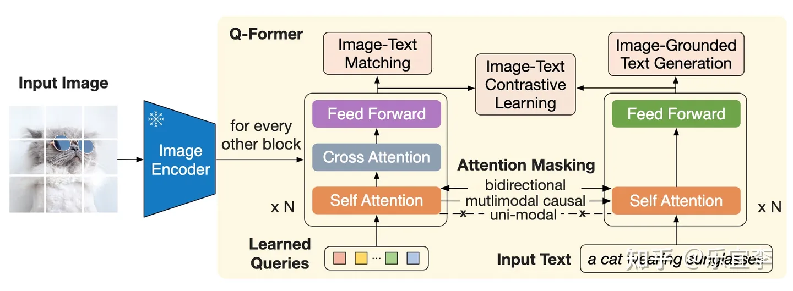

# 从LLM到多模态

> [多模态训练，怎么解决不同模态之间差异的问题？ - 知乎 (zhihu.com)](https://www.zhihu.com/question/495007578/answer/3297193490) - ViT | 多模态笔记
>
> [浅谈 Sora 未来的千倍推理算力需求 - 知乎 (zhihu.com)](https://zhuanlan.zhihu.com/p/683636677)
>
> [Github揽获8.6K星！《多模态大语言模型综述》重大升级 (qq.com)](https://mp.weixin.qq.com/s/9GImu7c7ZlakXSvvb3kjUQ)
>
> [Large Multimodal Models by Chip Huyen: Overview of multimodal systems and the recent history of this field.](https://huyenchip.com/2023/10/10/multimodal.html)

## 多模态 如何解决不同模态的差异问题

### STEP 1 理解型 多模态

> **Visual Bert -> CLIP -> FLAVA**

多模态步入快速发展是从VisualBert这项工作开始的，VisualBert 将图像的关键目标作为图像 token，然后利用 self-attention 的策略将 **文本 token 与图像 token 进行注意力计算**，这种模式取得了巨大的成功。

后来 CLIP 模型诞生了, 该模型将通过相似的模型结构（基于Transformer），**分别建模文本和图像**，然后通过大量的 **图像-文本 pair**，进行**对比学习**，将 图像特征 和 文本特征 映射到同一 特征空间，模型思想优雅, 结构简单

后来Meta公司完成的FLAVA模型，在模型输入方面更有友好，因为 **FLAVA 引入了图像的 encoder 模型 VIT**, 用户**不在需要目标检测器**。同时 FLAVA 的模型结构上继承了经典的分-->总的策略，即**图像和文本在前期分别进行 encode, 然后在后期通过 multimodal encoder 将单模态的特征融合产生多模态特征**。此外，FLAVA工作还引入了更多的多模态训练损失函数，如：Global contrastive(GC) loss， Masked multimodal modeling(MMM)，Image-text matching(ITM)，Masked image modeling(MIM)，Masked language modeling(MLM)，这些损失函数对后期多模态模型的发展影响非常大，一直到现在仍然被广泛使用。由于该模型在训练数据和优化目标上都有很大的改进，在很多数据集结果上取得了非常好的效果。

### STEP 2 生成式 多模态

> BLIP - 2 

BLIP-2 是[大语言模型](https://www.zhihu.com/search?q=大语言模型&search_source=Entity&hybrid_search_source=Entity&hybrid_search_extra={"sourceType"%3A"answer"%2C"sourceId"%3A3297193490})出现之后，多模态模型与大语言模型第一次重量级的结合. 后来的发展, 很多模型都采用了 Q-former 这一模块，同时结合 LLM模型做多模态模型的对齐工作。同时 多模态模型的主要任务也从“理解”转向了"生成”。

BLIP - Bootstrapping Language-Image Pre-training, 意为“通过冻结的图像编码器和大预言模型引导图像-语言预训练” , 一言以蔽之，BLIP-2就干了一件事：**将多模态混合数据（image+text）转化为 LLM可以理解的soft-prompt (或者称为 Embedding)**

我们知道，LLM工作时需要人类输入指令（Instruct）, 但是当我们想让 LLM输理解其他模态数据时就很难了，在 BLIP-2 出来之前，我们只能先将其他模型数据转化为人类的语言，然后变成 LLM的 intruct。但是，语言是匮乏的，哪怕是一张简单的图片，我们都不可能用语言完全描述它，更何况是多模态数据了。BLIP-2就是要解决这件事情，**通过与 LLM联合训练的方式，将多模态数据转化为Embedding, 该 Embedding 既可以输入LLM用于内容生成，也可以支持下游业务应用**。

> 
>
> 从图 1 我们可以看到， BLIP-2 的整个模型架构分为两块，左边的可以称为多模态理解，右边可以称为基于理解的内容生成。从参数上看，根据不同的参数功能可以分为3部分1️⃣，2️⃣，3️⃣。只有参数 2️⃣ 是可以训练的，其他参数全部是冻结的，其中1️⃣是用来提取输入图像的 Embedding（用 clip 的图像 encoder 初始化），2️⃣是需要学习的参数Q-Former, 也是模型精华所在，用于链接图像encoder和 LLM，3️⃣是 LLM生成模型，理论上可以是任意大模型。。

#### 预训练

为了能够让图Q-former 能够充分理解多模态输入数据，引入了预训练，预训练的结构如下

图 2乍一看是很复杂的，为了简化，我们可以将其理解为三个多任务预训练和一个 learned-queires 参数， Q-Former 可以立即为是一个 简化版的Bert 模型，外加一组可学习的 learned-queires 参数。

learned-queires 参数是比较不容易理解的，重点解释一下，首先它是一个参数矩阵（可以理解为多个 token），本文中是 32768的大小，即是 32 个 token，每个 token的特征维度是 768，该参数作为 transformer 的 Q, image encoder 输出的图像特征一般也是 768 的维度，token数量可以为 N，输出为 N*768, 作为 transformer 的 K, V。有了 Q, K, V 三者就可以做 Cross-attention，从而完成了图像特征的提取，可以将learned-queires 理解为：**配合 image-encoder 辅助提取图像的重要信息**。

3个预训练任务分别为：

- image-text matching: 该任务是判断输入的图像和文本对是否匹配，这里 learned-queires 和输入文本在 self-attention 层进行双向特征交互，最终产出的 隐形特征 Z（32*768），经过一个 head做 2 分类，然后 32 个二分离的 logits 求平均作为最终 logits，同时配合困难样本挖掘方式做训练。
- Image-Grounded Text Generation： 该任务根据根据图像，预测输入的文本，就是语言模型训练的策略，参考 GPT 的训练模式，为了防止信息泄露，learned-queires和 input text在 attention 层是单向可见的。
- Image-Text Contrastive Learning： 图文对比学习，这种训练方式与 clip是十分相似的，不过产出图像特征的方式不一样。还有一点不同是图像产出的 embed维度是 Nx*768, 文本采用[CLS] token 的特征维度是 1x768，因此计算的相似度为 1x32, 论文提出使用 32 个 score中最大的分数作为 similiarity. 为了防止信息的泄露，*learned-queires和 input text在 attention 层是双向不可见的。

以上三个预训练损失函数，对应三中不同的数据 mask 方式，具体实现中一个样本要3 次推理，计算复杂度很高。

#### 结合 LLM 微调

微调的策略很简单，就是将预训练模块产出的 Embedding 作为 soft-prompt 输入到 LLM 模型中，然后利用 LM loss 微调 Q-Former 模块，微调的目的是：**将 Q-Former 的特征空间与 LLM 的特征空间对齐；**

从图 3 可以看到， LLM模型可以是单独的一个 解码器（上半图），这种情况 LLM 不能 prompt。也可以损失 encoder+[decoder] 的形式，这种形式可以在 Encoder 部分加入控制 prompt。用户可以自行选取。

如何评价整个训练过程是否收敛呢？其中一个重要标准就是：**多模态数据是否被 LLM 有效的感知到；**

多模态的 soft-prompt学习的很好，那么 LLM 就能围绕多模态的数据输入产出新的内容。这种方式像多模态数据与 LLM 打通。这种范式被应用后，大预言模型的发展就能及时反哺多模态内容理解模型。

## Sora 未来千倍算力需求

> **一分钟的高清视频等价于多少 Token？** - **一分钟视频约为 1M tokens 。**
>
> 1. Sora 的训练算力需求大概率是 GPT-4 的 1/4 左右
> 2. Sora 的推理算力需求是 GPT-4 的 **1000 倍** 以上（这么看来 2 万亿美元市值的 NVIDIA 仍然不是高点）
>    1. 预计单台 8xA100 机器生成 1min video 需要推理 3h 以上
>    2. 预计单台 8xH100 机器生成 1min video 需要推理 31min 以上
> 3. 复现 Sora 的难度没有预想中的大，至少训练算力不是瓶颈； 国内靠 A800/H800 的余量仍可以满足
> 4. 国产芯片迎来一次机会，设计并量产 14nm 的中算力、大显存 LLM 推理芯片，可以绕开芯片制程的瓶颈迅速商业化

## 多模态大语言模型综述

本综述主要围绕 MLLM 的基础形式、拓展延伸以及相关研究课题进行展开，具体包括：

- MLLM 的基础构成与相关概念，包括架构、训练策略、数据和评测；
- MLLM 的拓展延伸，包括输入输出粒度、模态、语言和场景的支持；
- MLLM 的相关研究课题，包括多模态幻觉、多模态上下文学习（Multimodal In-Context Learning，M-ICL）、多模态思维链（Multimodal Chain of Thought，M-CoT）、LLM 辅助的视觉推理（LLM-Aided Visual Reasoning，LAVR）。

对于多模态输入-文本输出的典型 MLLM，其架构一般包括**编码器**、**连接器**以及 **LLM**。如要支持更多模态的输出（如图片、音频、视频），一般需要额外接入**生成器**，如下图所示：

其中，模态编码器(Modality Encoder)负责将原始的信息（如图片）编码成特征，连接器则进一步将特征处理成 LLM 易于理解的形式，即视觉 Token。LLM 则作为“大脑”综合这些信息进行理解和推理，生成回答。

目前，三者的参数量并不等同，以 Qwen-VL [1] 为例，LLM 作为“大脑”参数量为 7.7B，约占总参数量的 80.2%，视觉编码器次之（1.9B，约占 19.7%），而连接器参数量仅有 0.08B。

### 数据与训练

MLLM 的训练大致可以划分为**预训练阶段**、**指令微调阶段**和**对齐微调阶段**。预训练阶段主要通过大量配对数据将图片信息对齐到 LLM 的表征空间，即让 LLM 读懂视觉 Token。

指令微调阶段则通过多样化的各种类型的任务数据提升模型在下游任务上的性能，以及模型理解和服从指令的能力。对齐微调阶段一般使用强化学习技术使模型对齐人类价值观或某些特定需求（如更少幻觉）。

早期工作在第一阶段主要使用粗粒度的图文对数据，如 LAION-5B，这些数据主要来源于互联网上的图片及其附带的文字说明，因此具有**规模大（数 10 亿规模）但噪声多、文本短的特点**，容易影响对齐的效果。

后来的工作则探索使用更干净、文本内容更丰富的数据做对齐。如 ShareGPT4V [8] 使用 GPT-4V 生成的详细描述来做更细粒度的对齐，在一定程度上缓解了对齐不充分的问题，获得了更好的性能。但由于 GPT-4V 是收费的，这种类型的数据规模通常较小（数百万规模）。

此外，由于数据规模受限，其包含的世界知识也是有限的，比如是否能够识别出图像中的建筑为广州塔。此类世界知识通常储备于大规模的粗粒度图文对中。

第二阶段的微调数据一方面可以来源于各种任务的数据，如 VQA 数据、OCR 数据等，也可以来源于 GPT-4V 生成的数据，如问答对。虽然后者一般能够生成更复杂、更多样化的指令数据，但这种方式也显著地增加了成本。值得一提的是，第二阶段的训练中一般还会混合部分纯文本的对话数据，这类数据可以视为正则化的手段，保留 LLM 原有的能力与内嵌知识。

### 其他技术方向

除了提升模型的基础能力（如支持的输入/输出形式、性能指标）外，还有一些有意思的问题以及待探索的方向。

**多模态幻觉**的研究主要关注模型生成的回答与图片内容不符的问题。

**多模态上下文学习**技术为少样本学习方法，旨在使用少量的问答样例提示模型，提升模型的 few-shot 性能。

**多模态思维链**的基本思想是通过将复杂的问题分解为较简单的子问题，然后分别解决并汇总。

**LLM 辅助的视觉推理**方法探索如何利用 LLM 强大的内嵌知识与能力，并借助其他工具，设计各种视觉推理系统，解决各种现实问题。

## Multimodality and Large Multimodal Models (LMMs)

> 不是所有的 多模态系统 都是 LMM, 只有哪些有LLM组件的多模态系统可以被称为LMM

### 1 Multimodal System 组成

Generation

* Image generation (text-to-image synthesis)
* Text generation -> QA AND Image Caption

Vision-language understanding

* Classification (OCR) 
  * **image-to-text retrieval** -> 图片信息提取/类似淘宝
* Text-based image retrieval (image search) / text-to-image retrieval
  1. Method 1: 生成每个图片摘要作为索引, 查询这个摘要
  2. Method 2: 训练一个图文联合空间, 给一个文字查询, 然后产生Embedding, 用Embedding 查询

### 2 Multimodal System 组件 - 以 CLIP 为例

CLIP : multiple **image classification tasks** 

Flamingo : [the GPT-3 moment in the multimodal domain](https://arxiv.org/abs/2304.08485).

通用组件: 

1. An **encoder** for each data modality to generate the embeddings for data of that modality.
2. A way to **align embeddings** of different modalities into the same **multimodal embedding space**
3. [Generative models only] A **language model to generate text responses**. 

#### CLIP

##### OverView

关键贡献: Map data of different modalities, text and images, into a shared embedding space

**[ Image Encoder ]** Training this multimodal embedding space also produced a strong image encoder, which allows CLIP to achieve **competitive zero-shot performance on many image classification tasks**.

This strong image encoder can be used for many other tasks:

* image generation, 
* visual question answering, 
* text-based image retrieval.

Flamingo and LLaVa use CLIP as their image encoder. DALL-E uses CLIP to rerank generated images. It’s unclear if GPT-4V uses CLIP.

[ **Natural language supervision** and **contrastive learning** ] Allowed CLIP to both **scale up their data** and make training more efficient

##### CLIP's high-level architecture

> CLIP's architecture. 
>
> Both encoders and projection matrices are **jointly trained** together from scratch. The training goal is to maximize the similarity scores of the right (image, text) pairings while minimizing the similarity scores of the wrong pairings **[contrastive learning]**.

For the **image encoder**, the authors experimented with both ResNet and ViT. 

Their best-performing model is `ViT-L/14@336px`:

- Large vision transformer (ViT-L)
- 14 patches (each image is divided into 14 sub-images)
- on 336x336 pixel input

For the **text encoder**, CLIP uses a Transformer model similar to [GPT-2](https://openai.com/research/better-language-models) but smaller. Their base model has only 63M parameters with 8 attention heads. 

The authors found CLIP’s performance to be **less sensitive** to the capacity of the text encoder. (图片编码器不重要)

##### Natural language supervision

For many years, image models were trained with manually annotated (image, text) datasets (e.g. ImageNet, MS COCO). **This isn’t scalable.**  **Manual annotation is time-consuming and expensive.**

They created their own dataset – 400M (image, text) pairs – as follows.

1. Construct a list of 500,000 queries. 
   Queries are common words, bigrams, and titles of popular Wikipedia articles.
2. Find images matching these queries (string and substring match). | 
   Maybe Base search in their own Database
3. Each image is paired with **a text that co-occurs with it** (e.g. captions, comments) instead of the query since queries are too short to be descriptive.

Because some queries are more popular than others, to avoid data imbalance, they used at most 20K images for a query.

##### Contrastive learning

**Classifier objective** works **when the output space is finite**. Say, if the model was trained to predict among 10 classes, it won’t work for a task that has 100 classes.

**Language model objective** outputs a sequence of classes. While the language model objective allows for vastly more flexible outputs, CLIP authors noted this objective made the training difficult. They hypothesized that this is because the model tries to generate ***exactly* the text accompanying each image**

**Contrastive learning** is to overcome this challenge. Instead of predicting the exact text of each image, CLIP was trained to predict whether a text is more likely to accompany an image than other texts.

> 

> 

##### CLIP Applications

1. Classification
2. Text-based image retrieval - Similar to RAG Retrival 
3. Image generation - Rerank these visuals before showing the top visuals to users.
4. Text generation: visual question answering, captioning - **Undirectly Version**

#### Flamingo

Unlike CLIP, Flamingo **can generate text responses.** 
$$
Flamingo = CLIP + LLM
$$

##### Flamingo's high-level architecture

At a high level, Flamingo consists of 2 parts:

1. **Vision encoder**: a CLIP-like model is trained using contrastive learning. The text encoder of this model is then discarded. The vision encoder is **frozen** to be used in the main model.
2. **Language model**: Flamingo finetunes Chinchilla to generate text tokens, conditioned on visuals and text, using language model loss, with two additional components Perceiver Resampler and GATED XATTN-DENSE layers. We’ll discuss them later in this blog.

##### Data

> 2 (image, text) pair datasets, 1 (video, text) pair dataset, and 1 interleaved image and text dataset.

| **Dataset** | **Type**                           | **Size**         | **How**                                                      | **Training weight** |
| ----------- | ---------------------------------- | ---------------- | ------------------------------------------------------------ | ------------------- |
| M3W         | Interleaved image and text dataset | 43M webpages     | For each webpage, they sample a random subsequence of 256 tokens and take up to the first 5 images included in the sampled sequence. | 1.0                 |
| ALIGN       | (Image, text) pairs                | 1.8B pairs       | Texts are alt-texts, averaging 12 tokens/text.               | 0.2                 |
| LTIP        | (Image, text) pairs                | 312M pairs       | Texts are long descriptions, averaging 20.5 tokens/text.     | 0.2                 |
| VTP         | (Video, text) pairs                | 27M short videos | ~22 seconds/video on average                                 | 0.03                |

##### Flamingo's vision encoder

Flamingo first trains a CLIP-like model from scratch using contrastive learning. 

This component o**nly uses the 2 (image, text) pair datasets**, ALIGN and LTIP, totaling 2.1M (image, text) pairs

This is 5x larger than the dataset CLIP was trained on.

- For the text encoder, Flamingo uses BERT instead of GPT-2.
- For the vision encoder, Flamingo uses a NormalizerFree ResNet (NFNet) F6 model.
- Text and vision embeddings are meanpooled before being projected to the joint embedding space

##### Flamingo's language model

> Next token generation is conditioned on both text and visual tokens. Illustration taken from Chunyuan Li's CVPR 2023 tutorial: Large Multimodal Models

A traditional language model predicts the next text token based on the preceding text tokens. Flamingo predicts the next text token based on both the preceding text and visual tokens.

To be able to generate text conditioned on both text and visual inputs, Flamingo relied on Perceiver Resampler and GATED XATTN-DENSE layers.

###### Perceiver Resampler

As the visual inputs can be both images and videos, the vision encoder can produce a variable number of image or video features. 

Perceiver Resampler **converts these variable features into a consistent 64 visual outputs.**

> Interestingly enough, while training the vision encoder, the resolution used was 288 x 288. However, at this phase, visual inputs are resized to 320 × 320. 
>
> **It’s been shown that [a higher test-time resolution can lead to improved performance when using CNNs](https://arxiv.org/abs/1906.06423).**

###### GATED XATTN-DENSE layers

GATED XATTN-DENSE layers are inserted between existing and frozen LM layers to allow the language model t**o attend more efficiently to the visual tokens when generating text tokens.** Without these layers, Flamingo authors noted a drop of 4.2% in the overall score.

###### Loss function

#### CLIP v.s. Flamingo

### 3 LMM 近期研究

#### 1 Incorporating more data modalities

- [ULIP: Learning a Unified Representation of Language, Images, and Point Clouds for 3D Understanding](https://arxiv.org/abs/2212.05171) (Xue et al., Dec 2022)
- [ImageBind: One Embedding Space To Bind Them All](https://browse.arxiv.org/abs/2305.05665) (Girdhar et al., May 2023)
- [NExT-GPT: Any-to-Any Multimodal Large Language Model](https://next-gpt.github.io/) (Wu et al., Sep 2023)
- Jeff Dean’s ambitious [Pathways](https://blog.google/technology/ai/introducing-pathways-next-generation-ai-architecture/) project (2021): its vision is to “*enable multimodal models that encompass vision, auditory, and language understanding simultaneously*.”

#### 2 Multimodal systems for instruction-following

Flamingo was trained for completion, but not for dialogue or for following instructions. (If you’re not familiar with completion vs. dialogue, check out my post on [RLHF](https://huyenchip.com/2023/05/02/rlhf.html)). Many people are working on building LMMs that can follow instructions and have conversations, such as:

- [MultiInstruct: Improving Multi-Modal Zero-Shot Learning via Instruction Tuning](https://arxiv.org/abs/2212.10773) (Xu et al., Dec 2022)
- [LLaVA: Visual Instruction Tuning](https://arxiv.org/abs/2304.08485) (Liu et al., Apr 28, 2023)
- [InstructBLIP: Towards General-purpose Vision-Language Models with Instruction Tuning](https://arxiv.org/abs/2305.06500) (Salesforce, May 11, 2023)
- LaVIN: [Cheap and Quick: Efficient Vision-Language Instruction Tuning for Large Language Models](https://arxiv.org/abs/2305.15023) (Luo et al., May 24, 2023)

#### 3 Adapters for more efficient multimodal training

While Flamingo used 9 pretrained and frozen layers from Chinchilla, it had to pretrain its vision encoder, Perceiver Resampler, and GATED XATTN-DENSE layers from scratch. These train-from-scratch modules could be compute-intensive. 

Some works are quite promising. BLIP-2, for example, outperformed Flamingo-80B by 8.7% on zero-shot VQA-v2 with 54x fewer trainable parameters.

Works in this space include:

- [BLIP-2: Bootstrapping Language-Image Pre-training with Frozen Image Encoders and Large Language Models](https://arxiv.org/abs/2301.12597)
- [LAVIN] [Cheap and Quick: Efficient Vision-Language Instruction Tuning for Large Language Models](https://arxiv.org/abs/2305.15023)
- [LLaMA-Adapter V2: Parameter-Efficient Visual Instruction Model](https://arxiv.org/abs/2304.15010)

The two images below are from Chunyuan Li’s [Large Multimodal Models](https://datarelease.blob.core.windows.net/tutorial/vision_foundation_models_2023/slides/Chunyuan_cvpr2023_tutorial_lmm.pdf) tutorial at CVPR 2023, which is, btw, an excellent tutorial.

#### 4 Generating multimodal outputs