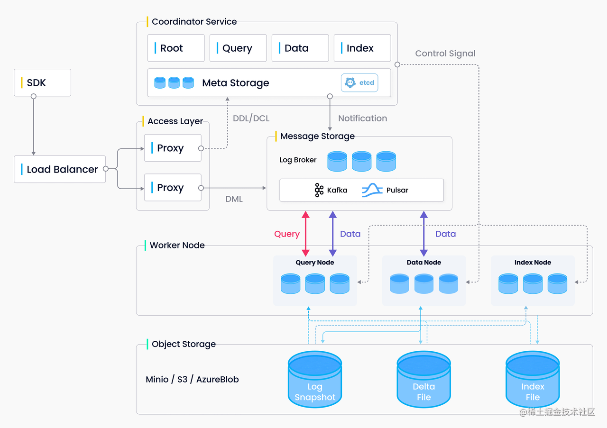

# Milvus - 向量数据库

> [Milvus的概述 (milvus-io.com)](https://www.milvus-io.com/)
>
> [云原生向量数据库Milvus扫盲，看完这篇就够了 - 知乎 (zhihu.com)](https://zhuanlan.zhihu.com/p/476025527)
>
> [Milvus 完整指南：开源向量数据库，AI 应用开发的基础设施（逐行解释代码，小白适用） - 知乎 (zhihu.com)](https://zhuanlan.zhihu.com/p/634255317)

## 简介

Milvus是一个高性能的**云原生**向量数据库, 专为管理和搜索大规模向量数据而设计。在人工智能和机器学习的很多应用中,数据通常表示为高维向量。然而,传统的数据库系统并不善于处理这种向量数据。这就是Milvus发挥作用的地方。

> 云原生: 
>
> "云原生" (Cloud Native) 是一种软件开发和部署的方法, 它充分利用了云计算平台的优势, 从而构建和运行可扩展的应用程序。
>
> 云原生应用被设计为**在云环境中**运行, 能够充分利用云平台提供的服务和资源。
>
> Milvus被设计为一个云原生的向量数据库,具有以下云原生特性:
>
> 1. **微服务架构:** 
>
>    应用程序被划分为一组小型、独立的服务,每个服务都有自己的生命周期,可以独立开发、部署和扩展。Milvus由一组松耦合的服务组成,如Proxy、Coordinator、Worker Node等,每个服务都有明确的职责, 可以独立扩展。
>
> 2. **容器化:**
>
>    服务被打包成标准的容器(如Docker), 使得它们可以在任何地方运行,而不依赖于特定的环境。Milvus的所有组件都可以容器化部署,支持在Kubernetes等容器编排平台上运行。
>
> 3. **自动化运维:** 
>
>    使用自动化的工具和流程来管理应用的生命周期, 包括部署、扩展、监控和故障恢复等。Milvus提供了Kubernetes Operator,可以自动化管理Milvus集群的部署、扩展、升级等任务。
>
> 4. **声明式的API:** 
>
>    使用声明式的API来定义应用程序的期望状态,平台负责确保实际状态与期望状态一致。Milvus的很多操作,如创建集合、创建索引等,都提供了声明式的API。用户只需要定义期望的状态,Milvus负责实现状态的同步。
>
> 5. **松耦合:** 
>
>    服务之间通过轻量级的API进行通信,减少了服务之间的依赖,提高了系统的灵活性和可维护性
>
> 这种"云原生"的设计, 使得Milvus非常适合在云环境中部署和运行,能够满足现代应用对向量数据管理的需求。

Milvus的优点在于:

1. **高性能:** Milvus专门优化了向量相似度搜索的性能, 即使在海量数据集上也能实现实时的高性能检索。

2. **可扩展性:** Milvus采用云原生架构设计,支持在云环境中动态扩展,以适应不断增长的数据量和访问量。

3. **高可用性**: Milvus内置了多种容错和高可用机制,确保系统能够持续稳定地提供服务。

4. **灵活的数据模型:** 

   Milvus提供了Collection(集合)、Partition(分区)、Segment(段)等数据管理和组织机制, 方便用户根据自己的需求来组织和管理数据。

5. **丰富的索引类型:**

   Milvus支持多种向量索引算法,用户可以根据自己的数据特点和性能需求选择合适的索引方式。

Milvus很好地解决了向量数据管理的痛点:

1. 传统数据库无法高效处理向量数据的问题。

2. 海量向量数据带来的存储和检索性能瓶颈问题。

3. 向量数据管理的扩展性和可用性问题。

总之, Milvus为各种AI应用提供了一个高性能、高可用、可扩展的向量数据管理平台, 让开发者能够专注于自己的业务逻辑, 而无需担心底层数据的存储和检索问题。

## 架构 和 工作流

Milvus 2.0 是一款云原生向量数据库，采用**存储与计算分离**的架构设计，所有组件均为无状态组件，极大地增强了系统弹性和灵活性。

Milvus采用了存储与计算分离的架构设计,主要包括四个层次:

1. 接入层(Access Layer): 

   由一组无状态的Proxy节点组成, 负责接收客户端请求、转发请求到执行节点、最后合并结果并返回给客户端。

2. 协调服务层(Coordinator Service): 

   包括Root Coordinator、Data Coordinator、Query Coordinator和Index Coordinator四种角色,负责管理和协调系统各个组件的工作,以及元数据的管理等。

3. 执行节点层(Worker Node):

   包括Data Node、Query Node和Index Node三种角色,负责执行具体的数据插入、查询和索引创建等任务。执行节点从协调服务获取任务并进行相应的处理。

4. 存储层(Storage):

   负责数据的持久化存储, 包括元数据存储、对象存储和消息存储。元数据存储(如etcd)存储系统的元数据; 对象存储(如MinIO)存储日志快照、索引文件等;消息存储用于数据写入和消费。

> **无状态**
>
> 无状态(Stateless)组件指的是那些不维护内部状态的组件。
>
> 每个请求都是独立的,组件处理请求时只依赖于请求本身提供的信息, 而**不依赖于之前的请求或状态。**
>
> 无状态组件的优势在于:
>
> 1. 可扩展性:由于每个请求都是独立的,系统可以方便地增加或减少组件实例,从而适应不同的负载需求。
>
> 2. 容错性:如果一个实例失效,请求可以被转发到其他实例处理,而不会影响整个系统的可用性。
>
> 3. 简单性:组件内部逻辑简单,不需要考虑状态的同步和持久化问题。
>
> 与之相对的概念是有状态(Stateful)组件。有状态组件会维护内部状态,处理请求时需要依赖之前的状态。典型的如数据库系统。有状态组件的扩展和容错相对来说更复杂。
>
> 在Milvus中, 绝大部分组件如Proxy、Coordinator、Worker Node等都是无状态的,这赋予了Milvus高度的可扩展性和容错性。

Milvus的基本工作流如下:

1. 数据导入:

   客户端将数据发送到接入层的Proxy节点,Proxy将写入请求路由到协调服务层的Data Coordinator。Data Coordinator为请求分配Data Node并生成日志。Data Node订阅消息存储获得日志数据并进行处理和存储。

2. 数据查询:

   客户端将查询请求发送到Proxy,Proxy将请求发送到协调服务的Query Coordinator。Query Coordinator根据元数据选择相应的Query Node执行查询。Query Node从对象存储加载数据并进行查询处理,将结果返回给Proxy。Proxy最后合并结果并返回给客户端。

3. 索引创建:

   根据用户请求,Index Coordinator选择Index Node来执行索引创建任务。Index Node从对象存储读取数据文件,创建索引并将索引文件写回对象存储,并更新元数据。

整个系统各个组件通过发布/订阅消息存储来解耦,实现松耦合的架构。这种设计赋予了Milvus很好的扩展性和容错性。

> Milvus 的索引创建
>
> 在Milvus中,索引是为了加速向量相似度搜索而创建的。你可以将索引理解为一本书的目录。当你想在书中找到某个特定主题时,你可以先查阅目录,然后直接翻到相关的页面,而不必逐页查找。Milvus中的索引也起到类似的作用,它帮助系统快速定位到与查询向量相似的向量数据。
>
> 当用户要为某个数据集合(Collection)创建索引时,过程大致如下:
>
> 1. 用户通过客户端向Milvus发送创建索引的请求, 指定所用的索引类型,比如IVF_FLAT、HNSW等。
>
> 2. 接入层(Proxy)接收到请求后, 将其转发给协调服务层的 Index Coordinator。
>
> 3. Index Coordinator 根据当前系统的负载情况和数据分布情况, 选择一个或多个Index Node来执行实际的索引创建任务。
>
> 4. 被选中的Index Node从对象存储中**读取需要建立索引的原始数据文件**。这些数据文件通常是由Data Node根据导入的向量数据生成的。
>
> 5. Index Node加载数据到内存后, **开始执行索引构建算法**。常见的索引算法包括k-means聚类、KD树、图索引等。索引构建的过程就是对原始向量数据进行重组和优化,生成一种数据结构,使得后续的相似度搜索更加高效。
>
> 6. 索引构建完成后,Index Node会将**生成的索引文件写回到对象存储**, 同时更新Milvus的元数据,记录下新的索引信息。
>
> 7. Index Coordinator接收到Index Node的完成通知后, 会将索引状态标记为"就绪",此时该索引就可以被用于数据查询了。
>
> 从用户的角度来看,整个索引创建过程就是发送一条创建索引的指令,然后等待一段时间,直到Milvus通知索引创建完毕。在此期间,具体的索引创建工作由Milvus内部的Index Coordinator和Index Node自动完成,用户无需关心细节。
>
> 一旦索引建立完成,后续的查询就会自动使用该索引。当用户发送一个查询请求时,Query Node会加载相应的索引文件,利用索引快速缩小搜索范围,找出最有可能与查询向量相似的一批候选向量,然后再在这些候选向量中进行精确的相似度计算,返回最终的结果。
>
> 这就是Milvus索引创建的基本过程。通过预先建立索引,Milvus能够大大加速海量向量数据的相似度搜索,使得用户能够实时获取查询结果。同时,Milvus提供了多种索引类型供用户选择,用户可以根据自己的数据特点和性能需求,灵活地选择合适的索引方式。

### **存储服务**

存储服务是系统的骨骼，负责 Milvus 数据的持久化，分为元数据存储（meta store）、消息存储（log broker）和对象存储（object storage）三个部分。

**元数据存储**

元数据是描述数据的数据。在Milvus中, 元数据包括集合的定义、分区信息、索引信息等。你可以把元数据理解为一本书的目录:它不包含书的具体内容, 但它告诉你每一章的标题、页码等信息。

Milvus使用ETCD作为元数据存储。ETCD是一个高可用的分布式键值存储系统。Milvus将元数据以键值对的形式存储在ETCD中。例如,一个集合的定义可能存储为: ("/collections/my_collection", "{'field': 'embedding', 'dim': 128}")。

当Milvus的其他组件, 如Proxy、Coordinator等, 需要获取元数据时,它们会从ETCD中读取。当元数据发生变更时,也会写入ETCD, 以保证所有组件看到的元数据是一致的。

**对象存储**

对象存储用于存储Milvus的实际数据,包括向量数据、索引文件等。你可以把对象存储看作是一个大仓库,Milvus将数据文件存储在这个仓库中。

Milvus支持多种对象存储,如本地文件系统、AWS S3、Google Cloud Storage等。数据文件被组织为一个个的对象,每个对象都有一个唯一的标识符。例如,一个向量数据文件可能被存储为: "milvus-data/collection1/partition1/segment1/vector.dat"。

当需要读取数据时,如查询向量时,Worker Node会从对象存储中读取相应的数据文件。当需要写入数据时,如插入新的向量,Worker Node会将数据写入到对象存储。

**消息存储**

消息存储在Milvus中扮演着"通信员"的角色。它负责在不同组件之间传递消息,协调它们的工作。目前，分布式版Milvus依赖 Pulsar 作为消息存储，单机版Milvus依赖 RocksDB 作为消息存储。消息存储也可以替换为 Kafka、Pravega 等流式存储。

例如,当有新的数据插入时, Proxy会将插入请求写入到消息存储。Data Coordinator 订阅了插入消息,它会从消息存储中读取请求,然后调度Worker Node执行实际的插入操作。Worker Node完成插入后,会将完成消息写入到消息存储,Data Coordinator读取到完成消息后,知道插入操作已经完成。

通过消息存储,Milvus的各个组件可以解耦,它们不需要直接通信,而是通过读写消息来协调工作。这提高了系统的灵活性和可靠性。

**单机版 Milvus** 包括的三个组件即为：

- **Milvus** 负责提供系统的核心功能。
- **etcd** 是元数据引擎，用于管理 Milvus 内部组件的元数据访问和存储，例如：proxy、index node 等。
- **MinIO** 是存储引擎，负责维护 Milvus 的数据持久化。

> 在Milvus的工作流中,这三种存储是这样配合的:
>
> 1. 当客户端发起一个请求(如插入或查询)时, Proxy会先从元数据存储(ETCD)中读取必要的元数据, 如集合的定义。
>
> 2. 然后, Proxy将请求写入到消息存储(Pulsar)。相应的Coordinator(如Data Coordinator或Query Coordinator)订阅了请求消息, 它会从消息存储中读取请求。
>
> 3. Coordinator根据请求的类型和元数据, 调度Worker Node执行实际的操作。Worker Node会从对象存储读取或写入实际的数据文件。
>
> 4. 操作完成后,Worker Node将完成消息写入到消息存储。Coordinator读取到完成消息,知道操作已经完成,可能会更新元数据存储。
>
> 5. 最后,请求的结果通过Proxy返回给客户端。
>
> 这就是Milvus的三种存储在工作流中的配合方式。
>
> 元数据存储提供了系统的"目录",对象存储存放了实际的数据,消息存储则负责在不同组件之间传递"消息",协调它们的工作。
>
> 通过这种设计,Milvus实现了存储和计算的分离,不同的存储负责不同的数据,不同的组件负责不同的工作。这提高了系统的可扩展性、可靠性和可维护性。

> **ETCD**
>
> ETCD是一个分布式的键值存储系统,常用于存储分布式系统的配置信息和元数据。ETCD的主要特点有:
>
> 1. 强一致性:ETCD使用Raft一致性算法,保证数据在所有节点上的一致性。
>
> 2. 高可用性:ETCD支持多节点部署,即使部分节点失效,系统仍能继续工作。
>
> 3. 事务支持:ETCD提供了事务功能,可以将多个操作组合在一个事务中执行,要么全部成功,要么全部失败。
>
> 在Milvus中,ETCD被用作元数据存储。元数据包括集合的Schema信息、分区信息、索引信息等。这些信息对于Milvus的正常运行至关重要,必须保证高度的一致性和可用性。同时,很多操作如创建集合、创建分区等,需要使用事务来保证原子性。
>
> 因此,ETCD非常适合作为Milvus的元数据存储。它不仅提供了强一致性和高可用性,还支持事务操作,可以满足Milvus对元数据管理的要求。此外,ETCD作为一个独立的组件,可以方便地与Milvus的其他组件解耦,提高了系统的可维护性和可扩展性。

## 其他相关概念

### Milvus 基本概念

#### **Collection-集合** - 类 表

包含一组 entity，可以等价于关系型数据库系统（RDBMS）中的表。

#### **Entity-实体** - 类 行

包含一组 field。field 与实际对象相对应。

field 可以是代表对象属性的结构化数据，也可以是代表对象特征的向量。primary key 是用于指代一个 entity 的唯一值。

**注意：** 你可以自定义 primary key，否则 Milvus 将会自动生成 primary key。请注意，目前 Milvus 不支持 primary key 去重，因此有可能在一个 collection 内出现 primary key 相同的 entity。

#### **Field-字段** - 类 行字段

Entity 的组成部分。**[Field](https://link.zhihu.com/?target=https%3A//milvus.io/cn/docs/v2.0.x/field_schema.md)** 可以是结构化数据，例如数字和字符串，也可以是向量。

**注意：** Milvus 2.0 现已支持标量字段过滤。并且，Milvus 2.0 在一个集合中只支持一个主键字段。

### Endpoint

在计算机网络中, Endpoint(端点)指的是通信链路的端点, 可以是服务端, 也可以是客户端。在分布式系统和微服务架构中,Endpoint通常指的是**一个服务的访问入口**, 即其他服务或客户端可以通过这个入口访问该服务提供的功能。

在Milvus中, Proxy就扮演了Endpoint的角色。客户端通过连接Proxy来访问Milvus提供的服务, 如数据插入、查询等。

Proxy接收客户端请求,根据请求类型将其转发给相应的组件(如Data Coordinator、Query Coordinator等)处理,最后将结果返回给客户端。

一个典型的工作流如下:

1. 客户端连接到Milvus的Proxy Endpoint。
2. 客户端发送请求(如插入或查询)到Proxy。
3. Proxy根据请求类型,将请求转发给相应的Coordinator。
4. Coordinator调度Worker Node执行实际的任务。
5. Worker Node处理完成后,将结果返回给Coordinator。
6. Coordinator将结果返回给Proxy。
7. Proxy将最终结果返回给客户端。

这样,Endpoint(Proxy)就像是Milvus的"大门",所有的客户端请求都需要经过它进入Milvus系统。

### 负载均衡

负载均衡(Load Balancing)指的是将工作负载分布到多个计算资源(如服务器)上执行, 以提高系统的性能和可用性。

负载均衡器(Load Balancer)就是实现负载均衡功能的组件。

常见的负载均衡组件有:

1. Nginx:是一个广泛使用的反向代理服务器,可以将请求分发到后端的多个服务器上。Nginx的负载均衡功能包括轮询、最少连接、IP Hash等策略。

2. Kubernetes Ingress:是Kubernetes集群中的一种资源,用于管理集群的外部访问。Ingress可以根据请求的主机名、路径等信息,将请求路由到不同的后端服务。

3. NodePort:是Kubernetes中的一种服务类型。NodePort会在每个节点上开放一个端口,通过该端口可以访问到集群内部的服务。外部负载均衡器可以将请求发送到任意一个节点的NodePort上,从而实现负载均衡。

4. LVS(Linux Virtual Server):是Linux内核中的一个负载均衡模块。LVS工作在网络层,可以将请求转发到后端的多个服务器。LVS支持多种调度算法,如轮询、最小连接、目标地址散列等。

在Milvus中,通常使用Kubernetes来部署和管理系统。Proxy就是通过Kubernetes的Ingress或NodePort来实现负载均衡的。当有多个Proxy实例时,请求会被均衡地分发到各个实例上,从而提高系统的性能和可用性。